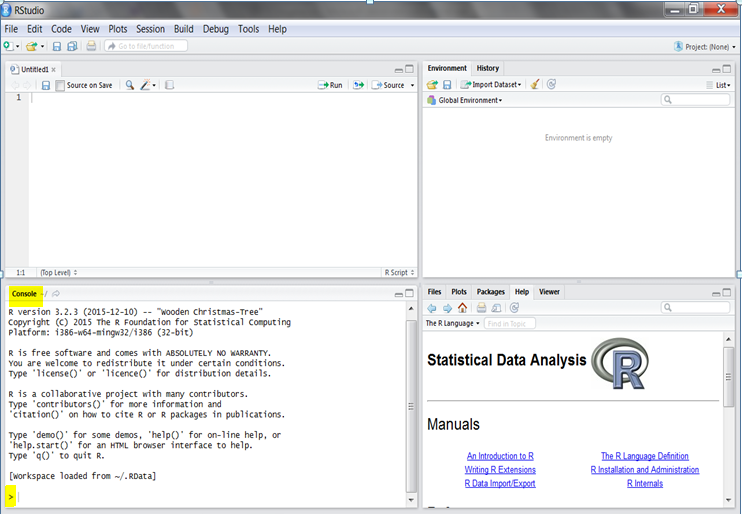
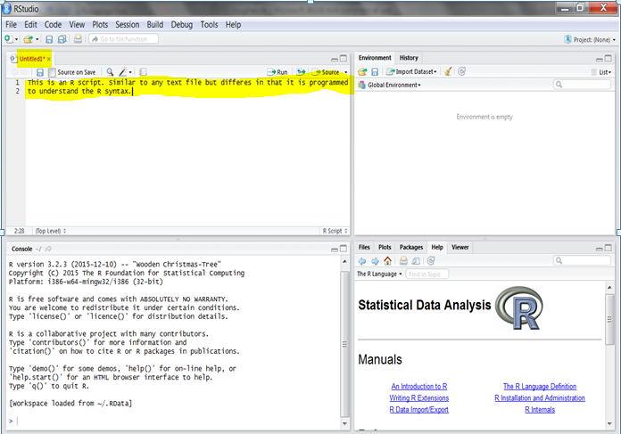

**ADDME**
Scooping rules: ls() has "f" and package `pryr` has "f", which is used? How can you ensure the right one is used?
* Global ENvironment - objects in memory
* A must add: Under objects - attibutes, classes, finding out its type (typeof, is.object)


**Session Goals**
  
* Know R and RStudio
* Download and install Base R and RStudio
* Be able to interact with R 
  + Know, set and change the working directory
  + Install and load R packages
  + Interactively work with R's console
  + Learn how to write scripts in R
* Working with version control systems
* Make function calls
* Know data types and objects used in R
* Subset different data objects
* Transform/Manipulate data sets
* Working with R's date and time
* How to import data into R
* Generate plots using base R
* Know how and where to get help
* Case Studies

## Introduction

Welcome to Data Analysis using `R`. This level (one) is all about the program you will be using to do the analysis, R. By the end of this level you should be able to do simple computation by `making function calls` and be able to work with add-on programs called `packages`.

In this level you will also get to know how to manage different versions of your documents by using `version control systems` and freely store/share the documents online. Version control is an important issue as you will be amending your documents (more so `R scripts`) severally, you will also want to collaborate with others on your project, hence, it will be vital to keep track of your changes and the contributions made. Version control programs such as Git help you do this and therefore a session on this has been added.


## What is R?

### R and a Brief History

R is many things, if you have never used a statistical package or are new to data analysis and indeed statistical programming (for whom this tutorials are geared towards), begin by viewing R as a calculator that can perform numerous analysis. If you have been using other statistical packages more so using the 'drop-down-menu/click' method, view R as your tool for reproducible analysis, a growing concern in publications and indeed evidence based programming in the development and humanitarian sectors. 

[R]("(https://en.wikipedia.org/wiki/R_(programming_language))") is a statistical computing and graphics program. It is a dialet of the `S` programming language developed by [Ross Ihaka]("https://en.wikipedia.org/wiki/Ross_Ihaka")
and [Robert Gentleman]("https://en.wikipedia.org/wiki/Robert_Gentleman_(statistician)") in `1993`. It is partly named after these two leading founder's first names and partly in conformity to the "one-letter" names of other programming languages developed at the `Bell Laboratories` of which **S** is one of them. The two founders developed the program while teaching at Auckland University in New Zealand. Their main aim was to offer their students a free statistical program that they could use during their statistical classes. 

As noted, R is an implementation of the S programming language and much of the S code works in R. However, there are subtle difference, like [lexical scoping](#Level Two/Lexical Scoping) which we shall discuss in detail in level two. 

Over the years, R has grown from the little known statistical programming language used by a few university students in Auckland, to a widely used program applicable not only in academia, but also in other industries. It is currently being maintained by the `R development core group`. [John Chambers]("(https://en.wikipedia.org/wikin/John_Chambers_(statistician))"), the founder of the S language is one of the core group members. Check out [this]("http://r4stats.com/articles/popularity/") page for current statistical programming popularity figures.

With the growing interest in R, there have been other programs developed with R as it's base. Most of these are known as `Intergrated Development Environments (IDE)` that essentially help analysts and programmers to code more efficiently. The most widely used IDE's include [RStudio]("https://www.rstudio.com/") and [Revolution Analystics]("http://www.revolutionanalytics.com/"). To distinguish R from the other programs, it is often called `base R` as it is the base for all the other programs.  

So in these series we shall refer to R as "base R" and we shall only work with R Studio, as it is most suitable for an introductory session into R as well as it being free. 

### Downloading and Installation of Base R

R is freely available for downloading from the Comprehensive R Archives Network (CRAN). `CRAN is R's repository`, a web server that stores identical and up to date version of code and documentation of R.

** How to download the executable program **

Before the actual downloading, you will need to select one of [CRAN's mirrors]("https://cran.r-project.org/mirrors.html"). A mirror as the name suggests is a reflection (copy) of the original. In this case, there are numerous CRAN mirrors located around the world. The main purpose of these mirrors is to reduce network overload to the main server located at [Institute for Statistics and Mathematics of WU (Wirtschaftsuniversität Wien), Austria]("http://statmath.wu.ac.at/"). 

Once you have selected a mirror you will then need to select the download suitable for your operating system: Windows, Mac, and Linux. Click on "install R for the first time" and it should start to download the most current version of R. 

** Installing Base R **

When the download is done, click on the executable program (if you can't find it on the task bar/start menu, check your download folder), then click run. This should take you through the following installation windows:

  * The set-up language window where you choose the installation language you are most comfortable with.
  * A welcome screen detailing the R version being installed. It also requests that all other applications should be closed for the installation process
  * The lincense window which you can read before proceeding to the next installation window
  * A window to indicate where R will be installed, the default is usually fine but you can change it
  * Next is a window to select the components to be installed. The first component should be selected as it contains core files. The next two depend on your system, but R should be able to detect it.
  * A startup options window which you can let R set it's recommended startup options or you can customize it. If you select to customize it, then you will get the following startup setup windows:
    + A window to indicate the startup menu folder. Here you can choose the default to have it in the R folder or you can specify another location. You can also indicate that the startup menu should not be created; however, choose the default.
  * Next, indicate additional tasks to be performed during setup like creating a desktop icon, quick launch and registry files. If you will not be using R often or you have other programs that you frequently use on you desktop or the quick launch, then you can indicate that you do not need them, but what is important are the [registry](#Level Two/Registry) entries: the default is recommended. With that, installation should begin.  

Please see a quick instructional [demo](Slides/Demo/1.Downloading and Installing R.html) on installing R on a windows operating system.
    
<h3 id="baseR"> Getting to know Base R</h3>

Now that you have installed R, let's get to know it. First locate the program, if you are on windows, you would either find it pinned on the start menu or you can locate it by clicking 'All Programs' then scrolling through to locate the program. Click on the R folder and then the executable program; R should immediately pop up. The screen would look like this:


The first thing you will notice is the two windows; the main one with a toolbar and a grey background along with another window which has only the minimize, maximize and close buttons.  

The embedded window is called the **R Console** and it is the interactive platform where you can issue commands (functions) and get it's output immediately. It is like a calculator, you type in the values and the calculations needed and receive the results upon pressing enter.It is best suited for computations(expressions) that can fit in one line. Something like addition, subtraction, multiplications, and divisions or any other simple computation. For multiple line computations, [scripts](#RScripts"), are more suitable. 

But before you get to type in your commands after the red blinking cursor, there are a few blue colored introductory notes giving the R version you have just downloaded; copyright issues; your computer's platform; R's warranty and conditions for use; R as a collaborative package; the recommended citation and some start-up commands (functions).

Let's explore this console a little bit before we discuss the toolbar as a lot of what you will find there relate to the console and other windows we are yet to load.

One of the commands given in this introductory note is about the names of the R contributors. R being a free program is generally developed and maintained on a voluntary basis, for this reason it would be good to see some of the good people who have given us such a wonderful program for free. To do so, type "contributors()" right after the "greater than sign" or at the blinking cursor. Don't forget the two parentheses, they are used to indicate that this is a command (or a function as we shall soon learn).

```{r eval=FALSE}
##R Contributors
contributors()
```

Hoping your first line of code worked. If it did, you should see a new window with some write-up on the contributors and a bit of history and inspiration for the development of R. If you were not able to, please check your spelling and case. `R is case sensitive` and any slight `misspelling` would not yield the results desired.

So now we can say you have written your first command also known as `making a funtion call`: a great achievement. Now, let's bring up the help documentation, type `help.start()`. If you typed it correctly, then you will see a window titled "Statistical Data analysis". Below it are four subheadings namely "manuals", "references", "miscellaneous materials" and "material specific to the window port". Feel free to read each one and more so the manual on `Introduction to R`, it will be your first reference point any time you have a coding challenge.

Two final commands that might be useful at this stage are clearing the console and quitting R from the command line. Your console right now has quite a bit of information, sometimes you might what a blank screen to write on, in this case you will need to press control(Ctrl) and L together and you should have a blank screen. Everything that was on the console is now deleted from the console but not from history. R by default saves commands you issue and can be recovered from the [history](#history) file). To quit R, it is recommended to use the command line by typing `q()`, try it and log in again.

With that, you have successfully experienced R and are ready to do more, but first, you need to familiarize yourself with two other windows. The first is what is called the `working space` or the `global environment` and the `script window`.

<p id="workingspace">The **working space** as the name suggests is a platform that you can use to temporarily store everything that you need to do your analysis like data, and functions</p>.

<p id="script">A **script** is a [text editor](Programming for Non-programmers/Other useful terms#texteditor) where you write commands/codes. Writing on a script rather than the console enables one to write multiple lines of code that can be reproduced easily.  

Okay, back to the menu bar, where you will notice the following menu items; `File`, `Edit`, `View`, `Misc`, `Packages`, `Windows` and `Help`. 

<ul>
<li>From the <b>file</b> ribbon, several options are provided to begin working with R.</li>
  <ul>
    <li>The first, <U>"Source R Code"</U> is used to open an existing script that is saved as a source file. A source file is a file that can be called from a different script or console and it's content are made available. Mainly used to store user defined functions.</li>
    <li>The next one offer's you the chance to start a <U>new script</U>,</li> 
    <li>The third menu <u>"open script"</u> is more like the first only that in this case the script is not a source file.</li>
    <li>Next you can <u>load any workspace</u> that you have saved or a history file. A <u>history file</u> is a file that documents what functions and variables were created. It is a useful document that can be used to rerun commands or variables previously run.</li>
    <li>Next, you get to <u>change your directory</u>. A Working directory is a folder you specify as containing your r data and files or where you would like to store them. It is important to always tell R what folder is your working directory or what folder to store all your outputs. This would usually change with different projects.</li>
    <li>The last two items on the file menu are <u>`print`</u> and <u>`exit`</u>. We have discussed exit and the best way to do so. Print on the other hand asks R to show the outputs on the console. I know for now this might not really be clear and it is be understandable, it shall be clear as we proceed on in the sessions. Key thing here is to lay a good foundation and build on from there. You can watch the video demo's first then come back to the notes, whichever way you prefer. But stick with it, it become easier and much more fun once the ground work has been set.</li>
  </ul>
<li>Next to the file ribbon is **"Edit"**, most of it is self explanatory and need just demonstration on how to use them. The last menu (GUI preferences) might need a bit more discussion but later when more ground work has been covered.</li>
<li>The **view** Ribbon can be used to specify if you what the toolbar or the status bar. Try checking and unchecking them and see.</li>
<li>The **Misc** is more of commands to R like stopping a computation, buffering (temporary storage on the disk for activities taking different time) an output, word completion, listing objects, removing all objects and checking the paths.</li>
<li>The next tool is the **"packages"** which we shall be discussing more in a later session.</li> 
<li>**Windows** just indicates how you would like the windows to be arranged. It works the same way as when you have multiple windows open and want them to be ordered in a certain way.</li> 
<li>The last tool is the **help** menu which list a number of ways one can get help. We shall be discussing this in details below.</li>
</ul>

Before winding up this brief tour of R, it would be important to note one useful term that you will hear quite a bit of, this is the `R session`. A session in R begins When you start-up R and ends when you close the program; this is an important note as it has certain implications. For example, everything you do in an R session is recorded or documented in a temporary folder within R called `tempdir` standing for temporary directory. 

Again, this might not be too clear, but it is useful to know this now as you will be starting many sessions as you try to learn R. It will definitely become clear when you have defined some few variables or objects. Now let's wind this session with a bit of computation on the console.

           
### Interactive Session

Some simple arithmetric, something you would normally do on a calculator:

```{r Simple_Arithmetric}
# Addition
2 + 5
# Subtraction
4 - 10
# Division
30/2
# Multiplication
3 * 9
```

Suppose we wanted to find out even numbers or if a number is divisible by another number. For example, what would you expect if you divided any even number with 2? Yes, indeed, you should get a whole number without any remainder (a point). An odd number would have a 0.5 remainder. Let's test this: 

```{r Even_and_Odd_Numbers}
#Even Numbers
2/2
4/2
6/2
20/2
100/2
100000000000000000000000000/2 # An even long number

#An odd number
5/2
35/2
37/2
```

We can use this same logic, to compute divisibility of any number by another. If by dividing we get a remainder, then the number is not divisible by the other number. If on the other hand we got a full number without any remainder, then the number is divisible by the other. Let's work it out on our new calculator(R console).

```{r Test_for_Divisibility}
#Divisible numbers
10/5
100/20
1700/17

#Not divisible
59/3
60/9
25/2
70/3
#Try out other numbers
```

Now, that was good, but there is a way to quickly determine divisibility by using what is called **Modulo**. Given two integers, modulo (indicated by two percentages %%) checks to see whether the integer on left of it is divisible by the integer on the right. Modulo returns the remainder of the division such that if a number is divisible by another then we expect no remainder and therefore get a zero.

For example, if we have 9 and 3, we could use the modulo like this, `9%%3`. In this case we are asking *is 9 divisible by three?*. So, if 9 is divisible by 3 then we expect a zero meaning there was nothing that remained after the division but if it were not the case, then we would expect to get the remainder of the division. 

```{r}
9%%3
```

In Mathematics, for our example, 9 is refereed to as the `dividend` and 3 as the `divisor`. If we had `9%%2` we expect a remainder of 1 where 9 is the dividend and 2 the divisor. When you divide 9 by 2 you get 4 and a remainder of one resulting in 4.5. In this case, the number 4 is refered to as the `quotient` and 1 the `remainder`. There is a whole discussion on this topic; but here I am merely introducing you to the concept which you could use in your programming. 

Now let's test it:

```{r Modulo_Operator_Computing}
9%%3
15%%7
#How about long numbers, atleast one that you cannot figure it out?
69294797%%8 
```

Let's briefly compute the mean (a measure of the data's centrality) and see how easy it is on the console. I am also introducing you to the `mean function` which is one of base R functions that you will use quite frequently.

What is the average of the following numbers?

```
        * 2, 5, 9, 3
        * 5, 8, 10, 100
```

There are two ways you can do this (at least for a small amount of data), the first entails adding the values and then dividing with their totals just like a calculator, or you could use the `mean function`.
        
```{r Arithmetric_mean}
#The calculator way
(2 + 5 + 9 + 3)/4

#The R way
mean(c(2, 5, 9, 3))
```

Notice that the R way is simpler and can handle many numbers. But we had to enclose the numbers in parenthesis with a letter `c` at the front. The `c` means `combine` (the values). We shall discuss this concept further during the [vectorisation](#vectorisation) session. For now, use `c(your values here)` whenever you want to compute the mean of some values.

I encorage you to get hold of some useful data like the ages of your colleges or friends; class scores; or hair/eye color in an an area and compute their average on the console. That would be a good start interacting with R.

At this point you have been able to make some few function calls, atleast cmmands R understands and can get you results. Question is, what if R does not understand what you are asking? Or what if R does not have the information needed? These are typical issues in any analytical program and there are ways of dealing with them. In R you would most often receive either an `error` or a `warning`. Let's look at them as they would become quite frequent especially at this early stage.


###Errors, Warnings and messages

<p4 id="errors">Errors</p4>

Suppose you asked R to do something with a function that does not exist; like get an average of some data but you misspell the function name by typing `means()`. What do you think would happen? 

```{r errors1, eval=FALSE}
means()
```

R would go looking for what you have typed (means) and not what you meant (mean), so unless there is another function by that name, R would not find what you sent it out to get. When this happens R would `throw and error` that it could not find the function. 

```{r errors2, eval=FALSE}
means()
#Error: could not find function "means"
```


An error therefore appears when R cannot find what you have asked it to get. Visusalise it this way, you type in a command and hit enter; R then gets hold of your command and goes on a search for the description of the command (the actions the command should do). Later on you will learn Rs [search path](#searchpath), but to finish the picture, R will begin the search in your working space followed by other areas called [environments](#environments), the last being Base R. If the command is not found there, it hits the `empty environment` and subsequently throws the error: R does the same thing when looking for data. 

Note, R literaly `stops` the execution of the command and then sends you the error message: a `failure to launch` scenerio. Also note that some functions have other functions contained with it. When discussing [functionss](#functions), you will learn of these functionss called low and mid-level functions. Take for example the mean function, this is an example of a top level function or a function you would `call` often. When it is called, it makes it's own calls to other functions like `sum()` and `\` meaning division. So instead of doing this:

```{r}
sum(2 + 5 + 9 + 3)/length(c(2, 5, 9, 3))
```

Where you ask R to get the total of your dataset and then get the total datapoints with the length function, you simply type:

```{r}
mean(c(2, 5, 9, 3))
```

R has done that summation for you by calling the lower function sum, division and length. If input for any of these lower functions is not available, then R will not execute and throw you an error message. 

<p4 id="warnings">Warning</p4>

What if you gave R a command it can find, but in this case you have used it incorrectly or there is a more effective command? R would execute the command but issue a `warning message`. Key point here is that R has found the command or data and has evaluated and produced an output, but it provides a message in the form of a warning detailing why or how the oputput was generated. This is usually due to the data or the specifications ([arguments](argument)) given.     

Different examples of warnings here


```{r eval=FALSE}


#Warning Message:
1.L # creating an integer: unnecessary decimal point
```

## What is RStudio

R Studio is a more user friendly version of R, and one of R's growing [Integrated Development Environment(IDE)'s](Programming for Non-programmers/Other useful terms#IDE). It includes a console, syntax-highlighting editor that supports direct code execution, as well as tools for plotting, history, debugging and workspace management [from RStudio]("https://www.rstudio.com/products/rstudio/"). 

We will be using RStudio for the rest of these tutorial series.  

### Downloading and Installing RStudio

To download the latest version of the program, go to RStudios [website]("https://www.rstudio.com/products/rstudio/download/") and select a program suitable for your computers specification.

There is an open source and a commercial version running on either Windows, Mac, or Linux. You can also get the desktop version of Rstudio or Server version. Read more on the differences and varieties of Rstudio [here]("https://www.rstudio.com/products/rstudio/").

[Here](Slides/Demos/Downloading_and_Installing_Rstudio.html) is a demo showing the step by step process of downloading and installing Rstudio.
               
### Getting to know RStudio layout

Once you have installed the program and clicked to start it, you will immediately notice four windows called panes. Let's begin with one pane you are now familiar with; the console located at the bottom left. 



You can start using it just as you did with the R console and see if you can get the same results.

Right above the console is the `script pane` mentioned [earlier](#baseR). If you can not see it, start a new script by clicking on `files`, then `New File`. For now select the first file type, R script, we shall discuss the other types of files during the reproducible analysis session.



On the top right side, is a window with two tabs. The first tab is called the environment and it is basically the working space discussed earlier *(provide link). Next tab is the history window which captures commands and variables created during a session. These two tabs play an important role in storage and retrieval of your data.

Below the working space is a pane with five tabs. The first is the files tab which shows you the folders and files in the working directory. Next to it is the plotting window where graphs are displayed. The package tab follows and shows the packages/R extensions that are currently available on your system. Following the packages tab is the 'help' tab where Rs help documentation is shown. Finally is the viewer pane, it is used to extend Rstudio to view internet local content.

Now with that quick tour of R Studio and since it shall be our learning platform, we shall not go into further details; it will become clear when actually using Rstudio.

### Working with RStudio's console

R Studio's console is exactly like that of base R. To prove this, try and rework the exercises done on base R. 

##2.1 Installing and loading Packages

A package is like a folder that contains grouped functions or data, this is what base R uses to store its functions and data. Read more about the packages that come with base R from the [FAQ] (http://cran.r-project.org/doc/FAQ/R-FAQ.html#R-Add_002dOn-Packages). Some of these packages form the core functions in R and others are recommended.

In addition to the packages that come with base R, there are numerous other packages available from [CRAN](https://cran.r-project.org/web/packages/). These are packages with functions and data contributed by other R users: This is one of Rs distiguishing features - its extensibility. 

When you start R, not all of the packages are available for use. The basic reason for this is to make R efficient in terms of memory usage and seach. The packages that are automatically loaded are:

```{r}
loadedNamespaces()
```

These are the core functions needed to make R operational. If you need to use any of the other unloaded base R packages, you need to tell R to make it available by using the function `library`. For example, you might want to do parallel computation for efficiency purposes; in R this can be achieved using the package `parallel`. Since it is one Rs packages but has not been loaded, we can tell R to load it using the `library` function.

```{r}
library(parallel)
```

Now let's see if it listed in the loaded packages.

```{r}
loadedNamespaces()
```

The parallel package has been made available and can now be used. To read more on this package, enter the following command `help(package = parallel)`.

If you need any of the contributed packages available on [CRANs](https://cran.r-project.org/web/packages/) website, you will first need to install the package. 

There are two ways of installing a package on either base R or RStudio, these are, graphical user interface (GUI) and the command line. 

  * From base R, go to the `Package` tab then `Install package(s)...`. You will then be prompted to select a `mirror` which is a copy of CRAN's web site and used to reduce network overload. You can select any mirror, but try the one that is closest to your location. Once that is done, you will be presented with a list of all packages, finish by selecting the desired package. Installation should begin immediately.
  * From RStudio, go to the `Packages` tab located in the lower right pane then click the `Install` icon. A dialogue box should open for you to specify the package needed but you will need to indicate the repository first. In additin to CRAN there are other R repositories like [Bioconductor](https://www.bioconductor.org/) and [Omegahat] (http://www.omegahat.org/). In this tutorial, we shall only deal with CRAN, but feel free to explore the other repositories.
  * Using the command line, that is the console, you can download a package using the function `install.package()`.

Before installing any package, lets look at two issues that are related to loading and installation of packages, these are R search path and libraries. 

<h4 id="search.path"> Search Path </h4>

Earlier on we briefly mentioned Rs process of locating commands and data. Here lets discuss it some more. The first question is what is a search path? A search path is a sequence of locations that R follows as it "looks" for an [object](#Object). Now the next question is what is an object. Although we shall discuss this later, there is no harm knowing that everything in R is an object, from the commands or functions used to the data and the output generated; packages are also objects. If an object is not on Rs search path, then R will throw and error because it could not find it. Therefore, for one to use a package they need to "put" it on Rs search path by loading it. Loaded packages come second after the gloabal environment. They comprise of the default packages already mentioned and any other loaded package. The `search()` function is used to determing the `current` search path.

```{r, eval=FALSE}
# The search path when no other data object or add-on package 
search()
##[1] ".GlobalEnv"       "package:parallel   "tools:rstudio"  "package:stats"
##[5] "package:graphics"  "package:grDevices" "package:utils""package:datasets" ##[9] "package:methods"   "Autoloads" "package:base"
```

Notice that the parallel package that we just loaded has been added to the search path right after the gloabal environment and right before the other packages? Now any function or data in any of these locations is available for use. 
 
To make the package `parallel` available, we used the function `library()`, lets discuss that as it will be a frequently used function.

<h4 id="library">Library</h4>

A library is a directory containing installed packages. Initially, there is only one library located at `r .Library`. However, this location might become unwritable in which case R might suggest to create another library. You can also create additional libraries using the `.libPaths()` function. This function can also be used to list the current libraries.

For example, we can create a new folder/directory and tell R to include it in it's list of libraries. 

```{r, eval = FALSE}
# The current libraries
.libPaths()
## [1] "C:/Program Files/R/R-3.2.2/library"

# Create a new directory in R
dir.create("R/win-library/3.2")
# Create the new library
.libPaths("R/win-library/3.2")

# Confirm the new library is created
.libPaths()
## [1] "C:/Users/Hellen Gakuruh/Documents/R/win-library/3.2"
## [2] "C:/Program Files/R/R-3.2.2/library" 
```

So now everytime you install or load a package and you have more than one library, you can specify the library to use with the `lib` and `lib.loc` arguments. If this is not specified, then, R will automatically use the first library on the `.libPaths()`. 

With the an additional library, you might not know where a certain package is or which library has the package. In this case use the `dir()` function which lists files in a given directory.

```{r, eval = TRUE}
# List of packages in the new library
dir(.libPaths()[1])
```

If you are wondering about the `[1]` after the `.libPaths()` function, it simply means *get the first result from the output of `.libPaths`*. This is a way of subsetting and we shall be discussing later.

A little word of advice, the more you practice and use R, the more you will use add-on packages and most often than not, some of these packages will only be used once. To avoid loading your computer with numerous unused packages, consider installing them in a temporary directory. You need not create this folder as R starts one for every session and uses it to temporary store objects for the session. You can call on this directory using the `temp.dir()` function. 

Okay, now lets practically apply these concepts by installing two packages. The first is a [web scrapping](other useful terms#web.scrapping) package known as `rvest` and the other is a graphing package known as `ggplot2`. Let's assume that we need `rvest` for only one session, but we will use `ggplot2` frequently to plot graphs. Therefore, we will install `rvest` in a temporary directory and `ggplot2` in the newly created library. 

```{r, eval = FALSE}
# Installing "rvest" to a temporary folder
install.packages("rvest", lib = tempdir())
```

Note, if you restart R, then the installation disappears and you will need to reinstall the package. You might want to (Add a better suggestion here)

```{r}
# Installing a required package
install.packages("Rcpp")
# Installing "ggplot2" to one of the libraries
install.packages("ggplot2", lib = .libPaths()[1]) #or install.packages("ggplot2")
```

It would be useful for you to note that some packages come with other packages  refered to as [Imports](Other_useful_terms#Imports.Packages). There are also those packages that it would [depend](Other_useful_terms#Dependecies) on and other packages thatit would [suggest](Other_useful_terms#Suggests). Always read the package's documentation using the the `help(package = "name")`to know more about the package. An example is `help(package = "rvest", lib.loc = temp())`.

Now that the two packages are installed, they are still not yet on R's search path.

```{r, eval= FALSE}
# Calling a function from an installed but unloaded package
ggplot(x, aes(a, b)) + geom_point()
# Error: could not find function "ggplot"

search()
[1] ".GlobalEnv"        "package:parallel"  "tools:rstudio" "package:stats"    
[5] "package:graphics"  "package:grDevices" "package:utils" "package:datasets" 
[9] "package:methods"   "Autoloads"         "package:base"
```

To make them accessible to R, they need to be loaded by using the `library()` function. For the `rvest` package, remember to specify the library location, otherwise R would return a "not found" message. 

```{r, eval=FALSE}
# Loading rvest without specifying the library location
library(rvest)
##Error in library(rvest) : there is no package called 'rvest'

# First loading a depency that was installed in the same temp directory
library(xml2, lib.loc = tempdir()) 
# Including the library location
library(rvest, lib.loc = tempdir())

library(ggplot2, lib.loc = "C:/Users/Hellen Gakuruh/AppData/Local/Temp/RtmpgrZNOU/downloaded_packages")

# Checking that they are loaded
search()
```

For practice, install and load a package called [swirl](http://swirlstats.com/). `Swirl` is an interactive learning platform that uses the console to teach a number of R topics. I highy recommend you start learning from swirl as soon as you are done with level 1, it will strengthen what we have discussed in preparation to level 2.


## The working directory

The working directory is a folder in your computer used to store all the files used or created during an [R session](#R session). They help to organize your work and avoid scattering documents and programs.

For example, if you were working on different projects or tasks, like analysing a survey at work, a completing a schools assignment, or doing your household budget, then each one of these projects would have it's own folder and any one of them would be your working directory whenever you are working on it. Therefore, your working directory will change depending on what project you are working on and it is best to tell R your working directory each time you start a new R session or switch projects or tasks. 

There are two ways to tell R your working directory. Using the command line and using graphical user interface (GUI).  
* Using GUI: On Rstudio, go to the `Session` tab and select `Set Working Directory`. There are three possible locations: `to source file location`, `to files pane` and to `choose directory`. The first location will set the working directory to the folder containing the R script, the next location will set the working directory to the files pane location which is you home directory. Lastly you can use the `choose directory` location to select the folder to be used.
* Using the command line (console): First establish the full [path](Other_useful_terms.html#path) to your working directory. Input this path to the `setwd()` (set working directory) function.

But before setting the working directory, it is useful to find out your current working directory so that you can know how to move to the new working directory. To do this, use the `getwd()`(get the working directory)  function. 

```{r, eval=FALSE}
# The current working directory
getwd()
##"C:/Users/Hellen Gakuruh/Documents"
```

My current working directory is located in the home directory (~). I want to make the tutorials folder to be the working directory. This folder is called `"Data_Mgt_Analysis_and_Graphics_R"` and is located within the folder called `"Data Mania Inc"` in the home directory `("~/Data Mania Inc/Data_Mgt_Analysis_and_Graphics_R")`
    

```{r eval=FALSE}
setwd("./Data Mania Inc/Data_Mgt_Analysis_and_Graphics_R")
```

The easiest method in setting working directory is using the GUI. 
         
### Introduction to scripting (reproducible analysis){#scripting}

So far we have been using the console to produce instant outputs. This method of analysis is quick and easy when doing single line computation but it is not ideal when you are doing multiple analysis that have more than one line of code. In addition, you might find it challenging later to reproduce the analysis (something that is gaining a lot of importance in publications). A good solution to this is working with scripts which are text files similar to notepad but programmed with syntax detection.

The script is used to type commands (functions and expressions) just as you would on the console. The difference is that on the script, the codes do not generate instant output, one must use the `run` command to execute them. 

In addition to reuseablity, another advantage of using the script rather than the console is the ability to add short desciptions or explanations of the code using `comments`. By including comments, the future you can understand the code. It also guides any other interested person to understand the code. They are included by using hash tags or the pond sign `#`. Hence any time R comes across `#`, it will know that anything after it is not part of the code.

Since we have not covered [data object creation](#vectorisation), we will create a short script generating our data on the fly and doing some bit of analysis on it. Basically, the script should be self explanatory given the comments used. 

First open a new script(if none is opened), then type in the commands below. To get their output, either highlight the whole Script or a section or you can place the cursor anywhere within the line of code you want executed and click the `run` icon. You can use you keyboard to run your code by pressing `ctrl+enter`. 

```{r commented.script, eval=FALSE}
# Combining the data elements
c(2, 5, 9, 3)
# Computing the sum
sum(c(2, 5, 9, 3))
# Getting the total number of elements in the dataset
length(c(2, 5, 9, 3))
# One way of computing the mean
sum(c(2, 5, 9, 3))/length(c(2, 5, 9, 3))
# Another way of computing the mean
mean(c(2, 5, 9, 3))
# Computing the median
median(c(2, 5, 9, 3))
# The median give a better description of the average for this dataset 
```

To save your script, go to the `file` tab and select `Save As`, the script will be saved with `.R` extension.

## Introduction to R Functions

**ADDME**
\* Show a graphical display of the function syntax: name, arguments - formals, body (curly the brackets)
\* The unique functions: methods and generic (link for extended write-up)
** Remember to read the internal

A function is basically a command you give to a computer program. It's an action that you what performed like getting the sum of some values (`sum()`), or getting the mean (`mean()`) or even finding out if a file exists in your computer (`file.exist()`). When you use a function, it is refered to as making a `function call`. In R, functions are [objects](#objects) and their names are followed by parenthesis.

Within the parenthesis are what are known as `arguments` or `parameters`. The arguments specify how the action will be carried out. Each function in R is well documented and therefore should be consulted to know how to make a function call. For example, for the `mean()` function, we can get its documentation by typing either `help(mean)` or `?mean` on the console and it should be loaded on the `Help` tab located on the right lower pane.   

At the top of the help documentation you will notice the name of the function requested, and a reference to the package to which the documentation comes from. In this case, the documentation is from the `base` package.

Below that, is the title of the documentation which is the `arithmetic mean`;  the default mean in R. A short description of the function is also given. The subsection written "Usage" gives the function name and it's arguments. For the mean, you can either use the first described usage i.e. `mean(x, ...)` or the second `mean(x, trim = 0, na.rm = FALSE, ...)` they both work the same way to compute the mean, they only differ in the number of arguments used.

To know what each argument means and what values to pass to it, you will need to read-up on the section titled "Arguments". In this case we see that `x` is the data you want to get the mean, `trim` indicates the fraction of the observations to remove from the computation of the mean (suitable for dealing with [skewed](Level_three.html#Skeweness) data or [outliers](Level_three.html#outliers) ); `na.rm` deals with missing data, if set to true, then mean would be computed without missing values; and the `...` gives room to pass other arguments to the mean. An argument can have default values or none at at all. In the second mean function, the `x` augument has no default value but both `trim` and `na.rm` have default values. What this means is that you can call the function specifying the value for `x` only as the other two arguments have values. If an argument does not have a default value and you do not give the value when making the function call, then R will tell you to provide it.

```{r, eval=FALSE}
# Making a function call without the x value
mean(trim = 0.5, na.rm = TRUE)
##Error in mean.default(trim = 0.5, na.rm = TRUE) : 
## argument "x" is missing, with no default
```

Otherwise if it has default values, and they are fine by you, then you can make the call without them.

```{r}
# x = c(2, 5, 9, 3)
mean(c(2, 5, 9, 3))
```

Since the above dataset has an extreem value (9), we can use the trim function to make the average reasonable. [Trim](Other_useful_terms.html#trimmed.mean) will remove the provided percentage from the computation.

```{r}
# Trimming 0.5 from the dataset or 0.25 from begining and 0.25 from the end
mean(c(2, 5, 9, 3), trim = .5)

# Compare with the median
median(c(2, 5, 9, 3))
```

The mean has a short and straightforward list of arguments, but others might have a number of arguments. For example, pull up the help documentation for importing data; that is, `help(read.table)`. This function has more than 20 listed arguments. But if you take a keen look at most of the arguments, you will notice that they have default values. Be careful and read through all the arguments and confirm that the defaults are okay, if this this is not done, then you might not get what you expected.

In addition to checking the help documentations, you can use the function `args()` to see the list of arguments for a specified function.

```{r}
# Mean arguments
args(mean)

# Read.table arguments
args(read.table)
```


It is also useful to note that there are functions called `top level` and those that are called `low level`. Top level functions are the functions that we mostly use to perform an action, while low level functions are called by the top level functions. For example, when computing the mean, you would call on the `mean()` function which in-turn calls the sum and length function to get you the mean. So in this case the mean is the `top level` function and `sum()` and `length()` functions are the low level functions or helper functions.{#top.low.functions}  

Session 4

## Data Types{#data.types} 

Before doing any analysis, it is important to know your data; what kind is it? In R, there are four major data types which also indicate the type of analysis to use. These are, 

**EDITME**
* mode() :basic type of its fundamental constituents(Intro to R)
* Property of an object, hence take section to a subsection in `objects` called `properties`

 + Numeric (both discreet and continuous), 
 + Characters which are qualitative or text data, 
 + Factors which represent grouped data (ordinal and nominal),
 + Boolean data which indicate True or False.  

All variables would be one of these data types.

## Objects 

What are they, link to write-up on OOP

### Properties

#### Attributes

What are they?

integral part of the objects system in R

#### Intrinsic Attribute

##### Basic type (mode)

##### Length

#### Non-intrinsic Attributes

Classes, names, row and column names, dim, dimnames ---> Manual: R Language definition (Names, dimensions, dimnames, classes, ts and copying attributes)

##### Classes 

Addition to the mode (numeric, logical, character, list) like matrix, array, factor and data.frame

### Basic types of Data Objects in R

* NULL:         NULL    
* symbol:       a variable name
* pairlist      a pairlist object (mainly internal)
* closure       a function
* environment   an environment
* promise       an object used to implement lazy evaluation
* language      an R language construct
* special       an internal function that does not evaluate it's arguments
* builtin       an internal function that evaluates its arguments
* char          a 'scalar' string object (internal only) 
* logical       a vector containing logical values
* integer       a vector containing integer values (Whole negative and positive numbers)
* double        a vector containing real values (Any number on the number line)

### Data Objects and vectorisation

**ADDME**
\* Sequence generation i.e. 1:10/c(1, 2, 3, -, 10)

The main data object in R is called a `vector`. The vector can be viewed as a variable. It can either be a a single vector, `a matrix`, a `data.frame` or a `list`. In this section we will be discussing how to produce these objects. But first, we need to know what assignment is, as it is used to produce the data objects.

#### Assignment

To create an object like a variable, we use what is called the `assignment operators`. These include the arrow like assignment composed by `"<" (greater than sign)` followed by `"-" (minus sign)` without spaces i.e. `"<-"`. The `"=" (equals)` sign can also be used though you will soon notice most R users prefer the arrow. I also prefer it, as it give R a uniqueness and also avoids confusion with the `[double equals sign]("Link to comparison operators") (==)` which you shall soon learn has a totally different meaning and usage. The third method is the `assign()`, function, it is most suitable when developing functions.

In this session, most of the assignments we shall use the 'arrow' type, but you are free to use the other two for practice and exercises.

#### Vectors

A vector is simply a single variable. It is created by the function c(). C means combine and it tells R to treat all the elements as one set or unit; it is just like [sets]("Link to the brief introduction to set under Intro to probability") in mathematics.

As an example, lets create a vector of ages in a class room. These are, 23, 28, 19, 34, and 25. We shall call our vector(variable) ages. So, basically what we will be doing is assigning this object/vector/variable called **ages** the above values.

But before assigning this values, we need to tell R that we want to combine this values such that they will be refereed too as a set. To do this, we use a [function]("Link to introduction to Base R functions") called `c`, which is short for `combine`. 

Now this is how we combine values together to form a single set and assign to it an object/vector named ages: 

```{r, numeric_vector}
ages <- c(23, 28, 19, 34, 26)
```

Look at your working space, do you see your first object? Did you also notice, that once you hit enter nothing was shown on the console(except what you entered)? What happend is that you asked R to **temporarily store** these values that you have called `ages` for use latter on during your R session. 

To see your values on the console, or what R calls to **print to the console**, just type the name of your object and you should see the values.

```{r printing_to_console}
ages
```

Good, we have now created our first R object and can print it's values on the console. But take a closer look at the values presented on the console after asking R to print them. Do you see the number one in a square bracket i.e. [1]? Where did that come from? What does it mean? This means that R produces outputs in a vector form and each element of the vector is indexed or given a position number in the vector, So 23 is the first value in the output vector.   

From this last example you can see that R works in what is called a **vectorised** operation. This means that all the data would be in one form of a vector or another and any computation on it would return a vector object as an output. In simple terms, all data stored in R would be a vector, the only difference would be the type of vector. 

Have a second look at the ages object on the working space or the global environment. Do you see the short word "num"? This indicates the data type as numeric. The square brackets [1:5] indicates that this object has numeric values beginning from 1 through five.

You can now use this ages object to do computations without retyping the values as we did when using the console. For example, try and get the mean of the ages i.e. `r mean(ages)`. 

Now let's create a different object or vector. In this case, we shall create a character vector of the names of the students whose ages are stored in the ages object. Their names are, HG, WN, TM, KL, DK. Character vectors are created in the same way as numeric vector, the only difference is that the characters need to be in quotation marks i.e. `" "`. This is important as this distinguishes a character or text or qualitative data with object names. So, in our case, we would create the character object as follows:

```{r character_vector}
nams <-  c("HG", "WN", "TM", "KL", "DK")
#Printing to the console
nams
```

**Exercise_1**

Using the same method used to create a numeric and character vector, create a Boolean vector that says TRUE if age is equal or above the mean and FALSE if it is below the mean. \\* This might not be suitable at this early stage
Note, Boolean values true and false have to be in capital letters and are not characters. 

```{r solution_exe_1}
m <- mean(ages)
ages >= m
```

[Factors]("Link to the section") are variables that contain qualitative data. For example, the syntax below, shows how characters are converted into factor variable. 

```{r }
# Creating a character vector
char.2 <- rep(sample(c("001", "002", "003", "004", "005")), each = 10)
# Conveting to a factor variable
fact.1 <- factor(char.2, unique(char.2))
# An ordered factor
fact.2 <- factor(char.2, sort(unique(char.2),decreasing = TRUE), ordered = TRUE)
# Compare the two vectors
cbind(fact.1, fact.2)[1:5,]
identical(fact.1, fact.2) #FALSE
```

Before winding up with this brief introduction to vectors it important for you to realize that vectors can only store values of the same data type. Thus you can not store numeric and characters in the same vectors. If you do, one will be converted to the other.

**Naming objects**

A small note on naming your objects. You can basically name them anything you want, but the key thing to remember is that names are meant to give some sort of reference to the values or data they store. So you want to assign names that you can easily recall and relate to. This said, you need to know that you can not start the name of an object with a numeric value but can start with an alphabet followed by a number. It can be as short as one alphabet e.g x or a, and as long as they do not exceed 10,000 bytes. You can use a period ".", or an underscore "_" within the name but periods are [prefered]("http://google-styleguide.googlecode.com/svn/trunk/Rguide.xml") in creating variable while underscore are prefered for naming files. Here are some examples:

```{r eval=FALSE}
age.mean <- mean(ages)
write.table(x = fruits, file = "my_fruits.txt",sep = "\t")
```

#### Matrices

A matrix is a vector with dimensions(dims). Dimensions means that the data displayed in rows and columns. Therefore a 2 by 2 matrix has 2 by 2 dimensions. The first number being rows and the second being columns. 

To create a matrix from existing objects or vectors, we use a function called cbind() or rbind(). cbind() means column bind two or more vectors, while rbind means row bind 2 or more vectors.

For example, using the vectors we just created, age and nams, we can combine them to get a simple data set in the form of a matrix. Now put your thinking caps on, which function between `cbind` and `rbind` is suitable to form the data set? Think of it this way, we want the name and then the age of that student. Try out both functions and see if it matches what you thought. See below if you are on the right track. Call this object "class_ages"

```{r matrix_vector1}
class_ages <- cbind(nams, ages)
class_ages
```
So there we have our first data set comprising student's names and their ages. We can easily see that the first student is named "HG" and is 23 years. Also note that the age vector is now a character vector. Character vectors have `" "` opening and closing quotation marks and you can see this from the global environment. You can also use the [sappy]("Link to the section on loops") and class() function i.e.

```{r }
sapply(class_ages, class)
```

You can also create a matrix using the function `matrix()`. Now, as good practice, pull up the help documentation of a matrix. In the usage section, you will find the function an how to create the matrix. ~~Even though we shall discuss R's functions in greater details, it would be good to see a few functions and how to use them~~. Here you see that inside the parenthesis the first requirement is the data. The second specify s how many rows the matrix should have followed by the number of columns. We can also specify whether the data should be filled by row or by column. dimnames provide dimension names and can only be specified using a [list]("Link to the list section").

Using our fictitious class data, lets try and construct a matrix using this second method. First, lets combine the data into one vector using the c() function. We then need to specify the number of rows as 5, (the number of students) and the columns as 2 (the number of variables). We would also like the combined data to fill the matrix by column which means byrow is set to FALSE and there is no need to type anything in the byrow. This is how we specify it:

```{r matrix_vector2}
combined <- c(nams, ages)
class_ages2 <- matrix(data = combined, nrow = 5, ncol = 2)
#View the matrix on the console
class_ages2
```

#### Data.Frames

Data frames are vectors that can store data of different types. This are the typical data sets structures used by other analytical programs. Hence it is most suitable to store most data as they usually have different data types.

we create a data frame with the data.frame() function using our earlier example but we will add two more vectors on gender, and residence . That is:
 
```{r Dataframes_vector}
#Adding two new variables/vectors
gender <- c("Female", "Male", "Male", "Female", "Female")
residence <- c("Ubarn", "Rural", "Urban", "Urbarn", "Rural")
#Creating the dataframe
class_df <- data.frame(nams, ages, gender, residence)
```

Good, we have a new object called `class_df` and it is a data frame. But wait a minute, look at your working space, do you see this object? Now, has it indicated the type of object it is? Apparently R did not do so. Question is, how can we find out what type of objects are on the working space?

Quite easy actually. Now we can see what type of object we have created using the class() function or  str() function which gives much more information. Try them out and see what type of object class_df is. (i.e., pull up their help documentation).


#### Lists

One interesting vector is called a list. Interesting in the sense that not many analytical programs give you this kind of data storage. 

A list in it's simplest term is a data storage structure that can accommodate numerous data objects within it and this objects can be of varying length and type. Which means that you can store matrices, data.frame's, and vectors inside the list. This type of data storage is quite useful as one can store groups of data sets together or store a data set and it's metadata(information about the data). For example, suppose the data in the matrix and in the data frame are different, we could store them together in a list like so.

```{r list_vector}
class_list <- list(matrix = class_ages, dataframe = class_ages2)
#Get information about the list
str(class_list)
```

You notice that we gave the names of the two items in the list when creating the list using the list() function. This is optional but highly recommended. The items in the list or any vector are referred to as an element. So in this case the list has 2 elements.

In summary We are now conversant with assignment operators, data types and vectorisation. This are important concepts that you will need as we proceed on.

**Exercises on creating objects**

1. Vectors


2. Matrices

3. Data frames

4. Lists


Session six

###2.3 Subsetting different data objects

As you analyse your data, you may find that you need to extract a subset. R provides you with a number of ways to do so. We shall discuss them using the data objects/vector we created in the last session. I would also request you use the script rather than the console as it provides you with a means for reproducing your results for revision or practice sessions.

####2.3.1 Subsetting a single Vector

To subset a vector, use the square brackets and the indices of the data you want to subset. Indices are position markers of each data value in any vector. For example, in the age vector, there are 5 values, the first index corresponds to the value 23, the second index corresponds to the value 28 and so on.

To subset this vector and get values of the 2nd, 4th and 5th value, use the square bracket as follows:

```{r subsetting_vector}
ages[c(2, 4, 5)]
```
Notice that for one to extract indices which are not in sequence then you need to first combine the values so that R reads them as one set. It the indices were 1:3, then you would not need the c() function as the full colon (:) indicates a set of sequencial values. Now try extracting values in the 5th, 2nd and 4th index, in that order.

```
*to hide/reveal div: solution
ages[c(5, 2, 4)]
```

####2.3.2 Subsetting a Matrix

As discussed during the for loop session, to sub-set a matrix use the row and column index. For example, to get the whole column of the ages in the class_ages matrix, then use `r class_ages[,2]`

####2.3.3 Subsetting a dataframe

**Using the [] brackes**

There are a couple of ways to subset a dataframe. The first is similar to subsetting a vector, i.e. using the brackets notation. For example, to subset the using the dataset tips from the reshape package, we start by installing and then loading it.

```{r}
install.packages("reshape2", repos = "https://cran.rstudio.com/")
library(reshape2)
```


We can then subset only the first 3 columns but with all row

```{r}
tips[,1:3]
```

We could also get the first 6 rows but with all variables (what you would get from the function head), i.e. 

```{r}
tips[1:6,] 
head(tips)
``` 

Now, lets subset using the knowlege gotten in the previous session. can we get only data for smokers? This is through first the see if you arrive at the same result as thet shown below:

```{r}
library(reshape2)
tips[tips["smoker"] == "Yes",]
```

One could also subset dataframes using the variable name i.e. dataframe$variable name. For example we could subset just one vector contaning the smoke variable i.e. `tips$smoker`

The third method that could be used to subset the dataset is by using a function called "subset()". Pull up it's help documentationa and try and see if you can subset the the data we have just done above.

We can further use this function to subset data that meets a condition. For example, lets subset data of females only and males only then subset data for smokers and non smokers for each gender. Assign these sub data to an object with appropriate name i.e.

```{r subset_function}
library(reshape2)
fem <- subset(tips, sex == "Female")
mal <- subset(tips, sex == "Male")
fem.smoke <- subset(fem, smoker == "Yes")
fem.nonsmoke <- subset(fem, smoker == "No")
mal.smoke <- subset(mal, smoker == "Yes")
mal.nonsmoke <- subset(mal, smoker == "No")
nrow(fem.smoke); nrow(fem.nonsmoke)
nrow(mal.smoke); nrow(mal.nonsmoke)
```

####2.3.4 Subsetting a List

List are a different type of vector. Subsetting lists is slightly different. First the elements of a list are of different type and lengths.

To subset a list by returning an output of the same type as the object it is being extracted from, the square brackes is used. Hence usng the square bracket will return a list. To return a dataframe we will need to use double square brackets [[]]. For example, lets combine all the subdata we extracted, i.e., fem. mal, fem.smoke, male.smoke, fem.nonsmoke, mal.nonsmoke and use these two susetting methods.


```{r}
#Creating a list
sub.list <- list(fem, mal, fem.smoke, mal.smoke, fem.nonsmoke, mal.nonsmoke)
#subsetting the first element
sub.list[1] #Returns a list
sub.list[[1]] #Returns a dataframe, class()
sub.list[[1]][2] #Returns the tips as dataframe
sub.list[[1]][[2]] #Returns tips in a vector form
```

**Exercise #x: Subsetting**
        
###Transformation/Manipulation of datasets
        
Before carrying out any analysis, the cardinal rule is to ensure that the dataset is tidy. This means that the rows contain observations and columns the variables or the measurements. This would also involve transforming some variables or computing new variables from the existing ones.

Using the dataframe we saved as "data1", let's get complete cases or observations as far as age is concerned by removing any observation that has a missing age value and create an object called "complete". We do this because age is an important factor, that is, the study was on women of reproductive years. There are specific methods of handling and analysing missing data, but in this case let's practice getting a subset of the data. 

In addition to removing missing data from the age variable, we could be interested in converting the age variable from a numerical vector to a factor vector. This is useful during analysis.

The variable called "Status" that has values on the marital status of the women has six levels. We could transform the variable into a binary variable in preparation for analysis using the binary analysis methods. So, in this case we would have "Married" as one level and "Other" as the second level. Okay, let's transform this data.

```{r}

#1. Removing all missing cases 
    #a. Using the function complete.cases
complete <- data1[complete.cases(data1$Age),]
    #b. Using "is.na()"
complete <- data1[!is.na(data1$Age),]
#2. Create a categorical variable and add to the dataframe

agegroups <- cut(complete$Age, breaks = c(15, 19, 24, 29, 34, 39, 44, 49, 65), labels = c("15-19yrs", "20-24yrs", "25-29yrs", "30-34yrs", "35-39yrs", "40-44yrs", "45-49yrs", "50+yrs"))
complete[,8] <- agegroups 

#3. Transform the variable "Status" into a binary variable
complete[, 9] <- ifelse(test = complete$Status == "Married", yes = "Married", no = "Other")

#Reordering the dataframe

complete <- with(complete, data.frame(id, Age, AgeGroup = V8, Status, BinaryStatus = V9, Occupation, Assistance, Delivery, Place))
```

Session 5
 
###Exporting Data to a csv and a text file

Having made your dataset tidy, you may wish to store the data in a spreadsheet or a text file. To do so, the write.table(), or write.csv() functions are can be used. 

```
\\#To a csv file
write.csv(x = complete, file = "Data/complete.WomenReproData.csv", row.names = F)

\\#To a text file
write.table(x = complete, file = "Data/complete.WomenReproData.txt", sep = "\t", row.names = F)

\\#View the csv and text files
file.show("Data/complete.WomenReproData.csv")
file.show("Data/complete.WomenReproData.txt")
```

## Reading data into R

Most often you will find yourself needing to import data into R, this can be of different formats. In this case, the first thing you what to do is establish the kind of data file you have. Particularly its encoding, and data separation pattern. 

In this session we will read(import) data saved in comma and tab delimited files.

### Know thy file

The first thing you need to establish before importing data is it's file type. You can do this by looking at it's extension, for example, `xlsx` (Excel Work Book), `.txt` (Text Delimited File), `.csv` (Comma Separated File), among others. Each of this files require to be read into R by specifying certain conditions. 

Perhaps the widely used data capture and manipulation file used is Microsoft Excel and therefore it would be one of the most frequently imported data. Excel has many extensions. Importing any one of them into R would require a complete knowledge of the file. This is because they have formatting methods that are not supported by R.

One quick solution to getting unformatted data that could easily be read by R is to convert them to [delimited files]("Link to delimitted files") like comma or tab before reading them in. You can do the same for the other types of data file. The alternative is to use a [package]("Link to packages") to read them in. Whatever method is selected, the core function used to read data into R is the `read.table()` function. 

Now let's look at importation of some of the common data files you might import into R.  

#### Using the **read.table()** group of function

The core function to read data into R is by using the read.table() function. Let's pull up the help documentation for this function and use it as a guide to import the tab delimited data called "tips". It should be in the data folder, in the zipped tutorial folder. Tips is a data set that comes along with an R package called "Reshape2".

From the help documentation of the read.table() function, you will see that the first thing we need to provide is the file name for which we need to read the data, we also need to indicate that the first row is a header and that the file is separated with tabs. e

We will read in this data and name it tips as shown below:

```{r reading_in_tabfiles}
tips <- read.table(file = "../Data/tips.txt", header = TRUE, sep = "\t")
```

Now let's read in a comma separated files. We can do this in the same way as we did for the text file, but an even easier function is the read.csv() function that already indicates that the first line is a header and the file data is separated with commas. This time, lets read in the file called "tips.csv" and assign it to an object called data2.

```{r}
data2 <- read.csv("../Data/tips.csv")
```

From your working space, you can see that data2 is an object with 244 observations and 7 variables.  

**Question**: What if we did not know how the data was stored, like if it has a header or not, if it has empty rows in the beginning and any other type of formatting. What if you can't open the data to see all these formats, how would you tell the reading-in options? 

One possible solution to this is to take a peek at the data, read in just a few row of data. First we will determine the delimiter then determine if the first row is a header.  

```{r}
# Reading 2 and third rows after skipping the first row 
read.table(file = "../Data/tips.csv", nrow = 2, skip = 1)
# Reading the first 5 rows by specifying the delimeter (comma)
sub_data <- read.table(file = "../Data/tips.csv", nrow = 5, sep = ",")
```

With that, we now know that the data is separated with commas and that the first row is a header. Now, if you had a large data set and wanted to speed up the process of reading it into R, then one way is to specify it's column classes.

```{r}
col.class <- c("numeric", "numeric", "factor", "factor", "factor", "factor", "integer")
data3 <- read.table(file = "../Data/tips.csv", header = TRUE, sep = ",", colClasses = col.class)
# Check if both datasets are the same
identical(data2, data3)
```

You can do this to files you are not sure of and it could guide you in how to read them into R.  

#### Using the "Import Dataset" option on the menu bar

The quickest way to import data is to go to tools and click on the "Import Data set" option. You can also find this on the global environment. Most of the requirements are those done with the code, it just makes the process easier and you can even preview the data.  

**Challenges in reading data into R**

we have covered a few ways to read in data, however, it would be important to note that sometimes reading in data into R is not that easy. More so if you have not fully known your file type and it's requirements. It is therefore important to understand your file type and read through the help documentation. There is also a manual called "R Data Import/Export" that you will need to read. Otherwise use the other help seeking methods discussed earlier to solve any importation or exportation issue.

## Quick Inspection of data

Now that we a data set, before doing any computation or analysis using the data sets, it would be important to see how your data looks like. First, you can ask R to show you a few observations at the beginning and at the end of the data frame. You could also use the `View()` function to look at you data in a spreadsheet like window. So let's have a glimpse at the data.

```{r}
#Printing the first 6 rows of the dataframe 
head(tips)
#Pringting the first 10 rows of the dataframe
head(tips, 3)
#Printing the last 6 rows of the dataframe
tail(tips)
#Printing the last 2 rows of the dataframe
tail(tips, 2)
```

```{r}
#Displaying data in a spreadsheet-like window (note it's capital "V")
View(tips)
```

Other useful functions are:
    
    + names() :- to show the variable names 
    + nrow()  :- total number of observation 
    + ncol()  :- total number of variables same as length() 

Try them out 

**Exercise**

Question on structure

number of observations and variables

Session 7

## Working with dates and time in R

Suppose you want to know today's date, and maybe what date it was 10days ago or 10 days to come. R has a way of giving you this information using a function known as `System date`. But do note that any computation with dates must be converted into numeric i.e. number of seconds. 

See below how to use it.

```{r}
# Today's date
Sys.Date()
# Date 10 days ago
Sys.Date() - 10 
# Date 10 days from today
Sys.Date() + 10
```

Session eight

## Introduction to R graphics (merge with write-up in level 3)

One of the most revered aspects of R is it's graphical capabilities. It is one of the reasons many analysts use R to present their findings.

There are three main plotting systems in R, these are, base R, Lattice and ggplot2. To generate a plot on base R, a call is made to any of the plotting functions (high level functions) and annotated with other low level functions. However on lattice, 
a single call is made on its plotting functions. GGplot 2 offers the best of both as it has a quick plotting function that can be called once and another that can called and added on.

In this session we shall use base R plotting functions and discuss Lattice and ggplot2 in subsequent sessions.

### Plotting using base R

Base R provides a wide number of functions to generate graphs. But before using any one of them, one must know the type of data they have. Below is a quick summary of some of the plots and the type of data that is appropriate:


Plotting function |  Type of data        |   Applicability 
------------------|----------------------|-----------------------------------                               
plot()            | numeric              | Main plot: Scatter and line plots  
plot(density())   | continuous           | Density plots  
plot.ts()         | ts                   | Time series 
hist()            | discreet             | Univariate data distribution
boxplot()         | numeric              | Summary statistics, can be by group
dotchart()        | numeric              | Single points e.g. totals, mean  
barchart()        | grouped data         | Make comparison or change
pie()             | grouped data         | Show part of a whole
as.dendogram()    | Multivariate         | Relationship between variables


#### The plot() function

The `plot()` function is one of the main high level plotting functions in R. There are other variation of the plotting function that can be used to produce different plots for example `plot.ts()` function is used to produce multiple time series plots

Once you understand how to make a plot using this function, then you can easily produce any of the other type of plots. the main focus of the function is to produce scatter plot given two numerical variables (x and y). The function can also be used to produce time series plots.

Pull up it's documentation i.e. `help("plot")`. From the usage section you can see that the function has three main arguments, these are; <b>x</b>, <b>y</b> and the <b>...</b>. `x` and `y` are the two variables to mapped on the graph. They must be numeric while the `...` is a placeholder (reservation) for any arguments from other functions like the graphical parameters. 

When you give only x and y arguments, then a scatter plot will be produced. Scatter plots as we shall see in the session on practical application of R, is good for visualizing relationships between variables. For example, using the tips data set, we could look at the relationship between tips and total bill.

```{r }
plot(x = tips$total_bill, y = tips$tip)
```

In all plots that require x and y coordinates, x indicates the values to be mapped on the x axis or the bottom axis. Y indicates the left axis. Most often you will have the dependent or the variable of interest on the left (y) axis and the independent 

We now have a scatter plot, however, it does not have a title and the x and y axis do not have good labels. These can be changed when making a call to the plotting function or by adding to the plot through a call to the `title()` function. 

Let's produce the plot using both of these ways.

**Adding a title and labels to a plot**

```{r }
# 1. Adding to the plot function
plot(x = tips$total_bill, y = tips$tip, main = "Relationship between total bills and tips", xlab = "Total Bill", ylab = "Tips")

# 2. Annotating the plot with the title and the lables
# But first to avoid overprinting on R lables, we initially plot without them
plot(x = tips$total_bill, y = tips$tip, xlab = "", ylab = "")
# Add (annotate) the lables using the title()
title(main = "Relationship between total bills and tips", xlab = "Total Bill", ylab = "Tips")
```

**Annotating: changing/adding graphical parameters to plot - pch**

Now that we have the title and the labels, lets try and change the plotting character. It is currently showing clear circles, we can change to filled circles. This will require changing of the graphical parameters. You can pull up it's documentation i.e. `help("graphical parameters")`. Check on the section written "pch" standing for plotting character. Further details are provided by the `plot()` function. We can use a pch of 20.

This can be done inside the plot function or outside by making a call to the `par()` function.

```{r }
#1. Changing the pch inside the plot() function
plot(x = tips$total_bill, y = tips$tip, pch = 20, xlab = "", ylab = "")
title(main = "Relationship between total bills and tips", xlab = "Total Bill", ylab = "Tips")
#2. Changing pch using the `par()` function
par("pch") #Check default pch
par(pch = 20)
plot(x = tips$total_bill, y = tips$tip, xlab = "", ylab = "")
title(main = "Relationship between total bills and tips", xlab = "Total Bill", ylab = "Tips")
par(pch = 1)#return default pch
```

**Annotating: changing/adding graphical parameters to plot - colour**

We now have a nice looking plot, but we can do more like we could change the color of pch by specifying it using the col argument i.e.

```{r }
# Change the color of the plotting character
plot(x = tips$total_bill, y = tips$tip, pch = 20, col = 4, xlab = "", ylab = "")
title(main = "Relationship between total bills and tips received", xlab = "Total Bill", ylab = "Tips received")
```

**Annotating: changing/adding graphical parameters to plot - colour**

We can make the plot to be much more informative by distinguishing the smokers from the nonsmokers i.e.

```{r }
# Change the color of the pch to distigush between smokers and nonsmoker
plot(x = tips$total_bill, y = tips$tip, pch = 20, col = tips$smoker, xlab = "", ylab = "")
title(main = "Relationship between total bills and tips received", xlab = "Total Bill", ylab = "Tips")
```
To know which color is for which smoking status, we add a legend to the plot.

```{r }
plot(x = tips$total_bill, y = tips$tip, pch = 20, col = tips$smoker, xlab = "", ylab = "")
title(main = "Relationship between total bills and tips received", xlab = "Total Bill", ylab = "Tips")
# Annotating the plot with a legend
legend("topleft", pch = 20, col = 1:2, legend = levels(tips$smoker))# can't get the color?
```

Well, we managed to distinguish the two, but it is not that clear thought there seems to be more data spread for the smokers. Therefore, for clarity sake, it is best to split the plot into two, showing the relationship by the smoking status. 

Now that will require knowledge on subsetting data frames which is covered in the next session. But in order to plot we look at subsetting using the square brackets.

**Subsetting data frames with square brackets** ---> move this to session 6

There are a couple of ways to subset a data frame. One way is to use square bracket after the name of the data frame, for example `tips[]`. Within the brackets we specify the rows (observations) and the columns (variables) i.e. `tips[5, 2]` which refers to the fifth observation in the second column, this would be a scalar. We could also have `tips[1:10, ]` which refers to all the column but for the first ten rows. We could select a few columns of the first ten rows with `tips[1:10, c(2, 4, 7)]`.

However, if the desired data (subset) needs to meet a given condition like it should be for smokers only, then you will need to specify the condition as the desired observation, that is `dataset[condition, columns]`.

So, in this case, the condition is that the variable(column) on smoking status should equal to "Yes" for smokers and "No"" for nonsmoker. Therefore to get the data on total bills for smoker we input tips[tips$smoker == "Yes", 1]

Notice that we use double equation (for equality) rather than one (for assignment). We could also use the column name with quotation marks as follows: `tips[tips$smoker == "Yes", "total_bill"]`.

We now can make a reference of the desired data, that is smokers and nonsmokers. The next issue to consider is how to plot two graphs on one plotting device. As you will soon learn, there are usually many ways to accomplish a task in R, including multi-plotting or paneling. One quick way is to specify the number of rows and columns needed to plot the graphs by calling the function par(). In our case we could have both plots on the same row that is `par(mfrow = c(1,2))`. 

```{r}
# Change number of rows and columns with par()
par(mfrow = c(1, 2)) 
# Plot for smokers
plot(x = tips[tips$smoker == "Yes", "total_bill"], y = tips[tips$smoker == "Yes", "tip"], pch = 20, col = 2, xlab = "", ylab = "")
title(main = "Smokers", xlab = "Total Bill", ylab = "Tips")
# Plot for non smokers
plot(x = tips[tips$smoker == "No", "total_bill"], y = tips[tips$smoker == "No", "tip"], pch = 20, col = 4, xlab = "", ylab = "")
title(main = "Non-smokers", xlab = "Total Bill", ylab = "Tips")
```

**Annotating: Increasing the margin

We can increase the margin by making a call to par() function and specifically `mar`.

```{r}
# Increase the right side
par(mar = c(5, 4, 4, 1.5), mfrow = c(1, 2))
plot(x = tips[tips$smoker == "Yes", "total_bill"], y = tips[tips$smoker == "Yes", "tip"], pch = 20, col = 2, xlab = "", ylab = "")
title(main = "Smokers", xlab = "Total Bill", ylab = "Tips")
plot(x = tips[tips$smoker == "No", "total_bill"], y = tips[tips$smoker == "No", "tip"], pch = 20, col = 4, xlab = "", ylab = "")
title(main = "Non-smokers", xlab = "Total Bill", ylab = "Tips")
# Return default setting for par function
par(mar = c(5.1, 4.1, 4.1, 2.1), mfrow = c(1, 1))
```

From the preceding example, you can now see that one can make, add and change different aspects of an R plot. 

**Interpreting plots**

There would be no point in making plots or any other computation is one can not interpret it. So from the graphs, what can we say about the relationship between  total bill and tips for smokers and non smokers?

First thing one notices is the spread of the data points particularly for smokers which is a bit spread out than the nonsmokers. When learning associations, you get to know that when data is spread out, it indicates that the relationship between the two variables is not as strong.

Also of importance is the general direction that the points are 'going toward'. In this case both plots show some diagonal upward direction meaning a positive relationship. We can therefore conclude that the higher the total bill, the higher the tip and particularly for nonsmokers.

Session nine

## Seeking help and the proper way to do so

As you start working on different analytical projects on your own, you might get some challenges in coding. Once you have tried your level best to find a solution but you are unable to, then you can use the following sources. Note, R is not a commercial package, so you would not expect to have staff dedicated to solve individual problems. But in the same breath, R has such an enthusiastic and dynamic community that it would be nearly impossible not to get you issue sorted.

### So where do you start?

The first thing you need to do is check the help documentation within R. You can do so by typing a question mark followed by you query. For example, if you need to know how to compute the mean, type `?mean`. This should open the mean documentation in the help pane. This can also be achieved by opening the help pane and typing your query at the top right corner as shown below (highlighted in yellow).


The advantage of using this method is that you will get the options for you to select. Also in the same method, you could get help by typing help(your query). Try out all the three ways to bring up the mean documentation.

If you do not get what you need, the next place to seek help is the R manuals. If you recall from the session on familiarization on base R, we used the help.start() command to get a comprehensive list of resources or documentation. One of the list items was R manuals. I strongly recommend you start reading "Introduction to R". At least after the session on R objects, you should be able to understand quite a bit of this document. It will guide you in how R works and therefore become a reference document throughout your R sessions.

If after having fully read the manual you are not able to resolve the issue, try asking a knowledgeable friend, someone who understands R or a programmer if it a programming issue.

Other places to seek help, are the numerous online sites beginning with the `R mailing list`. There are several R mailing lists that you can join, but at the initial stages it would be good not to join the developers mailing group as this is a rather advanced R users group. I would recommend [r-help mailing list]("r-help@r-project.org"). Try to also join [**stackoverflow**]("http://stackoverflow.com/") an online question and answer site, it is quite resourceful. You might also want to read articles written on the [R Blogger's]("http://www.r-bloggers.com/"). They often post interesting articles and training's. There is also an R web search tool powered by Google called ``[Rseek]("http://rseek.org/")``, so you could search R articles there.

### How to ask for help

At all times always remember to the polite and courteous. It is the fundamental human thing to do. you will also most often get more or better responses this way.

To be polite and courteous does not mean extensive write-up. You should strive to Offer detailed but to the point issues i.e. the code, error message and your operating system.

As you document the issue, try to also include a brief of the steps you took to resolve the problem. This will help you get quick and direct response. For example, you could have read the manual on the specific issue and tried it out but it did not work. If you leave this detail you might get a response that you need to refer to the manual. That would mean that you reexplain the problem detailing your use of the manual.

As a common courtesy, it is good to post solutions to questions once you have found your solution. This can help someone else with a similar issue. In the same line of discussion, before posting a question, it is important to always scroll through previous posts to see if something matches yours. If so, try the solution given before asking the question again.

Also note that posting one question in multiple sites does not increase your response rate or quality of the response. It only irritates the users who have access to the other sites and many do.

Session ten

## Case Studies: An introduction to analysis in R

###1(a). Movies for the Holidays - Selection by ratings

It is over the holidays and you want to get a few movies but you are not sure what to get. So you go online and manage to download a dataset which lists movies and their ratings. Let's suppose the data is the movies dataset that comes with ggplot 2 package.

Given this data, you would like to answer one basic (Analysis) question, that is:

* Which are the top rated movies?

Further to this, you might only be interested in movies rated `PG` and `PG-13` by the Motion Picture Association of America's (MPAA). It might also be beneficial to know the year of release of these top rate movies as well as their genre's.

Just for curiosity sake, you might need to know if the number of [Internet Movie Database (IMDB)]("http://www.imdb.com/") users who rated the movie had any implication on the ratings.

So now you want to know how you can use R to answer your question. By the way, in level three, you will learn that this type of question is called descriptive as opposed to exploratory, inferential, or predictive. 

First thing we need to do is access the dataset from the ggplot2 package that was downloaded earlier. Next we will use the `str()` (short for structure) function to know the data structure of the `movies` dataset. 

```{r }
# Loading package containing the "movies" dataset 
library(ggplot2)
# Uncomment the next line to get the dataset's documentation
#help(movies)
# Taking a glipse at the dataset 
str(movies)
```

The `str()` function shows that there are `r nrow(movies)` observations and `r length(movies)` variables in the dataframe. One very good thing about the str() function is that it gives a very good summary and indication of how the data is. It sort of combines the head() and the class() functions. 

From the dataset, we need to locate the variable of interest, that is "rating" and arrange it from the highest to the lowest to enable the selection of the top rated movies. We can select the first 10. 

Now, the function used to arrange data in R depends with the data object. If it is a vector, then use the `sort()` function and if it is a data frame, then use the `order()` function. Hence in our case we use the order function.  

```{r }
# Top 10 movies according to IMDB users rating
rating <- movies[order(movies$rating, decreasing = TRUE), ]
# Extract (subset) top ten movies and list their titles (names)
rating[1:10, "title"]
```

We now have the ten top rated movies according to IMD user. Following our stated output, we add the ratings, year of realease, and mpaa classification.  

```{r}
rating[1:10, c("title", "rating", "year", "mpaa")]
```

We now have a bit more information on the ten top rated movies. But hope you notice that no mpaa rating was provided, which means that they were not rated. Since our interest is to get only the `PG` or `PG-13` movies, then we will need to refine the search.

This will involve setting the condition for which the observations or rows must meet. In this case, the condition is that the movies must be classified PG or PG-13. Finally to get only the top ten movies, we use the function `head()`. 

```{r}
# Extracting top ten rated movies classified as PG OR PG-13
head(rating[rating$mpaa == "PG" | rating$mpaa == "PG-13", "title"], 10)
```

As before, let's add a few more information on the movies identified.

```{r}
head(rating[rating$mpaa == "PG" | rating$mpaa == "PG-13", c("title", "rating", "year", "mpaa")], 10)
```

**Question**: from the top ten listed movies, can you get their genre?

Great, let's see the top five movies in each genre. The listed genre are `r names(movies)[18:23]`and `r names(movies)[24]`, they are in column 18 through to 24. If you read the dataset's documentation, these are binary variables where 1 means that the movie was classified that genre and 0 if they are not. Therefore, to find all the movies in any one genre, we would need to get those listed as 1 in their category. 

```{r}
# Extracting the top five movie titles for each gengre
head(rating[rating$Action == 1, "title"], 5)      # Action
head(rating[rating$Animation == 1, "title"], 5)   # Animation
head(rating[rating$Comedy == 1, "title"], 5)      # Comedy
head(rating[rating$Drama == 1, "title"], 5)       # Drama
head(rating[rating$Documentary == 1, "title"], 5) # Documentary
head(rating[rating$Romance == 1, "title"], 5)     # Romance
head(rating[rating$Short == 1, "title"], 5)       # Short
```
Now let's get a few more information about these movies.

```{r}
# Adding more information on identified movies
head(rating[rating$Action == 1, c("title", "rating", "year", "mpaa")], 5)
head(rating[rating$Animation == 1, c("title", "rating", "year", "mpaa")], 5)
head(rating[rating$Comedy == 1, c("title", "rating", "year", "mpaa")], 5)
head(rating[rating$Drama == 1, c("title", "rating", "year", "mpaa")], 5)
head(rating[rating$Documentary == 1, c("title", "rating", "year", "mpaa")], 5)
head(rating[rating$Romance == 1, c("title", "rating", "year", "mpaa")], 5)
head(rating[rating$Short == 1, c("title", "rating", "year", "mpaa")], 5)
```

With that, we have quite a bit of information, but again, all the top five movies are not rated and our interest is only those movies rated PG or PG-13. To get the mpaa classifications, we will need to add them as conditions for the observation.

```{r}
# Identifing the top five PG and PG-13 movies for each genre 
head(rating[rating$Action == 1 & c(rating$mpaa == "PG" | rating$mpaa == "PG-13"), c("title", "rating", "year", "mpaa")], 5)
head(rating[rating$Animation == 1 & c(rating$mpaa == "PG" | rating$mpaa == "PG-13"), c("title", "rating", "year", "mpaa")], 5)
head(rating[rating$Comedy == 1 & c(rating$mpaa == "PG" | rating$mpaa == "PG-13"), c("title", "rating", "year", "mpaa")], 5)
head(rating[rating$Drama == 1 & c(rating$mpaa == "PG" | rating$mpaa == "PG-13"), c("title", "rating", "year", "mpaa")], 5)
head(rating[rating$Documentary == 1 & c(rating$mpaa == "PG" | rating$mpaa == "PG-13"), c("title", "rating", "year", "mpaa")], 5)
head(rating[rating$Romance == 1 & c(rating$mpaa == "PG" | rating$mpaa == "PG-13"), c("title", "rating", "year", "mpaa")], 5)
head(rating[rating$Short == 1 & c(rating$mpaa == "PG" | rating$mpaa == "PG-13"), c("title", "rating", "year", "mpaa")], 5)
```

We can now say we have enough information (i.e. synthesised data) to make the selection. This is precisely the same process a video library application might have for helping a client select a movie. Quite nice isn't it?

Now to feed the curiosity, on whether the number of IMDB users who actually voted had an impact on the ratings.

```{r}
# Number of votes per rating
votes <- cut(rating$rating, breaks = seq(0, 10, by = 1), labels = 1:10)
# Visualising the spread of votes
barplot(height = table(votes))
title(main = "Number of votes per rating", xlab = "rating", ylab = "votes")
```

From the barplot, it is also evident that the top and low rated movies had fewer number of votes and those that had average ratings. This means that there were fewer movies that were rated 10 or 1. Therefore, the nunmber of votes received per movie would not affect it's rating, it only meant that there were fewer or more users who gave the rating.

###1(a). Movies for the Holidays - Selection by the Oscars

Every good movie has a sequel, hence, our first case study on the movies dataset needs a sequel. In that line of thought, we explore another dataset having a list of all the movies that won the oscars from 1929 up to 2012. Our quest as before is to get a good selection of movies for the holidays.

In this case our specific interest is to find the top rated movies that have won the oscars. To do this, we will need to combine the information on rating and that of the oscars dataset. The oscars dataset comes from the "openintro" package and therefore we will need to first install the package.

```{r eval=FALSE}
install.packages("openintro")
```

Please as always after installing a package, read through it's documentation, i.e. `help(package = "openintro")` particularly on the `description` and help page for the `oscars` dataset.

Having read through the documentation, then the next thing is to load the package and then try to understand the data.

```{r}
# Loading the package
library(openintro)
# Taking a glimpse of the dataset
str(oscars)
```

Now we can answer our question of Which of the top rated movies also won the oscars.We begin by getting the vector with all the movie titles that have won the oscars. Then we match them with the rated movie titles and extract the first 10 movies. But there are a couple of challenges with this venture:
    
    1. A movie can be listed in multiple genre's.
    2. There could be multiple movie titles, some might be related like sequels, but in others they may be totally different movies. For example, Hamlet is one of the top ten rated movies, but there are other Hamlets produced in different years. If you check on the Hamlet that won the oscars, you would find that it is not the top rated movie.
        
```{r}
top.movies <- head(rating[which(rating$title %in% oscars$movie), 1:2], 10)
# All the listed "Hamlet", the first one is among the top ten rated movies but it is the second that wone the oscars (check on the year)
rating[rating$title == top.movies[2,1], c(1:2, 5, 18:24)]
# The "Hamlet" that won the oscars
oscars[oscars$movie == top.movies[2,1], 3:5]
```

So now the issue is how to extract all the listed genre's for a movie and how to ensure the top rated movies are also the one's that won the oscars. Okay, let's start with the latter and extract the top ten rated movies. We will use the years of release and year of receiving the oscars as the condition for ensuring the rated movie matches with the oscar movie. Note, the assumption is that oscars are given a year or so after release, hence we add a one year to the date of release before matching.


```{r }
# Extracting the rated movie titles and merging with the year of release
titles <- paste(rating$title, rating$year + 1)
# Extracting the oscar movies and merging with year of award
oscared <- paste(oscars$movie, oscars$oscar_yr)
# Marching the rated movies and the oscar movies, the top ten are selected
head(rating[which(titles %in% oscared), "title"], 10)
```

Now we can table more information that is, the titles of the top rated movies, year of release, year they won the oscars, their genre and the name of the leading actor(ess).

```{r }
top.movies <- head(rating[which(titles %in% oscared), 1:2], 10)
genres     <- head(rating[which(titles %in% oscared), 18:24], 10)
list <- sapply(genres, function(x) which(x == 1))
sapply(list, function(x) x[1])
# Manualy constructing the genre vector (Will figure out how to extract)
top.movies$genre <- c("Drama","Drama","Drama","Drama","Comedy and Romance",NA,"Comedy and Romance", "Drama","Drama","Drama") 
yr.name <- oscars[oscars$movie %in% top.movies[,1], 3:5]
merged <- merge(x = top.movies, y = yr.name, by.x = "title", by.y = "movie")
#
proposed.movies <- data.frame(Movie = merged$title, Year.Release = merged$year, Year.Oscar = merged$oscar_yr, Genre = merged$genre, Oscar.Winner = merged$name)
# Arranging by year of release
proposed.movies <- proposed.movies[order(proposed.movies$Year.Release),]
# Table the results
proposed.movies
```

There you have it, all the great hits according to IMDB users and the folks at the oscars. You certainly will be making a well informed selection.

But before concluding this interesting sequel, one final question.

Is there a relationship between movie ratings and the Oscars?

Get the ratings of the movies that won and plot 

```{r }
oscar.ratings <- rating[which(titles %in% oscared), c("title", "rating")]
hist(oscar.ratings[,2], main = "Ratings for Oscar awardees", xlab = "Ratings") 
```

For the oscar movies that had ratings, most were rated between 7 and 8 which was the majority rating values given by the IMDB user. This means that there is a high chance that an oscar movie would get a high rating from the users.

###2. Itinerary: air travel

You are anticipating a busy schedule next year, and being a meticulous planner you want to get adequate information to guide you along. One of the key aspects of your busy schedule would be travelling and specifically air travel. So you go ahead and locate some useful data on flights made in 2013. Your key objective is to "". 

Questions:

On average, which carrier had the least delays (arrival and departure)?
Total itme spent on trave (on air and other timings like take-off and landing) (comparing time spent on air and difference between departure time and arrival time)
can cost data be found? Could be linked to get financial implication

```{r warning=FALSE}
# Uncomment next line to install the case study data set
#install.packages("nycflights13")
library(nycflights13)
# Uncomment the next line to get documentation on the dataset
# help(flights)
# Getting a glipse at the data
str(flights)
```

```{r}
# Carrier with the least average delay
arr.delays <- aggregate(formula = arr_delay ~ factor(carrier), data = flights, FUN = median)
best.arrival <- arr.delays[which(arr.delays[,2] == max(arr.delays[,"arr_delay"])), 1]
dep.delays <- aggregate(formula = dep_delay ~ factor(carrier), data = flights, FUN = median)
best.departure <- dep.delays[which(dep.delays[,2] == max(dep.delays[,"dep_delay"])), 1]
```


DELETE ME
=========
* Go through section by section and confirm that it gets the lesson through  
* Based on the session, what are the most effective ways of gauging knowledge learnt?
Add a section leading to [google's R Style Guide]("http://google-styleguide.googlecode.com/svn/trunk/Rguide.xml") quite informative and important guide!


References:

http://www.functionx.com/excel/Lesson01.htm

R Core Team (2015). R: A language and environment for statistical computing. R Foundation for Statistical Computing, Vienna, Austria. URL http://www.R-project.org/.

