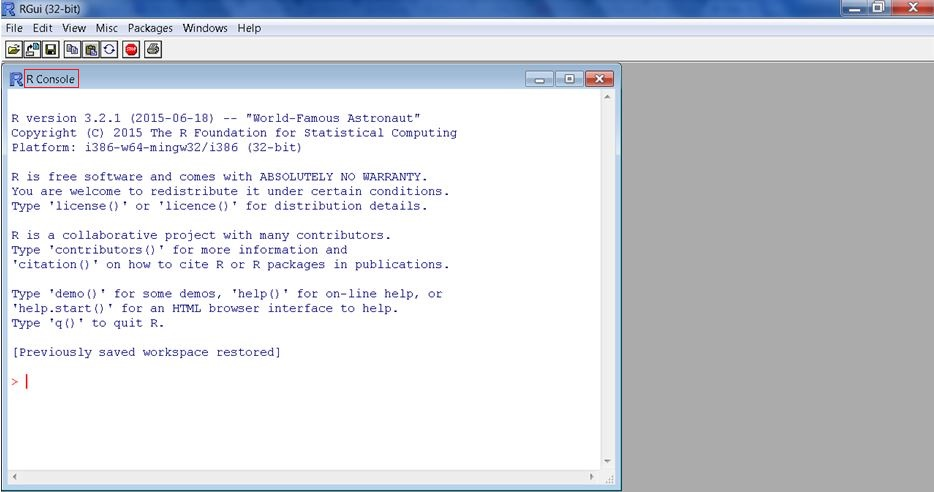

Session One: Getting to Know R and RStudio
================
Hellen Gakuruh
13 May 2016

-   [Session Goal](#session-goal)
-   [What we shall cover](#what-we-shall-cover)
-   [What is R?](#what-is-r)
    -   [Defining R and tracing it's history](#defining-r-and-tracing-its-history)
    -   [Downloading and Installation of Base R](#downloading-and-installation-of-base-r)
        -   [Downloading the executable program](#downloading-the-executable-program)
        -   [Installing Base R](#installingBaseR)
    -   [Tour of base R](#tour-of-base-r)
        -   [R at a glance](#RAtAGlance)
        -   [First interactive session on base R](#first-interactive-session-on-base-r)
        -   [R's other core windows](#rs-other-core-windows)
        -   [R's menu bar](#rs-menu-bar)
        -   [R remembers](#history)
        -   [R session](#Rsession)
    -   [Interactive Session (working with base R's console)](#RConsole)
        -   [Errors, Warnings and messages](#errors-warnings-and-messages)
-   [RStudio](#RStudio)
    -   [Downloading and Installing RStudio](#downloading-and-installing-rstudio)
    -   [Getting to know RStudio layout](#getting-to-know-rstudio-layout)
    -   [Working with RStudio's console](#RStudioConsole)
-   [Installing and Loading Packages](#packages)
    -   [Search Path](#searchPath)
    -   [Library](#library)
-   [Working directory](#workingDirectory)
    -   [Introduction to scripting (reproducible analysis)](#RScripting)
-   [Gauge yourself](#gaugeYourself)

Session Goal
------------

The main goal of this session is to facilitate you with the necessary tools and skills needed to begin working with `R` and `RStudio`.

What we shall cover
-------------------

By the end of this session you should:

-   know the difference between `R` and `RStudio`
-   have R and RStudio installed on your PC
-   have an understanding of what is meant by; `R session`, `workspace/global environment`, `working directory`, `errors`, `warning` and `messages`
-   be able to work interactively with both R and RStudio
-   be able to write reproducible scripts
-   know what packages are and where to get them
-   be conversant with R libraries and how to add them
-   be able to install and load a package

**Some Pointers on write-up**

Blocked content (with grey or white background and grey border) are called **R Chucks** which are R codes written similarly to writing on a [script](RScripts). The **\#** symbol indicates a comment usually used to give information about some line of code and **\#\#** indicates results or output of code which has been `run`.

If you are not totally new to R, how about skipping to the [Gauge yourself](#gaugeYourself) section and see what you need to brush up on.

What is R?
----------

### Defining R and tracing it's history

R is many things, if you have never used a statistical package or are new to data analysis and indeed statistical programming (for whom these tutorials are geared towards), begin by viewing R as a calculator that can perform numerous analysis. If you have been using other statistical packages more so using the 'drop-down-menu/click' method, view R as your tool for reproducible analysis (a growing concern in publications and evidence based programming in the development and humanitarian sectors).

More specifically, [R](%22(https://en.wikipedia.org/wiki/R_(programming_language))%22) is a statistical computing and graphics program. It is a dialect of **S** programming language developed by [Ross Ihaka](%22https://en.wikipedia.org/wiki/Ross_Ihaka%22) and [Robert Gentleman](%22https://en.wikipedia.org/wiki/Robert_Gentleman_(statistician)%22) in `1993`. It is partly named after these two leading founder's first names and partly in conformity to the "one-letter" names of other programming languages developed at the `Bell Laboratories` of which `S` is one of them. The two founders developed the program while teaching at Auckland University in New Zealand. Their main aim was to offer their students a free statistical program they could use during their statistical class.

R as an implementation of the S programming language has much of the S code but with subtle difference, like [lexical scoping](../Level%20Two/#Lexical%20Scoping) which we shall discuss in detail in level two.

Over the years, R has grown from the little known statistical programming language used by a few university students in Auckland, to a widely used program applicable not only in academia, but also in other industries. It is currently being maintained by `R's development core group`. [John Chambers](%22(https://en.wikipedia.org/wikin/John_Chambers_(statistician))%22), the founder of the S language is one of the core group members. Check out [this](%22http://r4stats.com/articles/popularity/%22) page for current ratings for most statistical programs.

With the growing interest in R, there have been other programs developed with R as its base. Most of these are known as `Intergrated Development Environment (IDE)` that essentially help analysts and programmers to code more efficiently (IDE's make R more user-friendly). The most widely used IDE's include [RStudio](%22https://www.rstudio.com/%22) and [Revolution Analystics](%22http://www.revolutionanalytics.com/%22). To distinguish R from the other programs, it is often called **base R** as it is the base for all the other programs. Just to clarify these two terms (`base` and `IDE`), you cannot have an IDE like RStudio without base R; base R is literally the foundation.

So in these tutorial series we shall refer to R as `base R` and we shall only work with `RStudio`, as it is suitable for an introductory session in R, it's also as free as base R (but there is a commercial version).

### Downloading and Installation of Base R

R is freely available for downloading from `Comprehensive R Archives Network (CRAN)`. CRAN is R's repository or a web server that stores identical and up to date version of its programs, codes and documentations.

#### Downloading the executable program

<p id="mirror">
Before downloading, you will need to select one of [CRAN's mirrors](%22https://cran.r-project.org/mirrors.html%22). A mirror as the name suggests is a reflection (copy) of the original. In this case, there are numerous CRAN mirrors located around the world (you can select the one that is closest to you). The main purpose of these mirrors is to reduce network overload to the main server located at [Institute for Statistics and Mathematics of WU (Wirtschaftsuniversität Wien), Austria](%22http://statmath.wu.ac.at/%22).
</p>
Once you have selected a mirror you will then need to select a version suitable for your operating system: Windows, Mac, and Linux. Click on "install R for the first time" and it should start to download the most current version of R.

#### Installing Base R

When downloading is complete, click on the executable program which should be at the status bar or your downloads folder, then click run. This should take you through the following installation windows:

-   The set-up language window where you choose the installation language you are most comfortable with.
-   A welcome screen detailing the R version being installed. It also requests that all other applications should be closed for the installation process
-   The license window which you can read before proceeding to the next installation window
-   A window to indicate where R will be installed, the default is usually fine but you can change it if you are conversant with program installation and access.
-   Next is a window to select the components to be installed. The first component should be selected as it contains core files. The next two depend on your system, but R should be able to detect it.
-   A start-up options window which you can either let R set or you can customize it. If you select to customize it, then you will get a window indicating the start up menu folder. Here you can choose the default to have it in the R folder or you can specify another location. You can also indicate that the start-up menu should not be created; however, it's best to choose the default.
-   Next, you will need to indicate additional tasks to be performed during setup like creating a desktop icon, quick launch and registry files. If you will be using R often, you can click on the desktop or the quick launch options, but make sure to check the [registry](../../Level%20Two/#Registry) option as it is vital in R; and with that, installation should begin.

I am currently working on a quick instructional [demo](../../Slides/Demo/1.Downloading%20and%20Installing%20R.html) on how to install R on a windows operating system, please keep checking the demo page.

### Tour of base R

Now that you have installed R, let's get to know it. First locate the installed program either from the desktop, on the start menu or if on `Windows` clicking `All Programs` and search for R. Once you have located it, click on the program to start it. The first screen you see would look like this:



#### R at a glance

The first thing you notice are two windows; the main one with a menu bar and with a grey background and another window which has only the minimize, maximize and close buttons (an embedded window).

The embedded window is called the `R Console` and it's R's interactive platform for issuing commands (functions) which instantly produces an output similar to that of a normal calculator (type in values with the necessary computations and you receive instant results). The console is best suited for computations or expressions that can fit in one line, something like addition, subtraction, multiplications, and divisions or any other simple computation. For multiple line computations like writing your own commands or functions, [scripts](#RScripting), are more suitable.

But before you get to type in your commands, there are a few (blue colored) introductory messages that give more information about the R version you have just installed; copyright issues; your computer's platform; warranty and conditions for use; R as a collaborative package; recommended citation and some start-up commands or functions.

Let's explore some of these commands as an introduction to R's console (interactive session) before we venture into the menu bar which discusses a number of issues to do with the console and other R windows. Commands are issued or typed right after the (red) blinking cursor (`>` on windows, although this can be changed with the `options` function).

#### First interactive session on base R

One of the commands given in the introductory message is about the names of R contributors. Since R is a free program, it is generally developed and maintained by volunteers, for this reason it would be good to see some of the good people who have given us such a wonderful program for free. To do so, type `contributors()` and don't forget the two parentheses `()` which indicate a command or a function call (as we shall soon learn).

``` r
## Type
contributors()
```

Hoping your first line of code worked. If it did, you should see a new window with some write-up on the contributors and a bit of history and inspiration that led to R's development. If you received an error, please check your spelling and case: `R is case sensitive` and any slight `misspelling` would not yield expected results.

So now we can say you have written your first command in R also known as `making a function call`: a great achievement. We will be discussing function calls in the [next session](SessionTwo_MakingFunctionCalls.html) but what you should know right now is that parenthesis in `R` indicate a function, therefore the name before the `()` is the name of the function you wish to use like `mean` is a name and it is a function because it is followed by `()`. We say `function call` when you use a function or what you might call a command in other programs, for example when we use the mean function `mean(c(2, 5, 6, 9, 3))` we have made a function call.

For our next function call, let's bring up the help documentation by typing `help.start()` (please note the `.` between the two words). If you typed it correctly, then you will see a window titled `Statistical Data analysis`, below it are four subheadings namely `manuals`, `references`, `miscellaneous materials` and `materials specific to your operating system`. The `help.start()` function is a great reference point and you should consult it frequently as you learn R. I strongly advice you read the manual on `Introduction to R` alongside this tutorial posts. Word of encouragement, most of the details might not be clear right now as you have really not had a go at R, but after a few sessions you will be able to appreciate the details in these documents).

Two final commands that might be useful at this very early stage are clearing the console and quitting R from the command line. Your console right now has quite bit of information (`introductory message`, `contributors()` and `help.start()`), if you would like a blank/clear screen to type on, press `control(Ctrl) and L` together if you are on windows and you should have a blank screen. Everything that was on the console should be cleared from the screen but not from history. R by default saves commands you issue and can be recovered from the [history file](#history). To quit R, one way is to use the command line by typing `q()` (try it and log in again).

With that, you have successfully experienced R and are ready to do more, but first, you need to acquaint yourself with two other windows. The first is what is called the `workspace` or the `global environment` and the `script window`.

#### R's other core windows

##### The Workspace/Global Environment Window

As you get to work with R, you will soon discover that everything entity in R is referred to as an `object`, from the data to the functions, to use any of this objects they need to be in an `environment` that R can access. This means for example that data has to imported into R as well as functions you have developed. These objects are usually temporary stored in what is called the **workspace** or **global environment**. In base R, the `workspace/global environment` is an invisible window whose content can be inspected by a call to `objects()`, or `ls()`. It is a temporary storage area for your objects and it is the first place R goes to look for objects during execution of functions.

Try calling either of these two functions (objects/ls), they should return `character(0)` meaning there is no object you have imported or created so far. Later once we have learnt [assignment operators](SessionFour_DataTypesandObjects.html) you will be able to see your objects with this these functions or remove them with `rm()`.

##### The script window

When working interactively on the console, you are literally issuing commands without saving them. You can recall a function using a history file but sometimes you would want to have all the code in one prose which you can rerun some sections or all of it. R (an indeed many other programming languages) offers something called a **script** which is a [text editor](../../Programming%20for%20Non-programmers/Other%20useful%20terms#texteditor) where you can write the commands/codes, this is usually written in a new window called "R Editor". A script written in this editor can be saved with a `.R` extension and can be retrieved later. Read more about scripting [below](#RScripting).

#### R's menu bar

Okay, let's go to the menu bar, where you will notice the following menu items; `File`, `Edit`, `View`, `Misc`, `Packages`, `Windows` and `Help`. Our aim here is not to dissect each of the menu item but rather have a basic knowledge as most will become relevant and clear once you start to work with R.

-   From the **file** menu item, several options are provided to begin working with R.
    -   The first, <u>"Source R Code"</u> is used to open an existing script that is saved as a source file. A source file is used to store related objects like functions or data. They can be called from another file/console in which case its contents are loaded on the `workspace`. Another way to access this file is by calling the `source()` function with the name of the file e.g. `myAnalysis.R`. added between the two parenthesis
    -   The next one offer's you the chance to start a <U>new script</U>,
    -   The third menu <u>"open script"</u> is more like the first, only that in this case the script is not a source file therefore its contents have to be run individually.
    -   You can also open a script by <u>Displaying files</u> which is different from `open script` as you open any file other that R scripts which end with `.R` extension
    -   Next you can <u>load or save a workspace or a history file</u>. A workspace as earlier mentioned is a temporal storage for your objects. This can be saved by calling the `save() or save.image()` functions or loaded with a call to `load()` function. History files can also be saved and loaded using `savehistory()` or `loadhistory()`. Within the parenthesis should be the `file name (including its extension ".Rdata" or ",Rhistory")`, if there is no file name given, R will save the files with only the extension on your working directory.
    -   You can also <u>change your directory</u>, a directory here means the `Working directory` which is a folder to be used to save files or has files for your [R session](#Rsession). It's important to always tell R what folder you will be using as it will source or store objects in that directory/folder. This folder can change as you work with different R assignments/tasks.
    -   Next is the <u>`print`</u> where you can send your file to be printed
    -   You can save console activity with <u>save to file</u>
    -   Finally you can <u>`exit`</u> R in which case you would be prompted to save you `workspace` and other unsaved files before exiting.
-   Next to the file is **Edit**, with most of it contents clear and only needs demonstration on how to use them. However, the last item GUI preferences might need a bit more discussion but let's do this a bit later when more ground work has been covered. It used to change setting of some of R's appearance, for now it is not important and the default is okay.
-   The **view** menu item can be used to specify if you what the toolbar and/or the status bar. Try checking and unchecking them and see.
-   The **Misc** are R commands for stopping computation, buffering (temporary storing on the disk for activities taking different time) an output, word completion, listing objects, removing all objects and checking R search paths.
-   The next item is the **"packages"** which we shall discuss in detail.
-   **Windows** just indicates how you would like the windows to be arranged. It works the same way as when you have multiple windows open and want them to be ordered in a certain way.
-   The last tool is the **help** menu which lists a number of ways one can get help. We shall be discussing this in details below.

#### R remembers

Every you do on the console or run from a script is temporary captured and stored by R. So if you do some computation or analysis, R will remember it and can retrieve it. For example,

``` r
# Compute the following:
1 + 5
## [1] 6
10 + 102
## [1] 112
```

Suppose you want to redo the computation, you can recall the computation with the "up" and "down" arrow keys and you can edit them as need be.

This is referred to as **history** and it is capture by R in **.Rhistory** file. On exit, by default this history file is saved in your working directory. This means that the next time you start R from that working directory the history file will be automatically loaded and you can recall any function used previously.

#### R session

Before winding up this brief tour of R, it's important to note one useful term that you will hear quite a bit of and that `R session`. A session in R begins when you start-up R and ends when you close the program; this is important to know as it has certain implications. For example, everything you do during an R session is recorded or documented in a history file which as noted earlier can easy be save or retrieved.

NB. All quite a bit of this might not be clear right now, but it will definitely become clear when you have defined some few variables or [objects](SessionFour_DataTypesandObjects.html#objects) or simply when you have started working with R both at the [console](#RConsole) (interactively) or on a [script](#RScripts).

Now let's wind this section with a bit of computation on the console.

### Interactive Session (working with base R's console)

On the console right after the blinking cursor (just as we did during our tour of R), perform the following simple arithmetic, something you would normally do on a calculator:

``` r
# Addition
2 + 5
## [1] 7
# Subtraction
4 - 10
## [1] -6
# Division
30/2
## [1] 15
# Multiplication
3 * 9
## [1] 27
```

Note that in this case, the mathematical operators are now functions that carry out the computation, otherwise you can call other R functions that do the same computation like `sum()` for addition or you can develop your own function (which we shall discuss in the second level).

Moving on, suppose we wanted to find even numbers or whether a number is divisible by another number. For example, what would you expect if you divided an even number with 2? Yes, indeed, you should get a whole number without any remainder or a point. An odd number would have a 0.5 remainder. Let's test this:

``` r
# Even Numbers
#-------------
2/2
## [1] 1
4/2
## [1] 2
6/2
## [1] 3
20/2
## [1] 10
100/2
## [1] 50
100000000000000000000000000/2 # An even long number produces an exponent
## [1] 5e+25


# Odd numbers
#------------
5/2
## [1] 2.5
35/2
## [1] 17.5
37/2
## [1] 18.5
```

We can use this same logic, to compute divisibility of any number by another. If by dividing we get a remainder, then the number is not divisible by the other number. If on the other hand we got a full number without any remainder, then the number is divisible by the other. Let's work it out on our new calculator (R console).

``` r
# Divisible numbers
#----------------
10/5
## [1] 2
100/20
## [1] 5
1700/17
## [1] 100


# Not divisible
#-------------
59/3
## [1] 19.66667
60/9
## [1] 6.666667
25/2
## [1] 12.5
70/3
## [1] 23.33333

# Try out other numbers
```

Now, that was good, but there is a way to quickly determine divisibility by using what is called **modulo**. Given two integers, modulo (indicated by two percentages **%%**) checks to see whether the integer on the left of it is divisible by the integer on the right. **Modulo returns the remainder of the division** such that if a number is divisible by another then we expect no remainder and therefore results to a zero.

For example, if we have 9 and 3, we could use modulo like this, **9%%3**. In this case we are asking **is 9 divisible by three?**. So, if 9 is divisible by 3 then we expect a zero meaning there was nothing that remained after the division but if it were not the case, then we would expect to get the remainder of the division.

``` r
9 %% 3
## [1] 0
```

In Mathematics, for our example, 9 is referred to as the **dividend** and 3 as the **divisor**. If we had **9%%2** we expect a remainder of 1 where 9 is the dividend and 2 the divisor. When you divide 9 by 2 you get 4 and a remainder of one resulting in 4.5. In this case, the number 4 is referred to as the **quotient** and 1 the **remainder**. There is a whole discussion on this topic; but here I am merely introducing you to the concept which you could use in your programming.

Now let's test it:

``` r
9 %% 3
## [1] 0

15 %% 7; 15/7
## [1] 1
## [1] 2.142857

# How about long numbers (at least one that you cannot figure out)
69294797 %% 8 # It says the remainder is 5
## [1] 5

# Let's confirm this
69294797/8 # Opps, we have a whole number, what is R up to?
## [1] 8661850

# R has default number of digits it can print, if your output exceed it like ours, then R will round it off to its default digit (in my case it is 7). To see your default:
getOption("digits")
## [1] 7
# and to change it
options(digits = 9)
# Now let's rerun our command
69294797/8 # we have our remainder (though not exactly 5 -- discussion for another session)
## [1] 8661849.62
```

Now, let's briefly compute the mean (a measure of a data's centrality) and see the number of ways we can do it.

What is the average of the following numbers?

            * 2, 5, 9, 3
            * 5, 8, 10, 100

There are two ways you can do this (at least for a small amount of data), the first entails adding the values and then dividing with their totals just like a calculator, or the r way by using the **mean function**.

``` r
#The calculator way
(2 + 5 + 9 + 3)/4
## [1] 4.75

#The R way
mean(c(2, 5, 9, 3))
## [1] 4.75
```

Notice that R's way is simpler and can handle many numbers. But we had to enclose the numbers in parenthesis with a letter `c` at the front. `c` is a function that means `combine` (the values). We shall discuss this concept further during the [vectorisation](SessionFour_DataTypesandObjects.html#vectorisation) session but for now, use `c(your values here)` whenever you want to compute the mean of some values.

I encourage you to get hold of some useful (numerical) data like the ages of your colleges or friends, class scores, hair/eye color in your area or some budget data and compute their average on the console. That should give you a good start to interacting with R.

At this point you have been able to make some few function calls, at least commands R understands and can get you results. Question is, what if R does not understand what you are asking? Or what if R does not have the information needed? Or there are either problems or other execution information. These are typical issues in any analytical program and there are ways of dealing with them. In R, you would most often receive an `error` a `warning` or a `message`. Let's look at these terms as they would become quite frequent especially at this early stage.

#### Errors, Warnings and messages

##### Errors

Suppose you asked R to do something with a function that does not exist; like get an average of some data but you misspell the function name by typing `means()` instead of `mean()`. What do you think would happen?

``` r
means()
```

R would go looking for what you have typed (means) and not what you meant (mean), so unless there is another function by that name, R would not find what you sent it out to get. When this happens R would **throw and error** that it could not find the function.

``` r
means()
#Error: could not find function "means"
```

An error therefore appears when R cannot find what you have asked it to get. Visualize it this way, you type in a command and hit enter; R then gets hold of your command and goes on a search for the description of the command or the actions the command should do (later on, you will learn Rs [search path](#searchpath)). This search begins from your [workspace](#workspace) followed by other areas called [enclosing environments](../../Level%20Two/#environments), the last of these environments being **Base R**. If the command is not found there, it hits the **empty environment** where no object exists and therefore sends you the error: R does the same thing when looking for data.

Note R literally `stops` the execution of the command and then sends you the error message: it's a `failure to launch` scenario.

##### Warnings

What if you gave R a command it can find, but in this case you have used it incorrectly or there is a more effective command or simply put, there are potential problems with your function call. R would execute the command but issue a `warning message` indicating execution problems faced.

Key point here is that R will execute the function subject to the identified problems which it will detail as warning messages. For example, when you what to use an integer (as opposed to a numeric value), you have to tell R the value is an integer by using the letter **L** after the value. If you mistakenly add a decimal point before the letter L, then you will get a warning message.

``` r
# Unnessary use of a decimal point 
1.L 
## [1] 1
## Warning message:
## integer literal 1.L contains unnecessary decimal point

# Otherwise it should have been
1L
```

##### Messages

Messages are informative statements given with R output/results. They usually give information on how execution was performed and these do not signal a problem just procedures used in the execution.

For example, if there are missing values or method in a call, `R` can execute the function but issue a message indicating what value or method was used.

RStudio
-------

R Studio is a more user friendly version of R, and one of R's growing [Integrated Development Environment(IDE)'s](../../Programming%20for%20Non-programmers/Other%20useful%20terms#IDE). It includes a console, syntax-highlighting editor that supports direct code execution, as well as tools for plotting, history, debugging and workspace management "<https://www.rstudio.com/products/rstudio/>".

Note we will be using RStudio for the rest of these tutorial series.

### Downloading and Installing RStudio

To download the latest version of the program, go to [RStudio](%22https://www.rstudio.com/products/rstudio/download/%22) and select a program suitable for your computer's specification.

There is an open source and a commercial version running on Windows, Mac, or Linux. You can also get the desktop version of Rstudio or Server version. Read more on the differences and varieties of Rstudio [here](%22https://www.rstudio.com/products/rstudio/%22).

Keep checking [this page](../../Slides/Demos/Downloading_and_Installing_Rstudio.html) for an upcoming demo showing the step by step process of downloading and installing Rstudio.

### Getting to know RStudio layout

Once you have installed the program and clicked to start it, you will immediately notice four windows called panes. Let's begin with one pane you are now familiar with; the console (usually located at the bottom left, though it can be in any side).


You can start using it just as you did with `base R's` console and see if you can get the same results.

Right above the console is the `script pane` which is a scripting [window](#scriptingWindow). If you can not see it, start a new script by clicking on `files`, then `New File`. For now select the first file type, R script, we shall discuss the other types of files during reproducible analysis session.


On the top right side, is a window with two tabs, the first tab is called the `environment` and it is basically the [workspace](#workspace) we discussed earlier. Next tab is the [history](#history) window which captures commands and variables created during a session. These two tabs play an important role in storage and retrieval of your data and functions.

Below the workspace is a pane with five tabs. The first is the `files tab` which shows you the folders and files in the working directory. Next to it is the `plotting window` where graphs are displayed. The `packages tab` follows and shows the packages/R extensions that are currently available on your system. Following the packages tab is the `help tab` where R's help documentation is shown. Finally is the `viewer pane`, it is used to extend Rstudio to view internet local content more so related to applications such as `Shiny` which we will briefly mention later.

Now with that quick tour of R Studio and since it shall be our learning platform, we shall not go into further details as we shall **learn on the go**.

### Working with RStudio's console

R Studio's console is exactly like that of base R. To prove this, try and rework the exercises done on base R.

Installing and Loading Packages
-------------------------------

A package is like a folder that contains grouped functions and/or data, this is what `base R` uses to store its functions and data. Read more about the packages that come with `base R` from the \[FAQ\] (<http://cran.r-project.org/doc/FAQ/R-FAQ.html#R-Add_002dOn-Packages>). Some of these packages form the core functions in R and others are recommended. You can also find information on all installed packages using the function **installed.packages()**. If you have more than one [library](#library) you can specify a particular library by adding it's path e.g. **installed.packages(lib.loc = .libPaths()\[1\])**.

In addition to the packages that come with base R, there are numerous other packages available from [CRAN](https://cran.r-project.org/web/packages/). These are packages with functions and data contributed by other R users: This is one of R's distinguishing features - its extensibility. Anyone even you can add a package to R's repository, as long as they are well coded.

When you start R, not all of the packages are available for use. The basic reason for this is to make R efficient in terms of memory usage and search. The packages that are automatically loaded are:

``` r
loadedNamespaces()
##  [1] "magrittr"  "formatR"   "graphics"  "tools"     "htmltools"
##  [6] "utils"     "yaml"      "grDevices" "stats"     "datasets" 
## [11] "stringi"   "rmarkdown" "knitr"     "methods"   "stringr"  
## [16] "digest"    "base"      "evaluate"
```

These are the core functions needed to make R operational. If you need to use any of the other unloaded base R packages, you need to tell R to make them available by using the function `library`. For example, you might want to do parallel computation for efficiency purposes; in R this can be achieved using the package `parallel`. Since it is one R's packages but has not been loaded, we can tell R to load it using the `library` function.

``` r
library(parallel)
```

Now let's see if it is listed in the loaded packages.

``` r
loadedNamespaces()
##  [1] "magrittr"  "formatR"   "graphics"  "parallel"  "tools"    
##  [6] "htmltools" "utils"     "yaml"      "grDevices" "stats"    
## [11] "datasets"  "stringi"   "rmarkdown" "knitr"     "methods"  
## [16] "stringr"   "digest"    "base"      "evaluate"
```

The parallel package has been made available and can now be used. To read more about this package, make the following function call `help(package = parallel)`.

If you need any of the contributed packages available on [CRAN's](https://cran.r-project.org/web/packages/) website, you will first need to install the package.

There are two ways of installing a package on either base R or RStudio, these are, graphical user interface (GUI) and the command line.

**GUI Approach**

-   From `base R`, go to the `Package` tab then `Install package(s)...`. You will then be prompted to select a [mirror](#mirror). Once that is done, you will be presented with a list of all packages, finish by selecting the desired package. Installation should begin immediately.
-   From RStudio, go to the `Packages` tab located in the lower right pane then click the `Install` icon. A dialogue box should open for you to specify the package needed but you will need to indicate the repository first. In addition to `CRAN` there are other R repositories like [Bioconductor](https://www.bioconductor.org/) and \[Omegahat\] (<http://www.omegahat.org/>). In this tutorial, we shall only deal with `CRAN`, but feel free to explore the other repositories.

**Command line approach**

From the command line, that is the code, you can download a package using the function `install.packages()` specifying the name of the package inside the parenthesis with quotation marks.

Before installing any package, let's look at two issues that are related to loading and installation of packages, these are R search path and libraries.

#### Search Path

Earlier on we briefly mentioned R's process of locating functions and data. Here let's discuss it some more. The first question is what is a `search path`? A search path is a sequence of locations that R follows as it "looks" for an [object](SessionFour_DataTypesandObjects.html#objects).

The next question is what is an object? Although we shall discuss this later, there is no harm knowing that everything in R is an object, from the commands or functions used to the data and the output generated; packages are also objects. If an object is not on R's search path, then R will throw and [error](#errors) because it could not find it. Therefore, for one to use a package they need to "put" it on the search path by loading it. Loaded packages come second after the workspace/global environment. They comprise of the default packages already mentioned and any other loaded package. The `search()` function is used to determining the `current` search path.

``` r
# Current search path 
search()
##[1] ".GlobalEnv"       "package:parallel   "tools:rstudio"  "package:stats"
##[5] "package:graphics"  "package:grDevices" "package:utils""package:datasets" ##[9] "package:methods"   "Autoloads" "package:base"
```

Notice that the parallel package is on the search path right after the global environment and right before the other packages? Now any function or data in any of these locations is available for use.

To make the package `parallel` available, we used the function `library()`, lets discuss that as you will frequently use it.

#### Library

A library is a directory containing installed packages. Initially, there is only one library located at C:/PROGRA<sub>1/R/R-32</sub>1.5/library. However, this location might become unwritable in which case R might suggest you create another library. You can also create additional libraries using the `.libPaths()` function. This function can also be used to list the current libraries.

For example, we can create a new folder/directory and tell R to include it in its list of libraries.

``` r
# The current libraries
.libPaths()
## [1] "C:/Program Files/R/R-3.2.2/library"

# Create a new directory in R
dir.create("R/win-library/3.2")
# Create the new library
.libPaths("R/win-library/3.2")

# Confirm the new library is created
.libPaths()
## [1] "C:/Users/Hellen Gakuruh/Documents/R/win-library/3.2"
## [2] "C:/Program Files/R/R-3.2.2/library" 
```

So now every time you install or load a package and you have more than one library, you can specify the library to use with the `lib` and `lib.loc` arguments. If this is not specified, then, R will automatically use the first library on the `.libPaths()`.

Quite often with additional library(s), you might not know where a certain package is or which library has the package. In this case use the `dir()` function which lists files in a given directory.

``` r
# Listing packages in the new library directory
dir(.libPaths()[1])
##  [1] "acepack"         "assertthat"      "base64enc"      
##  [4] "BH"              "bitops"          "caTools"        
##  [7] "coin"            "colorspace"      "curl"           
## [10] "DBI"             "DescTools"       "devtools"       
## [13] "dichromat"       "digest"          "evaluate"       
## [16] "file2dc17b843ef" "file2dc6c224780" "formatR"        
## [19] "Formula"         "ggplot2"         "git2r"          
## [22] "gridExtra"       "gtable"          "haven"          
## [25] "highr"           "Hmisc"           "htmltools"      
## [28] "httr"            "installr"        "jsonlite"       
## [31] "knitr"           "labeling"        "latticeExtra"   
## [34] "lazyeval"        "lme4"            "magrittr"       
## [37] "manipulate"      "markdown"        "memoise"        
## [40] "mgcv"            "mime"            "minqa"          
## [43] "modeltools"      "multcomp"        "munsell"        
## [46] "mvtnorm"         "nlme"            "nloptr"         
## [49] "nnet"            "openssl"         "packrat"        
## [52] "PKI"             "plyr"            "pryr"           
## [55] "pryr_0.1.2.zip"  "R6"              "RColorBrewer"   
## [58] "Rcpp"            "Rcpp_0.12.3"     "Rcpp_0.12.3.zip"
## [61] "RcppEigen"       "RCurl"           "reshape2"       
## [64] "RJSONIO"         "rmarkdown"       "rsconnect"      
## [67] "rstudioapi"      "sandwich"        "scales"         
## [70] "sjmisc"          "stringdist"      "stringi"        
## [73] "stringr"         "TH.data"         "tidyr"          
## [76] "whisker"         "withr"           "xlsx"           
## [79] "xlsxjars"        "yaml"            "zoo"
```

If you are wondering about the `[1]` after the `.libPaths()` function, it simply means *get the first result from the output of `.libPaths`*. This is a way of subsetting and we shall be discussing later.

A little word of advice, the more you practice and use R, the more you will use add-on packages and most often than not, some of these packages will only be used once. To avoid loading your computer with numerous unused packages, consider installing them in a temporary directory. You need not create this folder as R starts one for every session and uses it to temporary store objects for the session. You can use this directory by calling on the `tempdir()` function.

Okay, now let's practically apply these concepts by installing two packages. The first is a [web scrapping](../../Programming%20for%20Non-programmers/Other%20useful%20terms.html#web.scrapping) package known as `rvest` and the other is a graphing package known as `ggplot2`. Let's assume that we need `rvest` for only one session, but we will use `ggplot2` frequently to plot graphs. Therefore, we will install `rvest` in a temporary directory and `ggplot2` in the newly created library.

``` r
# Installing "rvest" to a temporary folder
install.packages("rvest", lib = tempdir())
```

Note, if you restart R, then the installation disappears and you will need to re-install the package.

``` r
# Installing a required package
install.packages("Rcpp")
# Installing "ggplot2" to one of the libraries
install.packages("ggplot2", lib = .libPaths()[1]) #or install.packages("ggplot2")
```

It would be useful for you to note that some packages come with other packages referred to as [Imports](../../Programming%20for%20Non-programmers/Other%20useful%20terms.html#Imports.Packages). There are also those packages that package [depends](../../Programming%20for%20Non-programmers/Other%20useful%20terms.html#Dependecies) on and other packages it [suggests](../../Programming%20for%20Non-programmers/Other%20useful%20terms.html#Suggests). Always read the package's documentation using `help(package = "name")`to know more about the package. An example is `help(package = "rvest", lib.loc = temp())`.

Now that the two packages are installed, they are still not yet on R's search path. If you tried calling a function in one of these installed but unloaded packages you will receive an [error](#error).

``` r
# Calling a function from the installed "ggplot2" package which is not loaded
ggplot(x, aes(a, b)) + geom_point()
# Error: could not find function "ggplot"

search()
[1] ".GlobalEnv"        "package:parallel"  "tools:rstudio" "package:stats"    
[5] "package:graphics"  "package:grDevices" "package:utils" "package:datasets" 
[9] "package:methods"   "Autoloads"         "package:base"
```

To make them accessible to R, they need to be loaded by using the `library()` function. For the `rvest` package, remember to specify the library location, otherwise R would return a "not found" message.

``` r
# Loading rvest without specifying the library location
library(rvest)
##Error in library(rvest) : there is no package called 'rvest'

# First loading a depency that was installed in the same temp directory
library(xml2, lib.loc = tempdir()) 
# Now loading rvest by including the library location
library(rvest, lib.loc = tempdir())
```

``` r
library(ggplot2, lib.loc = .libPaths()[1])
# Checking that they are loaded
search()
##  [1] ".GlobalEnv"        "package:ggplot2"   "package:parallel" 
##  [4] "package:knitr"     "package:stats"     "package:graphics" 
##  [7] "package:grDevices" "package:utils"     "package:datasets" 
## [10] "package:methods"   "Autoloads"         "package:base"
```

For practice, install and load a package called [swirl](http://swirlstats.com/). `Swirl` is an interactive learning platform that uses the console to teach a number of R topics. I highly recommend you start learning from swirl as soon as you are done with level 1, it will strengthen what we have discussed in preparation for level 2.

Working directory
-----------------

The working directory is a folder in your computer used to store all the files used or created during an [R session](#Rsession). They help to organize your work and avoid scattering documents and programs.

For example, if you were working on different projects or tasks, like analyzing a survey at work, completing a schools assignment, or doing your household budget, then each one of these projects would have its own folder and any one of them would be your working directory whenever you are working on it. Therefore, your working directory will change depending on what project you are working on and it is best to tell R your working directory each time you start a new R session or switch projects or tasks.

There are two ways to tell R your working directory. Using the command line and using graphical user interface (GUI).

**Using GUI:**

-   On Rstudio, go to the `Session` tab and select `Set Working Directory`. There are three possible locations: `to source file location`, `to files pane` and to `choose directory`. The first location will set the working directory to the folder containing the R script, the next location will set the working directory to the files pane location which is your home directory. Lastly you can use the `choose directory` location to select the folder to be used.
-   On base R, go to `file`, then `Change Dir...`, this should open a window where you can select the needed folder.

**Using the command line (console):**

First establish the full [path](../../Programming%20for%20Non-programmers/Other%20useful%20terms.html#path) to your working directory. Then input that path to the `setwd()` (set working directory) function.

But before setting the working directory, it is useful to find out your current working directory so you can know how to move to the new working directory. To do this, use the `getwd()`(get the working directory) function.

``` r
# The current working directory
getwd()
##"C:/Users/Hellen Gakuruh/Documents"
```

My current working directory is the home directory often denoted by a `~` (tilder) but we want to make the tutorial's folder to be the working directory. The folder is called `"Data_Mgt_Analysis_and_Graphics_R"` and is located within another folder called `"Data Mania Inc"` in my home directory `("~/Data Mania Inc/Data_Mgt_Analysis_and_Graphics_R")`.

``` r
setwd("./Data Mania Inc/Data_Mgt_Analysis_and_Graphics_R")
```

The easiest method in setting a working directory is using the GUI.

### Introduction to scripting (reproducible analysis)

So far we have been using the console to produce instant outputs. This method of analysis is quick and easy when doing single line computation but it is not ideal when you are doing multiple analysis that have more than one line of code. In addition, you might find it challenging later to reproduce the analysis (something that is gaining a lot of importance in publications). A good solution to this is working with scripts which are text files similar to notepad but programmed with syntax detection.

The script is used to type commands (functions and expressions) just as you would on the console. The difference is that on the script, the codes do not generate instant output; one must use the `run` command to execute them.

In addition to re-usability, another advantage of using the script rather than the console is the ability to add short descriptions or explanations of the code using `comments`. Comments help to understand the code for your future self. It also guides any other interested person to understand your code. Comments start with hash tags or the pond sign *\#* and any time R comes across it, it will disregard everything after it.

Since we have not covered [data object creation](SessionFour_DataTypesandObjects.html#vectorisation), we will create a short script generating our data on the fly and doing some bit of analysis on it. Basically, the script should be self explanatory given the comments used.

First open a new script (if none is opened), then type in the commands below. To get their output, either highlight the whole script or a section or your can place the cursor anywhere within the line of code you want executed and click the `run` icon. You can use you keyboard to run your code by pressing `ctrl+enter` (windows).

``` r
# Combining the data elements
c(2, 5, 9, 3)
# Computing the sum
sum(c(2, 5, 9, 3))
# Getting the total number of elements in the dataset
length(c(2, 5, 9, 3))
# One way of computing the mean
sum(c(2, 5, 9, 3))/length(c(2, 5, 9, 3))
# Another way of computing the mean
mean(c(2, 5, 9, 3))
# Computing the median
median(c(2, 5, 9, 3))
# Conclusion: The median gives a better description of the average for this dataset 
```

To save your script, go to the `file` tab and select `Save As`, the script will be saved with `.R` extension.

Gauge yourself
--------------

**Do you have the expected tools and skills from this session?**

1.  Where can you download **base R**?
2.  How many windows does default **R** start-up have?
3.  What is a console?
4.  What do these **()** mean?
5.  How can you clear the console?
6.  What is a script and why would you use it?
7.  What is **RStudio** and how does it differ from **R**
8.  True or False, **RStudio** can be downloaded from CRAN
9.  How many panes does default **RStudio** have?
10. What is your understanding of the following terms
    1.  Mirrors
    2.  Workspace/Global Environment
    3.  R session
    4.  Working directory
    5.  Search path
    6.  Error
    7.  Warning
    8.  Message

11. What are packages
12. How can you determine the installed packages in any library?
13. Which of the pre-installed packages are on the search path?
14. What is meant by a library?
15. How can you install a package
16. Are installed packages ready for use?

**You are ready for the second session if you know these**

1.  You can download **base R** from [One of CRAN's mirrors](%22https://cran.r-project.org/mirrors.html%22)
2.  Default base R has 2 windows, the main window and an embedded R console
3.  A console is an interactive platform for data analysis
4.  Parenthesis **()** signify a function call
5.  On windows **clr+L** will clear the console
6.  A script is a text editor for writing code. It's useful for multiple line of code and it's reproducibility (re-usability) ability
7.  **RStudio** is an Integrated Development Environment (IDE) which makes coding in R much easy. It differs from **base R** in the sense that it is only functional when **base R** is installed, base R is it's foundation
8.  False, the best way to download **RStudio** is from [RStudios website](%22https://www.rstudio.com/products/rstudio/download/%22)
9.  Default **RStudio** has four panes each having multiple tabs
10. Understanding of terms
    1.  A **mirror** a copy of an original used to reduce network overload to the main server
    2.  A **workspace** or global environment is a temporary storage environment
    3.  **R session** begin when you start R and ends when you close the program
    4.  A **working directory** is a folder in the computer with documents used or saved during an R session
    5.  A **search path** is a sequence of location **R** goes through to locate an object. It begins from the workspace and ends at the empty environment
    6.  An **error** occurs when R cannot locate an object. Execution of the command is halted and no results are given only the error message; R simply cannot execute the function
    7.  **Warning** is issued to document potential problems which are numerous like using the wrong statistical method say chi-square for expected values less than five or invalid input say `1.L` instead of `1L` for integers. These messages are not fatal and R will execute the command but issue the warning message detailing problem in execution
    8.  **Messages** are used to give more information on how an execution was performed, they do not signal a problem. For example, they can be issued to show what method or value was used when if it not included in a call

11. **Packages** are collection of functions and data bundled together to enable certain operations like specialized analysis or performance
12. You can determine installed packages using the **installed.packages()** function. You can also specify a library **installed.packages(lib.loc = .Library)**
13. Packages on the search path can be determined with **loadedNamespaces()**
14. A **library** is a directory containing installed packages. The default library can be accessed with **.Library**. You can add other libraries with **.libPaths()**
15. Packages are installed either through graphical user interface (GUI) or with the function **install.packages()**. The package name is included between the parenthesis in quotation marks e.g. **install.packages("ggplot2")**
16. No, installed packages need to be loaded with the function **library()**, this time the name of the package is not quoted e.g. **library(ggplot2)**

**Something Exra for you to find out on your own (not in notes)**

1.  What do double quotation marks mean and do they differ from single quotation marks. Also find out when they are used. Tip read *?Qoutes*
