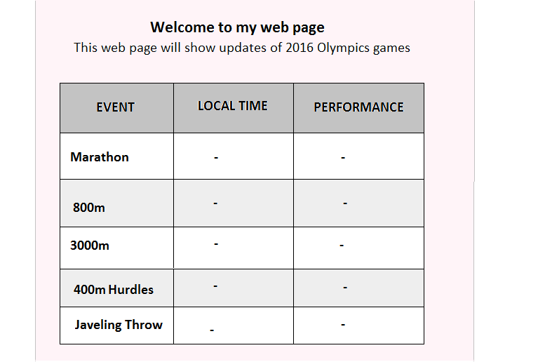
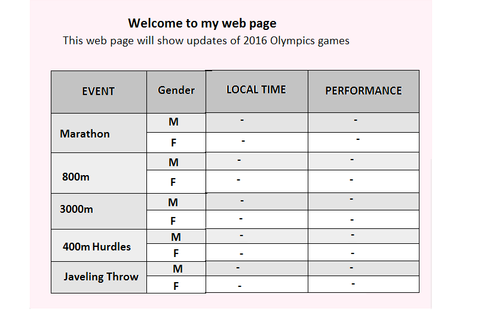

```{r globalOptions, echo=FALSE}
library(knitr)
opts_chunk$set(
  collapse =  TRUE,
  dev = "png",
  warning = FALSE,
  message = FALSE,
  fig.path = "figures/"
)
```

## Session Goal
  
The main goal of this session is to apply lessons learnt in level one.

## What we shall cover

By the end of this session you should:

* Know how to define coding problems
* Where to get help and 
* How to get help


## Prerequisite

To appreciate this session, you must have gone through all the sessions in level one.

## Introduction

So far we have covered the core of R, in this session we want to bring everything we have learnt together. We will do this through case studies which will take us through a number of everyday scenerios where R can be a handy tool.

This session is meant to be dynamic as it will start off with one case study and subsequent case studies will be added given your suggestions. It is therefore hoped that you will propose additional scenerios we can explore.

### Faster, Higher, Stronger: Let's cheer Rio (Olympics) 2016

As our first case study, we want to prepare for Olympics (2016) which as of writting this text is just a few days to go. In this regard we want to get some information on past and planned games. More specifically we want to:  

* Reproduce Olympics flag (as practice on colors and plotting)
* Get information when and where Olympics have been held (year, country and city)
* Number of Olympics events held before 2016 games 
* List of participating countries

Further to this we want to draw focus to one country, you can pick any of the participating countries, here we will focus on Kenya, given its historical interest and performance in athletics. Specifically, we will look at some of the events it's known to shine: 

* 800m for both male and female 
* Marathon

We will conclude by noting 2016 fixtures in terms o:

* timings of events of interest
* Kenya's 2016 athletics team and their scheduled events

#### Sourcing data

Internet has become one of the major data sources in today's technological world. Based on this fact, it is vital for us to be well acquinted with online data extraction or what is referred to as web scraping.

In our case we have a number of issues we seek to address, hence we will begin with a simple google search on each of these issues, and then import relevant data into R. To accomplish our task, we will use "rvest" a web scraping package. Rvest is useful for extracting certain parts of a web page like say a table or a paragraph, however, actual downloading of data is done by another package called "xml2" which rvest depends on. 

What distiguished online data importation from other sources is that web data (content of interest) comes annotated with additional text and characters commonly referred to as "markup". There are several markup languages used to develop web pages, some of these are XML (extensible markup language), HTML (hypertext markup language) and XHTML (extensible hypertext markup language). Of these three, HTML is the most common web language which means most of the data we import will be written in HTML. For this reason we will discuss web scraping in relation to HTML documents although the concepts we shall discuss can easily be extended to XML and XHTML documents.

Rvest with the help of xml2 make data importation easy, but only if we know what we want. What we see on a web page is not exactly what we import due to annotations which provide a web document's structure and appearance. Therefore to extract a section of a web document would require us to know these annotations which will give us guidance on how to extract required content (text, tables, figures, images and the like). With this, let's discuss how to read HTML documents.  

##### Reading HTML documents

###### Basic HTML

To read and comprehend HTML data, we must understand four core terms, these are "tags", "attributes", "content", "elements", and "nodes". The first three terms (tags, attributes and content) are the building blocks of HTML; they form a web page's structure.  But before discussing these terms it worth noting all web documents begin with declaration of doumen type. This declaration is an instruction to a web browser indicating web language used and its version. For HTML, this instruction is written in between "<!" and ">", for example HTML5 is "<!DOCTYPE html>". Declaring document type means a web browser can expect given version of HTML, this is important because different versions have different objects, hence some objects would be valid in one version but invalid in other versions.

###### HTML Tags 

Tags provide information about a particular section/content of a web page, this is what makes HTML a markup language (annotating content with descriptions). Tags are enclosed in angle brackets i.e. "<tagname>" and usually come in a pair of opening and closing tags. HTML has predefined tag names unlike "xml" which relies on definitions from a web developer/author. 

To understand the concept of tags, lets look at some tags frequently used in most HTML documents and conclude with a snipped version of "xml" tags just to get informed on how they look like incase you come across them when extracting online data.

**Core Tags**

There are two important tags each HTML document should have, these are:

* <html> and
* <body>

**<html> tag**

<html> is the second tag/code in any HTML document after document declaration <!DOCTYPE html> (note, "<!DOCTYPE html>" is **not** a tag). <html> tag indicates begining or root of a HTML source document. 

**<body> tag**

This indicates begining of the visible content (what you see on web page). <body> tag is nested in <html> tag.

```
1 <!DOCTYPE html>
2 <html>
3   <body>
4     visible content
5   </body>
6 </html>
```

In the HTML code above, line 1 declares html version which is HTML5, line 2 indicates starting point of a HTML document, line 3 begins the visible section, line 5 closes the visible section (body tag) and line 6 indicates end of html document.

Take note of indentation (recommended as two spaces), it indicates nested tags and shows relationship between tags. 

**<head>**

<head> tag is often added before <body> tag to provide information about the document, a web page can still be operational without this tag though not recommended as some information about web page is necessary. Information included in this tag are in the form of nested tags, they include;

* "<title>" - an important tag required in a HTML document,
* "<script>" tag for adding code that changes a users web page depending on input (mostly for making HTML dynamic),
* <style> tag used to add [internal styling sheets](#stylingSheets),
* "<base>" tag gives full url link for relative links mentioned in the document. A relative link is a web address that does not start at the root address or domain name like "http/https" but rather its file name like "sessionTen.html"" or file path like "dataManiaInc/sessionTen.html".  
* "<link>" tag is used add [external styling sheets](#stylingSheets). Note, this tag has no closing tag although in strict HTML versions a backslash is added before ">".
* <noscript> tag is used to provide alternative text for browsers that do not support scripts like JavaScripts
* <meta> tag provides metadata (information about data) like character encoding, page description, keywords (used by search engines), document author, and modification status. There could be more than one meta tag in a documents head tag.  

We can add a <head> tag to our earlier HTML code like this:

```
1 <!DOCTYPE html>
2 <html>
3   <head>
4     <title>My Olympics 2016 Web Update Page</title>
5     <style>
6       body { 
7         height:500px;
8       }
9     </style>
10    <base href="https://www.datamaniainc.org">
11    <meta name="keywords" content="Olympics 2016, Olympics update">
12    <meta name="author" content="Hellen Gakuruh"/>
13  </head>
14  <body>
15    Web Page Content 
16  </body>
17 </html>
```

<head> tag nests five other tags; title, style, base, and two meta tags. Title tag in line number 4 gives the title of the web page, style tag from line number 5 to line number 8 specifies height of the web page, base gives absolute path for relative urls used in the document and the two meta tags give details on key words to be used by search engines and name of web page autor. Note, unlike <body>, everything in the head tag is invisible; it is not seen on the web page, however it can affect the web page like making it dynamic when scripts are added.

\* If you are interested in visualing this HTML code, download one of the free source code/text editors like [notepad++](https://notepad-plus-plus.org) and enter our HTML code. Notepad++ is quite similar to "R's" script/text editor only that it works with many programming language like HTML and even R, hence it should be faily easy to use. However, if you need a bit of a boost in using it, google search tutorials on notepad++ which should give a number of tutorials including youtube channeles. I found [this](http://www.dreamincode.net/forums/topic/202504-notepad-and-beginning-html/) site good for beginners and discusses notepad++ usage in introduction to HTML.  

**Within <body> tag (visible part of a web page)**

**Heading**

Heading on a web page are added with <h1> through <h6> header tags. <h1> tag indicates top level header, <2> indicates second level headers, <h3> indicates third level header, <h4> indicates fourth level header, <h5> indicates fifth header and <h6> indicates sixth level header. <h1> through to <h6> are opening tag, they are closed with tags similar their opening except that closing tags are preceeded (before tag name) with a forward slash "/". In between opening and closing tags is the **visible content** for which the tag describes. For example we can add a heading "Welcome to our web page" with a <h1> tag and close it with </h1>.

```
<h1>Welcome to my web page</h1>
```

**Paragraphs**

Paragraphs are added with the <p> opening tag and </p> closing tag.

```
<p>This web page will provide updates of my favourite Olympics 2016 events</p>
```

**Lists**

To make an ordered list, for instance athletics events of interest, we use "<ol>" (ordered list) tag as a section divider (indicating starting of an ordered list) and nest <li> (list item) tags for each list item. 

This list,

1. Marathon
1. 800m
1. 3000m steeplechase
1. 400m hurdles
1. Javeling throw

 can be written in html as:

```
<ol>
  <li>Marathon</li>
  <li>800m</li>
  <li>3000m steeplechase</li>
  <li>400m hurdles</li>
  <li>Javeling throw</li>
</ol>
```

If we wanted an unordered list instead of an ordered list we use "<ul>" (unordered list) tags as section dividers and "<li>" tags for list items.

Our HTML code will be:

```
<ul>
  <li>Marathon</li>
  <li>800m</li>
  <li>3000m steeplechase</li>
  <li>400mhurdles</li>
  <li>Javeling throw</li>
</ul>
```

Which results in this unordered/bulleted list:

* Marathon
* 800m
* 3000m steeplechase
* 400mhurdles
* Javeling throw

**HTML Comments**

Like "R", HTML allows and encourages use of comments to annotate code, they are usually in the form "<!-- Comment -->" (note the "!" at the begining). Therefore when reading HTML data we would expect to see a number of comments which provide useful information but are usually not of interest in terms of data importation.

**Division and Table tags**

Other commonly used HTML tags are "<div>" and "<table>". <div> (division/section) tag demarcates different sections in a web page, for example figures, images, tables, lists and text. These tags are important as they are used to set a web page's layout and apperance.

<table> tags are used to specify begining and end of a table. These tags like ordered (ol) and unordered (ul) lists nest other tags like table header (theader), table body (tbody), table heads (th), table rows (tr) and table data (td).   

To see how this tags are defined, let us build a small web site with this tags. Our web page will have two sections, a document header and a table showing olympic games of interest. In the table, we will have a header with column heads and a body with cell data. Both column head and cell data will be added as table rows. This is what we expect:



In HTML code we will specify the two sections with "div" tag where each div will have other nested tags. In the first div (section) we will have two tags, "h1" for title of the web page and "p" tag which will give a paragraph with brief description of the web page. In the second div (section) we will nest a table containing a table header (for column names) and table body (with cell data). Structurally this should look like this: 


Nested tags are usually indented (prefarably with two spaces rather than a tab), as noted earlier, indentation helps to make code readable and distiguish relationships between tags. These relationships are important in accessing web contents.

Relationships between tags are shown by noting root and subsequent tags, diagramatically we can show these relationships as follows.


Here is our HTML code: 

```
<!DOCTYPE html>
  <html>
    
    <head>
      <title>My Olympics 2016 Web Update Page</title>
      <style>
        body { 
          height:500px;
       }
      </style>
      <base href="https://www.datamaniainc.org">
      <meta name="keywords" content="Olympics 2016, Olympics update">
      <meta name="author" content="Hellen Gakuruh"/>
    </head>
    
    <body>
<!--A section for header text-->
    <div>
      <h2>Welcome to my webpage</h3>
      <p>This page will give an update of my favourite 2016 Olympics events</p>
    </div>

<!--A table to be populated with 2016 Olympics events updates-->
    <div>
      <table>
        <tr>
          <th>Event</th>
		  <th>Local Time</th>
          <th>Performance</th>
        </tr>
        <tbody>
          <tr>
            <td>Marathon</td>
            <td>-</td>
            <td>-</td>
          </tr>
		  <tr>
            <td>800m</td>
		    <td>-</td>
            <td>-</td>
          </tr>
		  <tr>
            <td>3000m</td>
            <td>-</td>
            <td>-</td>
          </tr>
		  <tr>
            <td>400m Hurdles</td>
            <td>-</td>
            <td>-</td>
          </tr>
		  <tr>
            <td>Javeling throw</td>
            <td>-</td>
            <td>-</td>
          </tr>
		</tbody>
      </table>
    <div>
  </body>
</html>
```

This will result in the following web page.

![Sample Web page with basic html]file.show("figures/my2016OlympicsWatchTab.png")

As you can see, this web page is rather basic, something you would expect when you open a web site with a slow internet connection, it is devoid of color, layout and table borders. In essence that is what basic HTML does, it creates a structure with the contents, appearance is left for styling sheets like "cascading styling sheets" (CSS) which we shall discuss in the next section. 

Other than "html", "head", "body", "h1-h6", "p", "Ol", "ul", "div" and "table", there many tags one can use to develop a web page. If you come across a tag we have not mentioned and want to knwo what it is, check out a comprehensive list at [w3 schools tags reference page](http://www.w3schools.com/tags/default.asp), this is also a good tutorial site for matters web.

###### HTML Atttributes

Attributes are added to opening tags as a way to provide more information. Attributes can be specific or global, specific attributes belong to one or a few tags while global attributes can be added to any tag. Basic syntax is <tagname attribute="value">, let us look at a few examples of each(specific and global).

**Specific Attributes**

As note, specific attributes are added to one or a few tags, here are some examples.

**Charset attribute**

This attribute is used to specify character encoding, it can only be used with two tags, "<meta>" and "<script>". When charset is used in <meta> tag, it specifies *character encoding for the HTML document*, when it is used in <script> tag, it specifies *character encoding for external file*.

```
<!DOCTYPE html>
<html>
  <head>
    <script charset="Shift_JIS"></script>
    <meta charset="UTF-8"/>
  </head>
  <body>
    <h1>Wecome to my web page</h1>
  </body
</html>
```

In our HTML code above, we have specified that our external script has Japanese character encoding while HTML document has [UTF-8](../../Programming for Non-programmers/Files.Rmd#utf-8) encoding which is basically an extension of [ASCII](../../Programming for Non-programmers/Files.Rmd#ascii). 


**Rowspan attribute**

Rowspan attribute is used to specify number of rows a table cell can span. It is only applicable to <td> (table data) and <th> (table head) tags.

For our example, we will continue to building our web page, this time we will add a column to our table to distiguish between female and male events. These events have two separate starting time, hence we expect our column to show the same event in two separate rows (for example there will be two marathon events, one for male and another for female athlets). We can make events column to list one event which spans across two rows thereby having no repeated event. To do this we add attribute "rowspan" to each tag containing name of an event.

From our diagram, we can show this amendment as below:


Here's the HTML code:

```
<!DOCTYPE html>
  <html lang = "en">
    <head>
      <title>My Olympics 2016 Web Update Page</title>
      <style>
        body { 
          height:500px;
       }
      </style>
      <base href="https://www.datamaniainc.org">
      <meta name="keywords" content="Olympics 2016, Olympics update">
      <meta name="author" content="Hellen Gakuruh"/>
    </head
    <body>
<!--A section for header text-->
    <div>
      <h2>Welcome to my webpage</h3>
      <p>This page will give an update of my favourite 2016 Olympics events</p>
    </div>

<!--A table to be populated with 2016 Olympics events updates-->
    <div>
      <table>
        <tr>
          <th>Event</th>
		  <th>Gender</th>
          <th>Local Time</th>
          <th>Performance</th>
        </tr>
        <tbody>
          <tr>
            <td rowspan="2">Marathon</td>
            <td>M</td>
		    <td>-</td>
            <td>-</td>
          </tr>
		  <tr>
		    <td>F</td>
		    <td>-</td>
		    <td>-</td>
		  </tr>
          <tr>
            <td rowspan="2">800m</td>
		    <td>M</td>
            <td>-</td>
            <td>-</td>
          </tr>
		  <tr>
		    <td>F</td>
		    <td>-</td>
		    <td>-</td>
		  </tr>
          <tr>
            <td rowspan="2">3000m</td>
            <td>M</td>
		    <td>-</td>
            <td>-</td>
          </tr>
		  <tr>
		    <td>F</td>
		    <td>-</td>
		    <td>-</td>
		  </tr>
          <tr>
            <td rowspan="2">400m Hurdles</td>
            <td>M</td>
		    <td>-</td>
            <td>-</td>
          </tr>
		  <tr>
		    <td>F</td>
		    <td>-</td>
		    <td>-</td>
		  </tr>
          <tr>
            <td rowspan="2">Javeling throw</td>
            <td>M</td>
		    <td>-</td>
            <td>-</td>
          </tr>
		  <tr>
		    <td>F</td>
		    <td>-</td>
		    <td>-</td>
		  </tr>
        </tbody>
      </table>
    <div>
  </body>
</html>
```

Our new web page should look like this:


**Reversed attribute for list items**

If we want want to have a desceding list of items in an ordered list, we add attribute "reversed" to "ol" tag. This attribute only applies to "ol" tag and not "ul" tag.

Here is the HTML code;

```
<ol reversed>
  <li>Gold</li>
  <li>Silver</li>
  <li>Bronze</li>
</ol>
```

It will output this reversed list:

3. Bronze
2. Silver
1. Gold

**Adding links, href attribute**

To add links to a web page, we add attribute "href" to tag "<a>". Tag <a> is a hyperlink used to link one page to another. Other than <a>, href attribute can also be added to area, base and link tags. 

```
<a href="my_web_page.html">Link to my web page</a>
```

**Global Attributes**

Global attributes can be added to any tag, here we look at a few of them.

**Class attribute**

Class is an attribute used to identify more than two elements that need to be amended by style sheet or JavaScript (a programing language that makes HTML dynamic). For example we can add a class "center" which we can [later](#styleSheets) use to make elements with that class to be centered.

```
<h1 class="center">Top heading</h1>
<p class="center">Welcome to my web page</p>
```

**Id attribute**

Id is an element identifier, it can only be used to identify a single element. For example, in the following HTML code, "div1" is used to identify first <div> tag while "div2" is used to identify second id but they both have the same class "divs". This means, common style or JavaScript actions can be applied using their class but specific style will be applied with their respective id's.

```
<div class="divs" id="div1">
  <!-- A navigation bar on the left hand side -->
</div>
<div class="divs" id="div2">
 <!-- Web content on the right hand side -->
</div>
```

Please take a note of these two attribute as they will form a critical part in data extraction.

**Style**

Before discussing this, it important to distinguish between a **style tag** and a **style attribute**. We have seen "<style>" tag which is added to a header tag, here we are going to discuss an inline styling attribute for an element.

An inline style attribute works like secifications to <style> tag or external styling sheets. They are in the form of "<element style="style_definitions">. For example we can specify height and width of a web page using inline attribute style rather than <style> tag.

```
<body style="width:1000px; height:600px">
```

If both <style> tag and style attribute are specified and they differ, inline style attribute superseds <style> tag and any external styling sheet. So in the following HTML code, body of the web page will result in a width of 1000px and height 600px and not 500px and 250px specified by <stlye> tag in the header.

```
<head>
  <style>
    body {
      width:500px;
      height:250px
      border:2px solid #F2F2F2
    }
  </style>
</head>
<body style="width:1000px; height:250px; border:2px solid #F2F2F2">
  <h1>Wecome to my web page<h1>
</body>
```


###### HTML Elements

Having discussed tags, content and attributes, we can now define the term "element". An element is everything from opening to closing tags, therefore it includes (opening and closing) tags, attributes and content/text. 

```
<!-- All these are elements -->

<title>My Web Page</title>
<p id="p1">Welcome note</p>
<a href="my_webpage.html">Link to my web page</a>
```

When a tag has nested tags like lists or tables, each tag is counted as an element.

```
<!-- Here we have 2 elements (div and h1), h1 is a nested element -->
<div id="main">
  <h1>Top header</h1>
</div>

<!-- This list has four elements, one "ol" and the three nested "li" elements -->
<ol>
  <li>Level one</li>
  <li>Level two</li>
  <li>Level three</li>
</ol>
```
**Empty Elements**

There are tags which have no content or ending tags (just opening tags), these elements are referred to as "empty elements". An example of an empty element is "<br>" used to add line breaks on a web document. Some web documents close these empty elements with a forward slash after tag name; <br/>. 

Web pages that add a closing forward slash are well formed source documents following HTML standards (recommendations designed to promote consensus, fairness, public accountablility and quality).

**Relationship between elements - Document Tree**


**HTML Nodes**

In addition to having a basic understanding of HTML elements, it is also important to know what "nodes" are as they will become important in online data extraction using rvest package.

A HTML node is any part of a HTML document like elements, attributes, text, comments, and entire web document. This means an element is a specific type of a node specified by their tag names. For example, in our sample web page on Olympics evenets of interest, we have element nodes like div and table, we also have attributes nodes (rowspan) and comment nodes. We will use this nodes to extract data from web document in the next section. 

Given our understanding of elements, we can now discuss HTML styling or appearance of a web page which as we have noted earlier is meant to be separate HTML strucure. 

##### Cascading Styling Sheets (CSS) and Selectors

Basic HTML is meant to describe content of a web page and not how it is formatted. Mixing content description and formating for large websites can be quite long and sometimes prove to be unreadable. For this reason styling sheets were introduced and more recently "cascading styling sheets" have become widely.

Cascading Styling Sheets (CSS) are used to define style of a web page in terms of design, layout and considerations for different platforms (to ensure they display content in similar manner). The term "cascading" referres to styling order used, that is what has priority over another since style can be specified as an inline style using a "style attribute", an internal style sheet using <style> tag and an external sheet using <link> tag. In essence, the "cascading" will apply these rules:

1. Inline style will take precedence over others, then
1. External and internal styling sheets, lastly  
1. Browser default

For external and internal styling sheets, precedence will be given order of apperance, if an external link is specified before an internal style, then internal style will take effect, if internal style comes before an external styling sheet, then external styling sheet will be implemented.

A CSS syntax or a CSS rule-set is composed of "selector" and a "declaration block".

```
selector {
  property:value;
}
```

A declaration block is what is contained within the curly brackets, that is "property" and "value". There could be more than one declaration or a pair of property-value; each of these declaration is separated a semicolon including the last or one declaration.  

In basic terms a selector is a HTML element for which a style should be applied, this could be a tag name, an attribute or a pattern matching a specific element or node (element, text/content, comments, attributed and so on). Other than styling web pages, selectors are used to identify different parts of a web page for extraction purposes; for us, this is why we we began discussing basics of HTML (to understand selectors). 

Before we discuss how to specify selectors, let us have a quick look at an improved version of our web site. Our goal here is to intuitively link intended changes to a property/declaration statement. This should give us a general idea of how web pages are styled and prepare us for the section on "CSS selectors". 

**Styling web pages**

From our sample web page on 2016 Olympics events of interest, we designed/planned for this web page.



However, we could only go this far with HTML.


We now want to add some style, specifically we want change the following areas:

* Body
    + Add a border
    + Increase height and width
    + Change background color
    + Center entire body
* Header (both h1 and p tags)
    + Center text 
    + Increase  font size and change type
* table
    + Move caption to the bottom of table and right justify it
    + Center table but increase margin (space between header and table) at the top
    + Add an outer border
    + Increase height and width
    + Add background color for column header
    + Make table body rows have an alternating background color of grey and white
    + Center cell data and increase padding (white space around content)

These are fairly small changes hence we will use internal styling sheet rather an than external styling sheet which would have required us to link to a ".css" file, we also want to minimize adding inline style to make HTML code readable.

Here is our HTML code with css added to <style> tag nested in <head> tag.

```
<!DOCTYPE HTML>
  <html lang = "en">
    <head>
      <title>My Olympics 2016 Web Update Page</title>
      
<!-- Internal Styling sheet -->	  
	  <style>
	    #body { 
		  border: 2px solid rgb(236, 236, 236);
          height:670px;
		  width:65%;
		  background: rgb(255, 238, 243);
		}
		.center {
		  margin: auto;
		  padding: 0;
		}
	    .centerText {
		  text-align:center;
		}
		#header {
		  font: 20px Georgia, serif;
		}
		#table {
		  margin-top:7%;
		}
		table, th, td {
		  border:2px solid #000000;		  
		}
		table {
		  border-collapse: collapse;
		  width:90%;
		  height:300px;
		}
		caption {
		  caption-side:bottom;
		  text-align:right;
		}
		th {
		  background:rgb(195, 195, 195);
		}
		tbody > tr:nth-of-type(even) {
		  background: rgb(255, 255, 255);
		}
		tbody > tr:nth-of-type(odd) {
		  background:rgb(236, 236, 236);
		}
		th, td {
		  padding:8px;
		}	
		td {
		  vertical-align:center;
		}
      </style>
	  
      <base href="https://www.datamaniainc.org">
      <meta name="keywords" content="Olympics 2016, Olympics update">
      <meta name="author" content="Hellen Gakuruh"/>
    </head>
    
<!-- Start of visible sections -->
	<body>
	
	<div id="body" class="center">
	
<!--A section for header text-->
      <div class="center" id="header">
        <h2 class="centerText">Welcome to my Web Page</h2>
        <p  class="centerText">This page will give an update of my favourite 2016 Olympics events</p>
      </div>

<!--A table to be populated with 2016 Olympics events updates-->
      <div id="table">
        <table class="center">
	      <caption>Update Table</caption>
          <tr>
            <th>EVENT</th>
		    <th>GENDER</th>
            <th>DATE AND LOCAL TIME</th>
            <th>PERFORMANCE</th>
          </tr>
          <tbody class="centerText">
            <tr>
              <td rowspan="2"><strong>Marathon</strong></td>
              <td><strong>M</strong></td>
		      <td>-</td>
              <td>-</td>
            </tr>
		    <tr>
		      <td><strong>F</strong></td>
		      <td>-</td>
		      <td>-</td>
		    </tr>
            <tr>
              <td rowspan="2"><strong>800m</strong></td>
		      <td><strong>M</strong></td>
              <td>-</td>
              <td>-</td>
            </tr>
		    <tr>
		      <td><strong>F</strong></td>
		      <td>-</td>
		      <td>-</td>
		    </tr>
            <tr>
              <td rowspan="2"><strong>3000m</strong></td>
              <td><strong>M</strong></td>
		      <td>-</td>
              <td>-</td>
            </tr>
		    <tr>
		      <td><strong>F</strong></td>
		      <td>-</td>
		      <td>-</td>
		    </tr>
            <tr>
              <td rowspan="2"><strong>400m Hurdles</strong></td>
              <td><strong>M</strong></td>
		      <td>-</td>
              <td>-</td>
            </tr>
		    <tr>
		      <td><strong>F</strong></td>
		      <td>-</td>
		      <td>-</td>
		    </tr>
            <tr>
              <td rowspan="2"><strong>Javeling throw</strong></td>
              <td><strong>M</strong></td>
		      <td>-</td>
              <td>-</td>
            </tr>
		    <tr>
		      <td><strong>F</strong></td>
		      <td>-</td>
		      <td>-</td>
		    </tr>
          </tbody>
        </table>
       <div>
    </div>
	</body>
  </html>
```

It is quite understandable if you cannot figure out few of the selectors, we will gradually discuss them in the next section.

\* MUSTDO (transform to easy read) - Post-finish: Rewrite/reformat ---> new approach build up centered on DOM, but actual DOM before selectors. Reason: difference source code and DOM but DOM needs basic understanding; everything in view of structure, in beging it should be source code but after and before/during extraction it DOM.

\* Check iframe + syntax highlighter

**CSS Selectors**

1. Sequence of simple selectors
1. Pseudo elements
1. 


Terms (css3)
Specificity
Simple selector
Combinators
Subject
Sequence of simple combinators and pseudo elements
Constraints (imposed by adding other sequences using combinators)


Before defining a **selector**, we need to know the following terms; 

* subject,
* specificity,
* simple selectors,
* combinators,
* compound selectors,
* complex selectors,
* selector list, and 
* empty selectors. 

\* Please note these terms are discussed in reference to [W3C level (version) 4](#w3c4) documentation which has slightly different definitions from earlier versions.

**Subject**

CSS selectors can be used to target/represent one or more elements in a document tree, these elements are referred to as `subjects of a selector`. We will expound on this term as we discuss simple and other types of selector. What we need to note here is the ultimate element(s) represented by a selector and thereby what will be styled or what part of the document the selector will extract.

**Basics of specificity**

When multiple (different) CSS declarations target the same subjects, a browser has to figure out which of the CSS declarations to implement. It does so by calculating specificity based on weights assigned to different selector types. we will make this clear when discusing the different CSS selector types. 

**Simple selectors**

Simple selectors are the most basic types of selectors one can use to represent or target an element(s) in a document tree.
They are referred to as simple because they represent sections of a document without reference to other parts of the document.

Simple selectors include:

* Type selectors
* Universal selectors
* Class selectors
* Id selectors
* Attribute selectors and
* Pseudo-class selectors (structural, focus)
  
**Type selectors**  

Type selectors are tag names like "div", "table", "p", or "h1". These selectors are used to add general declarations like `div {background:#EEE}` which adds a grey background color to all "div's" in a document (including nested div's). This general "apply-to-all-of-this-type" nature means they are low in specificity and can be overwitten by other more specific selectors. In terms of weight assigned to different type of selectors, they "type selectors" have zero weight. We shall soon see the impact of this weight as we discuss other selectors.  

From our recently created web page, selectors "table", "caption", "th" and "td" are good examples of type selectors and any declaration made will be applied to all instances of those selectors. For example, we expect all table heads or "th" elements to have a background color of "rgb(1915, 195, 195)".

For these selectors, subjects are simply elements in a document tree that are of that type, like all table, all table head, headers h1, paragraphs and so on.

**Universal Selectors**

Universal selectors denoted by an asterisk `*`, are used to represent all elements in a document tree. They can also be combined with other selector for example "type selector" which represent all elemenets nested in the specified "type selector". For example, `div *` will match all elements in a "div". 

**Class selectors**

"class" is an attribute added to one or more tags with an aim of applying similar declarations across multiple elements. In terms of data extraction, multiple objects can be extracted by referring to their class name. In terms of styling, class selectors are preceeded with a dot ".".

From our web page, there are two classes, ".center" and ".centerText". These two classes are selectors which will apply styling declaration to elements with these classes. Note, unlike "id selectors" which we will discuss in the next section, class selectors can be added to multiple elements.

In terms of specificity, classes are more specific than type selectors, they have a weight of one. When two selectors like a *type and a class selector* target or attempt to represent the same element, browser will implement the selector with more weight, in this case it would use class declaration.

In the code snippet below, element "div" is represented by two selectors, "div" and .myClas each with a different CSS declaration (property/value pair). Since class has a higher specificity, the browser will implement declaration by ".myClass" which means text in "div" will be "blue". 

```
<style>
.myClass {
  color:blue;
}
div {
  color:magenta;
}
</style>

<div class="myclass">A division</div>
```

Note, if the two conflicting selectors are of the same type like two classes, then the last declaration specified will be used.

```
<style>
.myClass {
  color:blue;
}
.myClass2 {
  color:magents;
}
</style>

<div class="myClass div">A division</div>
```
In the example above, color to be implemented will be "magenta" as both classed have the same specificity but ".myClass2" was declared last. 


**Id Selectors**

Id's are unique element identifier and therefore they can only be added to one element. Id selectors are used for styling or extracting one element. Id selectors are specified with a pound/number sign "#" for example "#body {declaration}". These selectors have a higher specificity than classes and type selectors, this is because they can only be one id in a document while there could multiple classes and element types.

In our web page we had five id selectors, "body", "header", "table", "image" and "source", declarations made for these ids could only be applied to elements with those id's of which it can only be one.

**Attribute Selectors**

Just like classes and id's, other attributes in a document's tree can be represented with an attribute selector. Syntax of an attribute selector is "[attribute]" for example "[rowspan]" which will target all elements with an attribute "rowspan". In terms of specificity, attributes have the same weight as classed, 1. Attributes can be combined with an element's type thereby targeting elements with a given attribute or attribute value. Syntatically they are written as `element[attribute]` or `element[attribute=vaue]`. For example `div[class=table]` represents all div elements with a class table.

We can be more specific and target attributes with certain value, in order to do this we need to amend our syntax by adding an assignment operator (for HTML this is an equals sign) followed by value needed i.e. `[attribute=value]`. However, if there are more than one instances of these attribute=value, a tilde is added before assignment operator i.e. `[attribute~=value]`. In our web page, if we wanted to specify all rowspans with value "2" assuming there could be rowspans with other values, we would write it's selector as `[rowspan~="2"]`. Hope you realise that id's and classes being attributes can also be written in this form, for example `[class=myClass]` and `[id=myId]`.

In addition, attribute selectors can be used to target elements whose attribute values meeting a certain pattern. Pattern means a string match like a letter or word at the begining, end or anywhere within an attributes value. To match characters at the begining of an attribute's value (prefixes), a carat (^) is added before assignment operator. To match characters at the end, a dollar sign is added before assignment operator. To match a character in an attribute's value, an asterisk is added before the assignment operator.

\* TODO: Note how to add comments to CSS
```
<style>
/*Matching elements with an attribute value begins with given character*/
  [class^="center"]
/*Matching elements with an attribute value ending with a given character*/
  [class$="Text"]
/*Matching elements with an attribute value containing a certain character(s)*/
  [class*="x"]
</style>
```

The first selector, would match all elements with a class attribute starting with word "center", in our web page this includes elements with class "center" and "centerText". In the second selector only elements with class attributes values ending with text would match, these are elements with class attribute "centerText". Final selector would match any element with a class attribute whose value includes letter "x", from our web page this would match elements with class "centerText".

we can also add the following matches.

```
<style>
/*Match elements with only full word "center", hence does not include "centerText"*/
  [class|="center"]
/*Match all elements with a certain word*/

/**/
</style>
```

  
\* TODO: turn html snippets in Rmd to look like a HTML document. Possible solutions - iframe, an R function, check yihui's Rmd documents

**Pseudo-class Selectors**

Pseudo-class selectors are used to represent states not in document ree like user actions (hover, focus) and computer processes (onload)

**Combinators**

All based od descentants i.e. an actual descendant like grand child, a child, immediate sibling, all subsequent siblings 

* Whitespace 
* Greater than sign 
* Plus
* Tilde

**Empty selector**

Invalid selector


Dfn selector as sequence+combinator, and inclusion of pseudo-elements

grouping selectors (,) and invalidation

### Web scraping using CSS selectors

In this section we shift from web developed to data extraction. We are going to discuss CSS sectors not for stlying but for extarcting HTML content.

For styling and data extraction


To understand this, let us look at this simple web page written for this tutorial.

 ---> add icons

From this web page, we can see five things:

* A heading titled "Data Mania Inc.," 
* A sentence or a paragraph right below it,
* A table with information on sessions covered and various types of documents avaliable,
* Two screen shoots of R and RStudio and
* A footer

This is a fairly basic web page which should only be a few line, however its HTML document is a bit longer with added information on its structure. To view this, open the attached notepad 

```{r}
site <- "html_web_page.html"
gsub("\t", " ", readLines(site)) help(package = "rvest")
```


and we can source it using "rvest". Loading rvest automatically loads "xml2" which has a function for importing html documents called "read_html".  

```{r}
library(rvest)
url <- "html_web_page.html"
basicHTML <- read_html(x = url)
```

"basicHTML" contains the whole web page including additional infomation on its structure

```{r}
args(readLines)
readLines(url)
html_structure(basicHTML)
```


HTML code 


* Tags
  headers
  paragraphs
  table
      header
      row
      details
* Attributes
  id
  class
* Elements


#### Olympics color

JUst to get into the olympics mood, we are going to reproduce its flag containing five colored interlocking rings.

```{r}
x <- 1:10
y <- 1:10

# Increasing margin
parms <- par("mar", "bg")
par(mar = c(rep(3, 3), 1), bg = "aliceblue")

# Drawing plot
plot(x, y, type = "n", xlab = "", ylab = "", axes = FALSE)
rect(1, 1, 10, 10, col = "white", border = "antiquewhite")

# Adding points
points(2.5, 6, pch = 21, lwd = 5, cex = 15, col = "blue")
points(4,   4, pch = 21, lwd = 5, cex = 15, col = "yellow")
points(5.5, 6, pch = 21, lwd = 5, cex = 15, col = "black")
points(7,   4, pch = 21, lwd = 5, cex = 15, col = "green")
points(8.5, 6, pch = 21, lwd = 5, cex = 15, col = "red")

# Annotating with titles
title(main = "Olypics Rings", sub = "Originally by 'Baron Pierre de Coubertin' 1912", cex.sub = 0.8, col.sub = "grey", line = 0.5)

par(mar = parms$mar, parms$bg)
```

A more efficient code

```{r, eval=FALSE}
# Plotting frame
plot(x, y, type = "n", xlab = "", ylab = "", axes = FALSE, frame.plot = TRUE)

# POint coordinates
x. <- c(2.5, 4, 5.5, 7, 8.5)
y. <- c(6.0, 4, 6.0, 4, 6.0)

# Ring colors
cols <- palette()[c(4, 7, 1, 3, 2)]

# Adding points (one line)
sapply(1:5, function(i) points(x.[i], y.[i], pch = 21, lwd = 5, cex = 15, col = cols[i]))

# Annotating with titles
title(main = "Olypics Rings", sub = 'Originally by "Baron Pierre de Coubertin" 1912', cex.sub = 0.8, col.sub = 8, line = 0.5)
```


#### Olympics sports and years they were held


```{r, cache=TRUE}
if (!"rvest" %in% installed.packages()) {
  install.packages("rvest")
}
library(rvest)

# Read more about web scaping with package "rvest"
# help(package = rvest)
#demo(package = "rvest")

url <- "https://en.wikipedia.org/wiki/Summer_Olympic_Games"
sportHTML <- read_html(url)

sport <- sportHTML %>%
  html_nodes("center") %>%
  html_nodes("tr") 

sport1 <- sport[2:49] %>%
  html_text() %>%
  sapply(FUN = strsplit, split = "\n")

olympicsSports <- data.frame(sport = unname(sapply(sport1, "[[", 2)), Years = unname(sapply(sport1, "[[", 3)), stringsAsFactors = FALSE)
Encoding(olympicsSports$Years) <- "UTF-8"
olympicsSports
```

#### When and where Olympics were held (years, Country and City)


```{r}
# Extracting second table as text
sport2 <- sport[50:length(sport)] %>%
  html_text()

# Formating column names
colnms <- strsplit(sport2[1], split = "\n")[[1]][2:14]
colnms <- c(colnms[1:6], c("Total", "Men", "Women"), colnms[8], "Disciplines", colnms[11:13])

# Formating main table content (removing end-of-line markers)
hostYears <- strsplit(sport2[3:36], split = "\n")
hostYears

# Imputting NA for rows with missing data
# Problem: How to sapply (loop) and assign values
lessInd <- which(sapply(hostYears, length) < 15)
hostYears[[lessInd[1]]][length(hostYears[[lessInd[1]]]):15] <- NA  
hostYears[[lessInd[2]]][length(hostYears[[lessInd[2]]]):15] <- NA
hostYears[[lessInd[3]]][length(hostYears[[lessInd[3]]]):15] <- NA
hostYears[[lessInd[4]]][length(hostYears[[lessInd[4]]]):15] <- NA
hostYears[[lessInd[5]]][length(hostYears[[lessInd[5]]]):15] <- NA
hostYears[[lessInd[6]]][length(hostYears[[lessInd[6]]]):15] <- NA
hostYears[[lessInd[7]]][length(hostYears[[lessInd[7]]]):15] <- NA

# Extracting elements of a list to form a matrix
datMat <- sapply(2:14, function(i) sapply(hostYears, "[[", i))
head(datMat)

# Encoding data (read corrupted date range format)
Encoding(datMat) <- "UTF-8"
head(datMat)

# Extracting starting date (for defining olympic year as a date object)
# Problem: Extract start date in mixed format range (to be used to create date objects)
dates <- strsplit(datMat[,5], split = " ")
startDate <- sapply(seq_along(dates), function(i) dates[[i]][1])

# Converting matrix to a data frame and adding column names
hostYearsDF <- data.frame(datMat, stringsAsFactors = FALSE)
names(hostYearsDF) <- colnms[-14]

# A few rows of data
hostYearsDF[1:3,]

# Separating host city and country 
cityCountry <- strsplit(hostYearsDF[,"Host"], split = ",")
hostYearsDF$hostCity <- sapply(cityCountry, "[[", 1)
hostYearsDF$hostCountry <- sapply(cityCountry, "[", 2)

# New columns on host cities and countries
hostYearsDF[, 14:15]

# Table of hosting contries by number of olympics games held
hostingFreq <- table(hostYearsDF$hostCountry[-33])
hostingFreq

# Countries which have hosted olypics more than once
moreThanOnce <- which(hostingFreq > 1)

#### Plot showing olympics host contries and number of events held
###################################################################

# Adding some margins at the bottom and descreasing the other sides
par(mar = c(5, 3, 3, 0.5))

# Producing plot without x axis 
plot(hostingFreq, xaxt = "n", xlab = "", ylab = "", col = ifelse(hostingFreq > 1, "deepskyblue", "grey"), las = 1)

# Adding tick marks for x axis without label 
at <- 1:length(hostingFreq)
axis(1, at = at, labels = FALSE)

# Adding axis labels as text so as to make then slant
text(c(0, at[-c(20:21)]), par("usr")[3] - 0.5, srt = 45, xpd = NA, labels = names(hostingFreq), cex = 0.7, adj = 0, pos = 1, col = ifelse(hostingFreq > 1, "deepskyblue", 1))

# Annotating with title and y label
title(main = "Olympics Hosting Countries", line = 2)
title(ylab = "Number of hosting events", line = 2.5)
#rect(xleft = 5, y = -3, xright = 15, ytop = -1)

# Adding a legend at the bottom of figure
legend(x = 2, y = -1.7 , legend = "Hosted more than one olympics", lwd = 2, col = "deepskyblue", xpd = NA, cex = 0.8)

# Resetting graphical parameter
par(mar = parms$mar)

# Country that has held the most number of games
hostingMode <- hostingFreq[which.max(hostingFreq)]
cat(names(hostingMode), "has hosted the most number", paste0("(", as.vector(hostingMode), ")"), "of olympics games")

# Cities that have hosted more than one olympics
hostInd <- which(hostYearsDF$hostCountry %in% names(hostingFreq[moreThanOnce]))
leadHosters <- hostYearsDF[hostInd, c("hostCity", "hostCountry")]
cityHosts <- table(leadHosters[, "hostCity"])
cityHosts2 <- cityHosts[cityHosts > 1]
modeCity <- names(which.max(cityHosts2))
cat("City with most number of olympics games held is", modeCity)

####
cityInd <- sapply(names(cityHosts), function(i) which(i == leadHosters[, "hostCity"]))
cityInd1 <- unname(sapply(cityInd, "[[", 1))
countries <- leadHosters[cityInd1, "hostCountry"]
leadCityCountryHosts <- cbind(cityHosts, countries)[order(countries, decreasing = TRUE),]
cityHosts2 <- as.numeric(leadCityCountryHosts[,"cityHosts"])
nams <- rownames(leadCityCountryHosts)

par(mar = c(5, 3, 2.5, 0.5))

at <- c(0.4, 1, 1.6, 3.5, 5, 6.5, 8, 9.8, 10.6)
cols <- c(rep(4, 3), 5, 6, 7, 8, rep(2, 2))
plot(x = at, y = cityHosts2, type = "h", xlim = c(0, 11), ylim = c(0, 5), lwd = 2, col = cols, xlab = "", ylab = "", las = 1, xaxt = "n")
axis(1, at = at, labels = FALSE)
text(x = at, y = par("usr")[3] - 0.5, srt = 45, xpd = NA, adj = 1, labels = nams, cex = 0.8)
legend("topright", legend = unique(sort(countries, decreasing = TRUE)), title = "Host Countries", col = unique(cols), lwd = 2, cex = 0.7)
title(xlab = "Host Cities", line = 3.3)
title(main = "Olympic Hosts Cities and Countries", line = 1)
title(ylab = "Number of Olympics Games Held", line = 1.8)
```

## List Olympics Record Holders in athletics


```{r, cache=TRUE}
url <- "https://en.wikipedia.org/wiki/List_of_Olympic_records_in_athletics"
records1HTML <- read_html(x = url, encoding = "UTF-8")

mensRecordTabs <- records1HTML %>%
  html_nodes("table") %>%  
  "["(1) %>%
  html_table()

mensRecordDf <- as.data.frame(mensRecordTabs[[1]])
head(mensRecordDf)

mensRecordMat <- sapply(mensRecordDf, function(x) {
    Encoding(x) <- "UTF-8"
  x
})

mensRecordDf <- as.data.frame(mensRecordMat, stringsAsFactors = FALSE)
head(mensRecordDf)
mensRecordDf$Event[1:10]

# Formating events vector (removing 'span' values)
events <- strsplit(mensRecordDf$Event, split = "!")
lengths <- sapply(events, length) 
lengthOne <- which(lengths == 1)
lengthTwo <- which(lengths == 2)
mensRecordDf$Event <- sapply(events, function(x) x[length(x)])

#


# Formating Games vector (removing span)
games <- strsplit(mensRecordDf$Games, split = "!")
mensRecordDf$Games <- sapply(games, "[", 2)

# Converting character to a date object after formating
date <- strsplit(mensRecordDf$Date, split = "0000")
date <- sapply(date, "[", 4)
mensRecordDf$Date <- as.Date(date, format = "%B %d, %Y")


mensRecordDf <- mensRecordDf[, -7]

femaleRecordTabs <- records1HTML %>%
  html_nodes("table") %>%
  "["(2)
```


```{r}
#####################################################
#####   Athletics and World Record Holders
#####################################################

# Athletics record table
#########################
# Source
url <- "http://records.unitarium.com/athletic-records"
worldRecords <- read_html(url, encoding = "UTF-8")
   
# Creating html table (returns a list)
worldRecordsTabs <- worldRecords %>%
  html_nodes("table #rec_tab") %>%
  html_table()

# Formating data set
####################
# 1. Adding character encoding (read athlets names)
worldRecordsMat <- sapply(worldRecordsTabs[[1]], function(x) {
  Encoding(x) <- "UTF-8"
  x
})
worldRecordsMat[1:4,]

# 2. Convert to data frame
worldRecordsDf <- as.data.frame(worldRecordsMat, stringsAsFactors = FALSE)

# 3. Converting character to date object
worldRecordsDf$Date <- as.Date(worldRecordsDf$Date, format = "%b %d, %Y")
worldRecordsDf[1:4,]

# 4. Converting record type to factor and separating type of record and gender
worldRecordsDf$`WR/OR` <- as.factor(worldRecordsDf$`WR/OR`)
worldRecordsDf$type <- ifelse(worldRecordsDf$`WR/OR` == "OR Men" | worldRecordsDf$`WR/OR` == "OR Women", yes =  "OR", no =  "WR")
worldRecordsDf$gender <- ifelse(worldRecordsDf$`WR/OR` == "OR Men" | worldRecordsDf$`WR/OR` == "WR Men", yes = "Male", no = "Female")

# 5. Converting event vector to factor
worldRecordsDf$Event <- as.factor(worldRecordsDf$Event)

# Athlets holding both types of record
######################################
# Male Athlets
levs <- levels(worldRecordsDf$Event)
malRecHolders <- sapply(levs, function(x) worldRecordsDf[worldRecordsDf$gender == "Male" & worldRecordsDf$Event == x, "Record Holder"])
names(malRecHolders) <- levs
malRecHoldersUnique <- apply(malRecHolders, MARGIN = 2, FUN = unique)
maleFiltered <- unlist(Filter(function(x) length(x) == 1, malRecHoldersUnique))
ind <- which(maleFiltered == "-") 
maleWithBothRecords <- data.frame("Record Holder" = maleFiltered[-ind])
maleWithBothRecords

# Female Athlets
femRecHolders <- sapply(levs, function(x) worldRecordsDf[worldRecordsDf$gender == "Female" & worldRecordsDf$Event == x, "Record Holder"])
femRecHoldersUnique <- apply(femRecHolders, MARGIN = 2, FUN = unique)
femaleFiltered <- unlist(Filter(function(x) length(x) == 1, femRecHoldersUnique))
femInd <- which(femaleFiltered == "-")
FemalesWithBothRecords <- data.frame("Record Holder" = femaleFiltered[-femInd])
FemalesWithBothRecords

# Comparison of male and female records
#######################################
mainEvents <- unique(worldRecordsDf$Event)

# Olympics Records (OR)
orMale <- worldRecordsDf[worldRecordsDf$type == "OR" & worldRecordsDf$gender == "Male", "Record"]
orFemale <- worldRecordsDf[worldRecordsDf$type == "OR" & worldRecordsDf$gender == "Female", "Record"]
orRecords <- data.frame(Event = mainEvents, Male = orMale, Female = orFemale)
orRecords

# World Records (WR)
wrMale <- worldRecordsDf[worldRecordsDf$type == "WR" & worldRecordsDf$gender == "Male", "Record"]
wrFemale <- worldRecordsDf[worldRecordsDf$type == "WR" & worldRecordsDf$gender == "Female", "Record"]  
wrRecords <- data.frame(Event = mainEvents, Male = wrMale, Female = wrFemale)

# Events Kenya holds Olympics or World Records
##############################################
Encoding(names(worldRecordsDf)) <- "UTF-8"
indKenya <- which(worldRecordsDf$` ` == "KEN")
eventsKenya <- worldRecordsDf[indKenya, "Event"]
eventsKenya
holdersKenya <- worldRecordsDf[indKenya, "Record Holder"]
holdersKenya
recordKenya <- worldRecordsDf[indKenya, c("Record Holder", "Event", "type", "Record", "Date", "gender")]
recordKenya
```


```{r}
##############################################################
## Kenya's performance over the years in 800m running event
#############################################################
# Source
site <- "https://en.wikipedia.org/wiki/800_meters"
chapRec800m <- read_html(site, encoding = "UTF-8")

# Get text "women" before 5th table
html_text(html_node(chapRec800m, css = "span#Women_2"))
# Get text "edit"
html_text(html_node(chapRec800m, css = "span#Women_2 + span.mw-editsection > a[href]"))
# 
html_nodes(chapRec800m, css = "h3 > span#Women_2 + table") 

search()
library(rvest)
html_text(html_nodes(chapRec800m, css = "h3 + table")[5])# n = 6
```

CSS Selectors 

By relationships

Parent child
Siblings
Ancenstor descendants


By type 
By attribute (e.g class and id)
By position
Universal
A combination
Structural 

```{r}
# Extracting all tables from website
chapTabs800m <- chapRec800m %>%
  html_nodes(css = "table")

# Olympics and World Record 800m Medalist
########################################

# 1. Olympics 800m Tables
#########################
# Males
male800mOrRecord <- chapTabs800m %>%
  "["(4) %>%
  html_table() %>%
  "[["(1) %>%
  sapply(function(x) {
    Encoding(x) <- "UTF-8"
    x
  })
  
male800mOrRecord[, "Games"] <- gsub(x = male800mOrRecord[, "Games"], pattern = "\ndetails", replacement = "")
male800mOrRecord <- as.data.frame(male800mOrRecord)

install.packages("XML", lib = .libPaths()[1])

search()
library(rvest)

# Females
fem800mOrTab <- 
chapRec800m %>%
  html_nodes(".plainrowheader:nth-child(25), .plainrowheaders tr")
  
  
```


```{r}
movie <- read_html("http://www.imdb.com/title/tt1490017/")
cast <- html_nodes(movie, "#titleCast span.itemprop") 
html_text(cast)
html_name(cast)
html_attrs(cast)
html_attr(cast, "class")

```


```{r}
# 2. World Record 800m Tables
#######################
# Male
male800mWrRecordTab <- chapTabs800m %>%
  "["(6) %>%
  html_table() %>%
  "[["(1) %>%
  sapply(function(x) {
    Encoding(x) <- "UTF-8"
    x
  })

# Female
fem800mWrRecorsTab <- chapTabs800m %>%
  "["(7) %>%
  html_table()

# Performance Table
####################

# Kenya's olympics records

kenyaOlympEntry <- "1956"
boycottYears <- c("1976", "1980")
olympicYears <- gsub(pattern = " [A-Za-z]*", replacement = "", x = male800mOrRecord$Games); olympicYears
boycottInd <- sapply(boycottYears, function(x) which(x == olympicYears))
preEntryInd <- which(olympicYears < kenyaOlympEntry)
KenyaNonOlyYrs <- c(preEntryInd, unname(boycottInd)); KenyaNonOlyYrs
KenyaOlymYrs <- olympicYears[-KenyaNonOlyYrs]; KenyaOlymYrs
place <- gsub(pattern = "[0-9]* ", replacement = "", x = male800mOrRecord$Games[-KenyaNonOlyYrs]); place
n <- length(KenyaOlymYrs); n

# Functions for data frame construction
year <- function(vec) {
  year <- gsub(pattern = " [A-Za-z]*", replacement = "", x = as.character(vec))
  year
}
withoutKEN <- function(vec) {
  gsub(pattern = ".{6}$", replacement = "", x = vec)
}

# 1. Male
##########

male800mGold <- male800mOrRecord[grep(pattern = "KEN)$", x = male800mOrRecord$Gold), c("Games", "Gold")]
male800mSilver <- male800mOrRecord[grep(pattern = "KEN)$", x = male800mOrRecord$Silver), c("Games", "Silver")]
male800mBronze <- male800mOrRecord[grep(pattern = "KEN)$", x = male800mOrRecord$Bronze), c("Games", "Bronze")]

# No need for (KEN)
KenyaMale800mGoldMedalists <- withoutKEN(vec = male800mGold$Gold)
KenyaMale800mGoldMedalists
KenyaMale800mSilverMedalists <- withoutKEN(vec = male800mSilver$Silver)
KenyaMale800mSilverMedalists
KenyaMale800mBronzeMedalists <- withoutKEN(vec = male800mBronze$Bronze)
KenyaMale800mBronzeMedalists


male800mGoldYears   <- year(male800mGold$Games); male800mGoldYears
male800mSilverYears <- year(male800mSilver$Games); male800mSilverYears
male800mBronzeYears <- year(male800mBronze$Games); male800mBronzeYears

KenyaMale800mMedalTab <- data.frame(Year = KenyaOlymYrs, City = place, Gold = rep("-", n), Silver = rep("-", n), Bronze = rep("-", n), stringsAsFactors = FALSE)

male800mOrGoldInd <- sapply(male800mGoldYears, function(x) which(x == KenyaMale800mMedalTab$Year))
male800mOrSilverInd <- sapply(male800mSilverYears, function(x) which(x == KenyaMale800mMedalTab$Year))
male800mOrBronzeInd <- sapply(male800mBronzeYears, function(x) which(x == KenyaMale800mMedalTab$Year))


KenyaMale800mMedalTab[male800mOrGoldInd, "Gold"] <- KenyaMale800mGoldMedalists
KenyaMale800mMedalTab[male800mOrSilverInd, "Silver"] <- KenyaMale800mSilverMedalists
KenyaMale800mMedalTab[male800mOrBronzeInd, "Bronze"] <- KenyaMale800mBronzeMedalists

KenyaMale800mMedalTab

# 2. Female
############
fem800mOrRecordTab


KenyaFemale800mMedalTab <- data.frame(Year = KenyaOlymYrs, City = place, Gold = rep("-", n), Silver = rep("-", n), Bronze = rep("-", n))


# 2016 listing
# Can a reminder function be defined?  
```


References:

1. Selectors level 4: W3C Working Draft 2 May 2013 https://www.w3.org/TR/selectors4
1. 


Exercise

Produce Kenya's cross country medal table for bot male and female athlets
