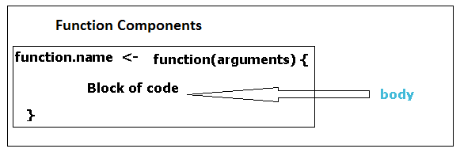

```{r globalOptions, echo=FALSE}
library(knitr)
opts_chunk$set(
  collapse =  TRUE,
  dev = "png",
  warning = FALSE,
  message = FALSE,
  fig.path = "figures/"
)
```

## Session Goal
  
The main goal of this session is to equip you with the necessary skills to make function calls in R.

## What we shall cover

By the end of this session you should:

* Be conversant with the term function and function call
* Know what constitutes a function and a function call
* Be conversant with arguments 
* Distinguish between named and unnamed arguments
* Know how R positions arguments in a call
* Be able to know and change default values
* Have an understanding of what top and low level functions are
* Know what is meant by anonymous functions

## Prerequisite

To appreciate this session,

* you must have R and RStudio installed and running
* know how to use the console
* be conversant with RStudio panes like console, help and packages


## R Functions

A function is a command you give to a computer program; basically an action you what performed like getting the sum/total, mean or determine existence of a file in your computer. There is virtually nothing that can happen in R without the use of a function, for example, if you want to get data into R, or clean it (data manipulation and transformation), or analyse it, or even export its output, you must use a function.

Presence of parenthesis **( )** like **sum( )**, **mean( )** or **file.exist( )** indicated a function and when it is used, it is referred to as **making a function call**.

Before we discuss function calls, let's note the two types of functions in R; these are the in-built functions like sum, mean as well as file.exist, and those you develop (also known as user defined functions). In this session we will discuss in-built functions that come with base R in form of [(default) packages](SessionOne_KnowingRandRStudio.html#packages) and those available from add-on packages. User defined functions will be covered in level 2. 

## Making Function Calls

### Function's composition{#functionComposition}

First thing you need to know is the composition of R's function. A function in R is composed of a **name**, **arguments/parameters**, and **Body**.



A function begins with its name followed by parenthesis and curly braces (body). To make a function call you need a function's name and it's parenthesis (), for example **mean()** (the body or what is in curly braces is not necessary to make a call but it will give you insight as to how the function works).

### A functions name

Most functions in R are named after the actions they should perform, for example the two average functions mean and median. Others include sum, exit, ncol (number of columns), nrow (number of rows) e.t.c. 

However, there are numerous other functions that might not follow this kind of logic for example, you might expect a function called "mode" to get the most frequently occurring observation (the third measure of central tendency), however, this is not the case as mode in R has a totally different meaning. It gives the internal type of an object (we shall discuss this in the [fourth session](SessionFour_DataTypesandObjects.html#mode))  

Key point to note here is that, knowing a function's names comes with **practice** and **reading R manuals** (help.start()) and **online tutorials/discussions/Q and A**. 

One final tip on function names, there are unnamed functions usually included in other functions, these are referred to as **anonymous functions**.

For example, the function within the sapply function (with one argument `x`) is an anonymous function.

```{r}
a <- list(1:10, 11:20, 21:30, 31:40, 41:50)
b <- list(round(rnorm(10), 1), round(rnorm(10), 1), round(rnorm(10), 1), round(rnorm(10), 1), round(rnorm(10), 1))

# Anonymous function
sapply(1:5, function(x) a[[x]] + b[[x]])
```

### Arguments

Within the parenthesis of a function are arguments or parameters. These arguments specify how a function will work or how a command will be carried out. It's important to know a function's arguments as they have implications on the output you receive. Sometimes this can result is an [error](SessionOne_KnowingRandRStudio.html#errors) meaning nothing is produced or a [warning](SessionOne_KnowingRandRStudio.html#warnings).

To know a function's argument, you need to read its documentation which can be accessed with the function **help()** or preceding the function's name with a questions mark. For example, get documentation for the mean function by typing either **help(mean)** or **?mean** on the console. The documentation should appear on the help tab located on the right lower pane.    

From this documentation (at the top), you will notice the name of the function requested, and in curly braces the package to which the documentation comes from i.e. **base package**. The package name is given to identify location of a function. This stems from the fact that other non-base R packages can have similar names as those in base R.

Right below is the title of the documentation, in this case the **arithmetic mean**; R's default mean. A short description of the function is also given followed by a section on the function's usage. This "Usage" section shows how the function is called in terms of its name and arguments.

But before we discuss this section, there are some critical issues we need to discuss first, these include naming of arguments, their order in a call and default values.

#### Named and Unnamed Argument

Going back to the mean documentation and specifically the usage section, we see two ways of calling the mean function, that is R's **mean(x, ...)** and S3's **mean(x, trim = 0, na.rm = FALSE, ...)**. Both of these work the same, the minor difference can be understood by reading up on [Object Oriented Programming in R](../../Programming for Non-programmers/Object_Oriented_Programming_in_R.html#methods).

Looking at the second function, the S3 method, there are four arguments, these are **x**, **trim**, **na.rm**, and **...**. These are the **names** of the arguments and to make a call you need to give **values** to these arguments.

You can make a function call with only values specified or with named arguments. To understand what this means, let's first get to know what the arguments for the mean function are and their expected values: The section called **Arguments** will guide us on this.

From this section we can see that **x** is an object (object can be described as any entity in R) and the expectation is that it should either  be a numeric/logical vector (variable), date, date-time or time interval objects: Anything other than this will raise a warning. **Trim** is a fraction of observations to remove from computation (suitable for dealing with [skewed](Level_three.html#Skeweness) data or [outliers](Level_three.html#outliers) ), the expectation is that it should be a value between 0 and 0.5. In R, **NA** means missing data and therefore **na.rm** is an argument indicating how missing data should be handled, the expected values are either true or false (remove or don't remove). For now let's leave the **...** argument as it requires a bit of knowledge in methods.

Now that we know what x, trim and na.rm mean, lets look at how to make function calls with both named and unnamed argument.

```{r}
# To call the mean function, you can name the arguments.
mean(x = c(2, 5, 9, 3), trim = 0.5, na.rm = TRUE)

# Or call with unnamed arguments
mean(c(2, 5, 9, 3), 0.5, TRUE)
```

#### Position matching for named and unnamed arguments

If you call a function with named arguments, then the position of the arguments do not matter.

```{r}
# Matching position of the arguments.
mean(x = c(2, 5, 9, 3), trim = 0.5, na.rm = TRUE)

# Mixing the order of arguments
mean(trim = 0.5, x = c(2, 5, 9, 3), na.rm = TRUE)
```

But if you have unnamed arguments then you need to give the values of arguments according to their order as R will match each value with argument in that position.

```{r, eval=FALSE}
# Mixing order for unnamed argument
mean(TRUE, 0.5, c(2, 5, 9, 3))
## [1] TRUE
## Warning message:
## In if (na.rm) x <- x[!is.na(x)] :
  ## the condition has length > 1 and only the first element will be used
```

R has given us a result of TRUE, not exactly what we expected, and in addition it has given us a warning indicating a problem with the call. What happened is that R marched TRUE to the X argument, 0.5 to the trim argument and c(2, 5, 9, 3) to the na.rm argument. Since the expected values for X include logical values, putting `true` where x should be is okay by R, however, when you put more than one value where one value (true/false) is expected, then you will get a warning message.  

If you have named and unnamed arguments the rule of the thumb is to name subsequent arguments, otherwise R will match the values with the position of the other arguments.

```{r}
# Naming the second and subsequent argument
mean(c(2, 5, 9, 3), trim = 0.5, na.rm = TRUE)

# Naming only the second argument
mean(c(2, 5, 9, 3), trim = 0.5, TRUE)
```

The second call did not raise a warning as the last value was matched to the correct argument but this might not be the case in other situations.

Now let's look at default values.  


#### Default values for arguments 

Arguments can have default values which are used if a call is made without the argument. For example, the mean function has two arguments with default values, these are trim and na.rm. This means a call can be made with only the value of x, but if x is missing, then you will get an error. 

```{r}
# Calling the mean with only x
mean(x = c(2, 5, 9, 3))

# You call with default values but that's just unnecessary
mean(x = c(2, 5, 9, 3), trim = 0, na.rm = FALSE)
```
```{r, eval=FALSE}
# Making a function call without the x value
mean(trim = 0.5, na.rm = TRUE)
##Error in mean.default(trim = 0.5, na.rm = TRUE) : 
## argument "x" is missing, with no default
```

If a default value is not what you want, you can add the argument specifying the value you want. For example,  since the above data set has an extreme value (9), we can use the trim function to make the average reasonable. 

```{r}
# Trimming 0.5 (50%) from the dataset or 0.25 (25%) from beginning and the end of the dataset instead of the default 0
mean(c(2, 5, 9, 3), trim = .5)

# Compare with the median
median(c(2, 5, 9, 3))
```

If we had a data set with missing values, then we need to tell R to make the computation without the missing values otherwise it will result in NA

```{r}
# Taking the mean of a dataset with NA when na.rm is false (default)
mean(c(2, 5, 9, 3, NA), trim = .5)

# Taking the mean of a dataset with NA when na.rm true
mean(c(2, 5, 9, 3, NA), trim = .5, na.rm = TRUE)
```

The mean has a short and straightforward list of arguments, but others might have a number of arguments. For example, pull up the help documentation for importing data; that is, `help(read.table)`. This function has more than 20 listed arguments. But if you take a keen look at most of the arguments, you will notice that most of the arguments have default value. It is of great interest to you to read through the descriptions of all the arguments and confirm that the defaults are okay, this is usually a source of many challenges in function calls and expected outputs.

In addition to checking the help documentations, you can use the function `args()` to see the list of arguments for a specified function.

```{r}
# Mean arguments
args(mean)

# Read.table arguments
args(read.table)
```


It is also useful to note that there are functions called `top level` and those that are called `low level`. Top level functions are functions that we mostly use to perform an action, while low level functions are called by the top level functions. For example, when computing the mean, you would call on the `mean()` function which in-turn calls the sum and length function to get you the mean. So in this case the mean is a `top level` function while `sum()` and `length()` are the low level functions or helper functions.  

Later in level two as we learn **user defined functions**, we shall discuss functions in terms of argument, body and environment.


## Gauge yourself{#gaugeYourself}

1. What are functions?
1. How can you tell an object is a function?
1. What is meant by a function call?
1. What constitutes a function call?
1. What are arguments? 
1. Distinguish between named and unnamed arguments
1. What do you expect would happen if I made a function call with all the necessary argument but only the second argument is named and distort the position of the other arguments?

**You are ready for the third session if you know these**

1. Functions are commands issued for an action to be performed
1. In R an object name followed by parenthesis indicates a function
1. A function call occurs when a function is used or run
1. A function call constitutes a name of a function and it's arguments
1. Arguments give details or input for function execution
1. A function call with arguments and their values are referred to as named arguments while a call with values only is referre to as unnamed arguments.
1. Since all the arguments are provided, then you will not receive an error, however, due to distortion of position, if the value given does not meet the expected value, a warning will be issued and output generated will be questionable.

**Note**

This write-up has used non programming definition in as much as possible with the intent of being useful to non-programmers and imparting concepts and skills necessary for analysis.
