## About this post{#aboutPost}

This article aims to cover the very basic principles of Object Oriented Programming (OOP), in R.   

To start off, we shall discuss the key concepts of OOP and then it's implementation in R. We shall conclude with a case study that automates a monitoring system by implementing R's OO system.  

This post is most suitable for non-programmers interested in developing effective and efficient analytical programs.  

**Key terms:**{#keyTerms}

Objects, Classes, Methods, Attributes, Instatiation, Inheritance, S3, S4, RC, Encapsulation, Polymorphism

### Prerequiste{#prerequiste}

To appreciate and follow though the write up, it is highly recommended that you have a basic understanding of R and more specifically how to create functions and make function calls in R.

## So why Object Oriented Programming (OOP)?{#why-oop}

Quite simply it makes your code so much easier to use and read. Using an Object Oriented approach gets you to start programming with a well laid out plan rather than coding it first. You also get to visualize the program in terms what it should do, what it requires and the best way to implement it. With OOP, it is not about the language, in fact, you can develop a program and implement it in any OOP language. For example, you can write a program which can be implemented in both R and C++ (with just a few twicks here and there). Selection of the language is all about how conversant you are with the language and its capabilities. Obviously my choice is R, so R it is, our discussion of OOP shall be based on its implementation in R.    

R offers this system as a means for good programming, hence it can be referred to as an Object Oriented Program. However, R is also a functional programming language as all actions rely on function calls. This make Rs OOP implementation slightly different from other OOP languages, it is what `John Chambers` calls [functional, object-based system^1^](#references).

Before we go into further details about this unique OO system that R implements, lets get to know OOP first. To do so, consider the following situations; when writing functions, do you recall having to repeat a section of the code, or had a long program that just needed some clarity by segmenting different sections? Or are there times you had to change the body of the function leading to a change in how the function is called? How about sharing your functions with others, have you ever wanted to provide your users with a basic code without the intricacy of its operation? If any of these rings a bell, then OOP is the solution as it can address all these situations effectively and efficiently. Therefore, OOP is a programming model that enables clear linkages between functions through a hierarchical system, encapsulation (hiding core functions), and creation of different forms of a object to meet different objects.  

OOP does all that through `objects`, which are similar to real life objects as they can be described in terms if its *name*, *properties* and *what it can do or its behaviours*. Prior to OOP was the `procedural programming` language that was based on sets of instructions (procedures) to carry out tasks. Procedural programming looked at the sequence of steps needed to accomplish a task starting from the issue or problem. Unfortunately if somewhere down the line (of code) edits were necessary, then it ment changing the whole program. OOP came to salvage this situation by using objects, a `piece meal` approach. In this system, programs are written to act on objects therefore changes were made to the objects rather than the whole program.

In addition to OOPs ability to handle edits and updates, there are three principles that guides it, these are, [inheritance](#inheritance), [encapsulation](#encapsulation) and [polymorphism](#polymorphism). we shall look at these principles in greater detail as they apply to R.

OOP comes in different [varieties](https://en.wikipedia.org/wiki/Object-oriented_programming); R implements the `class-based system` as opposed to `prototype-based systems`. In the class system, objects are developed or constructed  from *blue prints* known as `classes`. Classes in most OO systems describe objects in terms of [what they are](#properties) and [what they can do](#methods). However, as we shall soon see, in R methods are defined in functions (with the exception of the new RC system) and not the classes. For the `prototype-based systems`, the properties and methods are directly described in the objects: prototype being the default object. 

Alright, lets look at how R implements OOP. First we shall have a general discussion on the concepts particularly on `classes`, `methods`, `Rs functional approach` through the use of `generic functions`,  `methods dispatching mechnism`, `inheritance`, and finally the `three class based systems`. We shall then move swiftly to the most interesting part of this article, actual implemention of the OO systems in R, we shall do so by using a typical case study. So brace yourself, we are in for some fun times ahead.  


## OOP Concepts as applied in R

Other than `objects`, there are two more important concepts in OOP, these are `classes` and `methods`. In addition, R being a `functional programming language`, it extends OOP concepts with the concept of `generic functions`. 

### Classes 

Classes in R are part of an objects `attribute`. Attributes describe or give the basic information about an object (`properties`). Other than an objects class, other attributes are, `names`, `dimensions`, `dimnames`, `classes`, and `ts`. 

Of all the attributes, `classes` are particularly important as they are used in evaluating function calls. Base R classes include `numeric`, `logical`, `character`, `complex`, `list`, `expressions`, and `names`: Others are `matrix`,  and `array`. You can get an objects class by calling the `class` function i.e. `class(mean)` or for simple vectors `mode()`. These base R classes are known as `implicit` classes and all objects have one of these classes. An object can further extend its implicit class with other classes thereby having a vector of classes. How these classes are arranged determines the inheritance and methods dispatching mechanism to be implemented.  

### Methods 

As classes provide the details of an object (the what), `method` give the `how` or the behavior of the object; that is, what it will or should do. In essence methods are just functions but functions that act on objects of a certain class.

So an object of class say "a" would have a method specifically defined to act on objects with that class.

```{r eval=FALSE}
# Create an object
obj <- 1:10

# Add class attribute
class(obj) <- "a"

#print object
obj
## [1]  1  2  3  4  5  6  7  8  9 10
## attr(,"class")
## [1] "a"

# Define a method for that class
methodForA <- function(object){
  # Print maximum and minimum values
  print(c(min(object), max(object)))
}
methodForA(object = obj)
## [1] 1 10 
```

### Generic functions

In our introduction we referred to R as a `functional, object based system`, this is because in the first two OO systems in R, methods belong to functions called `generic functions`. These functions act as methods dispatchers by determining the class of the object and then dispatching appropriate methods to the object.

Generic functions in themselves do nothing other than dispatching methods. Actually, you can view generic functions as `smart folders`. Smart in the sense that they do more than store files (methods in this case), they can also give you a method depending the class of the object you give it. So a generic function could have numerous methods within it (as you would have in your folders), and the work of the generic function is to dispatch the correct method.

Base R is loaded with generic functions, one such function is the `plot` function, it can take different data objects and still be able to produce an appropriate plot for the object.

```{r}
x <- 1:10
plot(x, main = "Plot with one numeric variable x")
y <- rnorm(10, 5, 2)
plot(x, y, main = "Plot with two numeric variables")
class(anscombe)
plot(anscombe, main = "Plot for a data frame")
class(USPersonalExpenditure)
plot(USPersonalExpenditure, main = "Plot for a matrix")
class(UCBAdmissions)
plot(UCBAdmissions, main = "Plot for a table")
plot(AirPassengers, main = "A time series plot")
```

That's the `magic` of a generic function, it checks the class of an object and looks for its method. 

A generic could have numerous methods which can be shown through a call to `methods()`.  

```{r}
methods(plot)
```

Since the methods are the actual implementers like `plot.ts` for time series data, they can be called directly and can sometimes be quite efficient. 

```{r}
plot.ts(AirPassengers)
```

However, this is not good programming practice and it is not encouraged. This is because calling a method directly would mean dispatching mechanism is not initiated and any changes to the generic internals could affect your call. In addition, if a method calls another method through inheritance, then this would not also be possible as there is no record of the generic function. 


### Inheritance Mechanism{#inheritance} 

Inheritance is a mechanism that allows related objects to be linked together by reusing common code. It is a way of implementing the `DRY` (do not repeate yourself) principle of programming or making code more efficient. This is achieved by classes inheriting methods of other classes. For example, if an object has classes `A`, `B`, and `C`, then the first class `A` can inherit methods for both `B` and `C`. Therefore, implementing an inheritance mechanism wholy depends on an objects class vector. Inaddition, the order in which the classes appear in a class vector would indicate the order of inheritance. For our object, methods for class `B` would be inherited before methods for class `C`. 

The best way to organise your classes is to think of the class of the end object moving forward, that is, what do you want to achive and what processes and objects do you need to achieve it.

For instance, you are interested in scrapping some web pages for certain mentions or activity; this could be anything really, like reactions to programs being implemented, costs and fundings, new technology, or hits to certain web pages. Your interest is to update your webpage with this information. To do this you must first:

1. Source the data (usually from multiple sites) and cache it
1. Analyse the data 
1. Table and plot the data and finally,
1. Update your site

These four steps can be implemented with four classes; `source`, `analysis`, `display`, and `update`. An object with these four classes should be able to meet our objective, but the key thing here is the order of the classes; what is the first class and what should follow. 

For our case we shall start with the class for our intended output that is `update`, then `display`, then `analysis`, and finaly `source`. The idea here is; `update` will call `display` which will call `analysis` which in turn will call `source`. `Source` will then implement the functions (methods) that are defined for sourcing data and return the data to `analysis`. `Analysis` will then pick the data and invoke methods for analysis. It will then send the analysed data to `display` which will produce the necessary tables and plots. `Display` will finally send the tables and plots to `update` which will implement the necessary changes to the webpage. So if there were any inputs in our objects, they will be sent up the inheritance levels and outputs sent down by the inherited methods.  

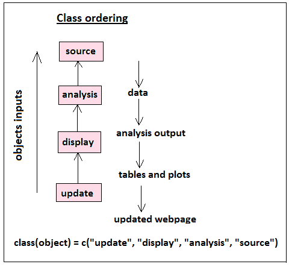

### Methods Dispatch Mechanism in R{#dispatchingMechanism}

In `S3` and `S4` the generic function is responsible for dispatching methods. Dispatch is based on the class of the object supplied to the generic and can either be a `single dispatch` or `multiple dispatch` mechanism. 

`Single dispatch` means the generic will only dispatch methods for the first object to it's call; it overlooks any other object supplied to it. 

```{}
genericFunction(object1 = x, object2 = y)
# Method for class(x) will be searched and dispatched, class(y) is irrelevant
# in method search
```

`Multiple dispatch`  occurs when a generic can dispatch methods for class of more than one objects. 

```{}
genericFunction(object1 = x, object2 = y)
# Dispatcher will source for defined methods for the combined classes of x and y
```

In both dispatching mechanism, the dispatcher will first create and cache the class vector of the object(s). The search for an appropriate method will begin with the first listed class(es), if a method is not found then a method for the second class(es) is searched, if this is also not found, the the third is searched and so on until there are no more classes in which case the default method is sourced. If a generic does not have a default method then an error is issued. 

If on the other hand an object does not have a class attribute (base objects), then it's implicit class is used to dispatch an appropriate method, if there is no method for the implicit class, then the default method is dispatched. In the event there is no default, then an error will be given. Which dispatching method is actually used depends on the `OO System`. 

For [RC](#rc), methods dispatch is clear as objects call methods through references. This is because methods belong to classes rather than functions.

## Implementation of OO system  in R  

OOP system in R is implemented through a `class-based system` currently composed of three systems; `S3`, `S4` and `Reference classes(RC)`. There is a fourth system that is usually unmentioned as it is not extensible by users, this is the [base type](#baseType) and it is the foundation on which all other systems are implemented. All  objects are either `pure base R`, `S3`, `S4` or `Reference classes(RC)` objects.  

`S3` and `S4` are an implementation of the `S` language created by `John Chambers`, where [S3 corresponds to the third version and S4 to the forth version of the language](#http://ect.bell-labs.com/sl/S/history.html). `RC` is a new OO system in R and deviates from the functional programming aspect of Rs OO system as methods belong to classes and not function as is the case in `S3` and `S4`. This implementation closely resembles other OOP implementing languages like `JAVA` and `C++`.   

### Distinguishing R objects

Everything in R is an object, from the functions, to language objects like environments, and names or symbols. Actually, the [R Language Definition](#references) manual lists about twelve basic types of objects, these are: `vectors`, `lists`, `language`, `expressions`, `functions`, `NULL`, `promise`, `dot-dot-dot`, `environment`, `pairlist`, `any-type`, `builtin and special` form of objects.

Internally all these objects are written in `C` language detailing their `content`, `memory requirements` and their `type`. For all objects, the `C structure` would have either `base R`, `S3`, `S4` or `RC` listed as their type. Base R objects were defined during Rs development, while `S3` and `S4` came later; RC is still a new OO system in R.

It is important to know an objects type to effectively use and manipulate them.

#### Base types

R was originally not a class-based system and therefore all the base objects have no class attribute. By this fact you can determine base objects by running `is.object` function. The function returns `TRUE` if an object has a class attribute and `FALSE` if it does not. You can also run the function `objects` inputting the base environment. This will list all base objects.

```{r}
# All objects in base R
baseObj <- objects(envir = baseenv())
# Number of base R Objects
length(baseObj)
# Check if they have a class atrribute
baseType <- sapply(baseObj, is.object)
all(baseType == FALSE)
# Check if they are all functions
all(sapply(baseObj, is.function) == FALSE)
```

The package [pryr](https://github.com/hadley/pryr) by `Hadley Wickham` is an excellent package to snoop around Rs internal working. 

```{r}
# Load the package
library(pryr)

# Find out if they are all base objects
all(sapply(baseObj, otype) == "base")

# Find if they are all functions
all(sapply(baseObj, ftype) == "function")
```

Few pointers (one reason we need to know an objects type), you can not add base objects, that privilege goes to the `Rs core group`, but you can add [S3](#s3methods) OR [S4](#s4methods) methods to existing generic functions (objects) otherwise known as `internal generic function`. Internal objects are base objects written in `C` and built into Rs [interpreter](#comp.inter). They are only accessible through a `C interface`; in other words not easily accessible to non-programmer. `grep` is a good example, in case you have not have used this function, it is used to carry out `pattern search` in character vectors. Lets look at the source code for this function to understand `internaly implemented functions`. 

```{r}
# Source code for grep
grep
```    

The first expression within the body of the function checks to see if the input data has a  character class. If it does not, then an `S3` object is created by first converting the input into a character vector and then adding a name attribute.

The second expression is now of interest to us, just like generic functions the code showing how a pattern search is done is not there, instead, it invokes another function called `.Internal` with the original call to grep. The `.Internal` function is an indicator that grep is an internally implemented function written in `C` language. The question now is how to read `C` if you have no background in that language. Unfortunately this is not a walk in the park kind of thing, but one proposed way is to call `show_c_source` function from the `pryr` which opens a [GitHub] page with the source code. However, this might not be too friendly for non-programmers, hopefully someone will convert them to a more `reader friendly` version for non-porgrammers.   

There are other internal functions that are directly accessible, these are known as `primitive` functions. The `S3` types can be accessed through `.S3PrimitiveGenerics` vector which lists all the primitive (internal) generic functions. 


#### S3 types

Next in line after the base objects is the S3 OO system. In this system one is able to create new objects by adding a class attribute. While it was easy to establish `base objects`, this is not the case in `S3` as there is not function to check them. However, one suggestion is to call `is.object` and `isS4` functions. This will tell us if the object has a class attribute or not and if it is a S4 object. If the object has a class attribute then it is not a base object and if it is not `S4`, then it is highly likely to be `S3`.  

```{r}
# Does airmiles dataset have a class attribute? 
is.object(airmiles); 
# Is it an S4 object?
isS4(airmiles)
# Is there a class attribute?
attr(airmiles, "class")
```
This can be confirmed with our helpful `pryr` (pryer) package.

```{r}
library(pryr)
# Pryr, what say you?
otype(airmiles)
```

Super, it has confirmed for us that `airmiles` with a `ts` class is a `S3` object.

### S4 types

S4 is a much later OO system therefore do not expect to get S4 objects in base R, only in `packages` like the `matrix package`. `S4` implementation is like `S3` but with the exception that it is quite detailed, and organized.  

Unlike `S3`, testing whether an object is an `S4` implementation is just one call away; `isS4()`. Of course `pryr` can also give us this information. 

```{r}
# Source one of my objects
source("Scripts/s4RcObjects.R")
isS4(f)
```


### RC type

Reference class is new in R, it deviates from `S3` and `S4` OO systems as methods belong to classes and not functions. This distinction is what sets `RC` to be similar to other programming languages that implement OO systems, however, they are as formal as `S4`.

Since this method is new in R, we would not expect to find `RC` objects in base R nor in most package (just some of the new ones), so like `S4` objects we will source one of my `RC` objects.

```{r}
source("Scripts/s4RcObjects.R")
library(pryr)
otype(aObj)
```

### Class-based system in R

#### S3 OO System

`S3` is the first OO system in R and by far the easiest. Base R and other `CRAN` packages have a number of `S3` objects. In this system classes are not defined and methods belong to generic functions.

##### Creating S3 Objects

Objects in `S3` are created like any variable, using the assignment operator (`<-`), the only distiguishing feature is addition of a class attribute. An object can have one or more classes, these classes are not defined, just named.

```{r}
# Creating an S3 object with assignment operator
s3Obj1 <- 1:10
# Adding a class attribute
class(s3Obj1) <- "myNumeric"
# Adding more classes
class(s3Obj1) <- append(class(s3Obj1), c("a", "b"))
class(s3Obj1)
```

Another way to create an object in S3 is through a call to the `structure` function. 

```{r}
s3Obj2 <- structure(1:10, class = c("myNumeric", "a", "b"))

# Compare the two objects
all.equal(s3Obj1, s3Obj2)

# Are they S3 objects?
library(pryr)
otype(s3Obj1);otype(s3Obj2)
```

##### S3 Generic Function{#s3Generics}

Creating a generic function in `S3`, is similar to developing a function with the exception that the body of the function has a call to another function `UseMethod` which is responsible for the actual `methods dispatch`. It does this by searching for an appropriate method within the generic function and invoking it with the same argument (inputs) as the call to the generic: it is as if the call was made to the method directly. 

The standard way to create a `S3` generics is:

```{r, eval=FALSE}
generic <- function(object){
  UseMethod("generic", object)
}
```

A few things you need to know as you create a generic function: One, the arguments for a generic should be the same as those of its methods. So if a generic has `object` as its argument, then its methods should have the same argument `object`.

The second thing to note, `S3` uses `single methods dispatch` mechanism which means only the class of the first object (argument) to a generic will be used to get an appropriate method. If the object does not have a class attribute, then its [implied class](#impliedClass) is sourced, if there is no appropriate method for that implied class then the default is searched. In the event that there is no default, then an error is issued. 

Third, the generic function should be created as shown above. If you add any variable before the `UseMethod()`, it will be evaluated. However, this is not recommended, because invoking `UseMethod` moves the evaluation frame forward and it does not go back to the generic function; its like a moving train that does not return. Of course this also means any variable after `UseMethod` will not be evaluated: we have literally left the generic function.

```{r}
firstGeneric <- function(object){
  a <- cat("I will be evaluated and printed, but thats about it\n")
  UseMethod("firstGeneric", object)
  b <- cat("I will not be evaluated, so you will not see me\n")
}
```

<p id = "useMethodVariables">The fourth thing to appreciate is that, `UseMethod()` can only be used within a function. It has two arguments, the names of the generic and the object whose class will be used to dispatch the appropriate method. When `UseMethod` is invoked, it will create some variables which will be used to get the next method. These variables are `.Class` (the class of the object), `.Generic` (the generic being used) and `.method` (the method currently being invoked). If you call a method directly like `plot.ts(tsdata)`, these variables are not created as there was no call to the dispatcher (one of the dangers of calling methods directly).</p>

##### S3 Methods

`S3` methods, are created like ordinary function, they only need to have names that are searchable by the generic function. These names are formed by combining the generic and class names with a period as a separator.  

```{r}
firstGeneric.myNumeric <- function(object){
  # Actions to be performed by the method
  paste("Number", object)
}
```

They are called with a classed object.

```{r}
obj <- structure(1:10, class = "myNumeric")
firstGeneric(obj)
```

Notice the first message in the generic function `generatorS3` was printed but not the second after the `UseMethod`? 

To get all the methods available to a generic function, call `methods()` with the name of the generic. This can also be used to get all the methods available to a class.

```{r}
# Methods for generic function
methods(firstGeneric)
# Class of an object
class(obj)
# Available methods to a class
methods(class = "myNumeric")
```


##### S3 Methods Dispatch

`S3` uses `single dispatch` mechanism{#dispatchMechanism} and only the class of the first objects is used to dispatch methods.  

If an object has class `A`, `B`, and `C`, the dispatcher (`UseMethod`) will first look for a method for the first class which is `A`. If a method for class `A` is not found, then a method for class `B` is sort. If there is no method for class `B`, then a method for class `C` is searched. If it is also not found, then the default is dispatched. All generic functions need to include a `default method` as good programming practice, but if it is not there, then an error will be issued.

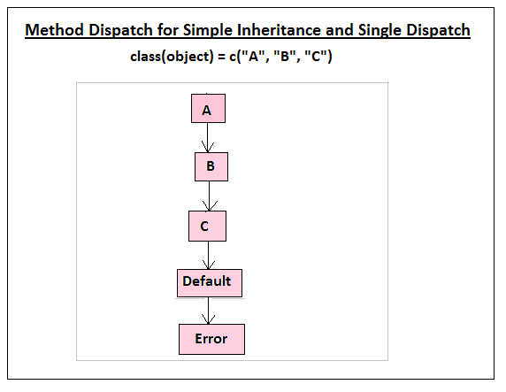

```{r}
# Creating objects
a <- structure("A", class = c("A", "B", "C"))
b <- structure("B", class = c("B", "D", "E"))
c <- structure("C", class = c("C", "F"))
f <- structure("F")
# Creating a generic function
g <- function(object){
  UseMethod("g", object)
}
```
```{r, eval=FALSE}
# Calling a generic with missing method and default
g(a)
Error in UseMethod("g", object) : 
  no applicable method for 'g' applied to an object of class "c('A', 'B', 'C')"
```
```{r}
# Adding a default method
g.default <- function(object){
  cat("opps no method found\n")
}
```
```{r}
# Calling generic with only a default method
g(a)
# Defining a method for class "C"
g.C <- function(object){
  cat("Method for C\n")
}
# Calling the generic with only methods for class `C` and `default` 
g(a)
# Defining method for `B`
g.B <- function(object){
  cat("Method for B\n")
}
# Calling the generic with only methods for class `C`, `B` and `default`
g(a)
```

##### S3 Inheritance Mechanism 

`S3` inheritance is implemetned by a call to `NextMethod()` within the body of a method. So if an object has class `A`, `B` and `C`, then class `A` can inherit methods for both `B` and `C` by calling `NextMethod`. 

When `NextMethod()` is invoked, it will search for the next method after the current method from variable with classes created by [`UseMethod()`](#useMethodVariables). If it finds it, it will call the method with the same inputs (object) as the current method.


```{r}
g.A <- function(object){
  NextMethod() # Calling next available method 
  cat("Method for A\n")
}
g.C <- function(object){
  cat("Method for C\n")
}
# Calling a generic with methods for `A` and `C`
g(a)
g.B <- function(object){
  NextMethod()
  cat("Method for B\n")
}
# Calling a generic with methods for `A`, `B` and `C`
g(a)
```

Try and predict their outputs: Take note of functions calling for non existing inherited methods.

```{r, eval=FALSE}
g(b)
g(c)
g(f)
```

You can check whether an object inherits methods for a certain class with the function `inherits`

```{r}
inherits(x = a, what = "F")
inherits(x = a, what = "D")
inherits(x = a, what = "C")
inherits(x = a, what = "B")
```


#### S4 OO System

`S4` works the same way as `S3` as they both add a class attribute to objects and methods belong to generic functions. However, their classes are defined with consistency checks and have a different dispatching mechanism. In addition, `S4` are contained in the pre-loaded `methods` package and not the `base` package as `S3`.

##### S4 class definition{#s4ClassDfn}

`Class definition` is a meta data object with information on what an object of that class is: it's an objects `blueprint`. Objects in `S4` can only be created from defined classes unlike in `S3` where objects are created from just the name of a class. In this system, validity is included as part of class definition.

Classes in `S4` are created with a call to `setClass()`.  The first argument to the function is the `name` of the class, the other key arguments are `representation or slots` which define the type of data the object will have, and the `cointains` argument which lists additional classes.  

The slots or the representation argument should be a named list or character vector. The names are essential for extraction methods. The classes in the `contains` argument are called `superclasses`, these are classes that the `named class` (called `subclass`) extends to or inherits. In `S3`, the named class would be the first listed class and the classes in the `contains` argument would be the subsequent classes, hence this argument is crucial in implementing inheritance machanism in `S4`. 

When `setClass` is invoked with just the name of the class, then it will create a `virtual class`. A virtual class is one which no object can be created*, its mostly used to enable classes to share some code like a `class union`.

When a class is defined, it returns a `generator function` which can be used to instatiate (create) objects of that class. This function is usually stored in the `global environment` unless the argument `where` is specified (though you should not).

```{r}
# A virtual class
setClass(Class = "A")

# Formal classes for instatiation
setClass(Class = "B",
         representation = representation(data = "numeric"))
setClass(Class = "C",
         representation = representation(info = "character"),
         prototype = prototype(info = "Hello")# A default value
         )
```
```{r}
# To check all the currently defined classes
getClasses(globalenv())
# To see the definition of a class
getClass(Class = "A")
getClass(Class = "B")
getClass(Class = "C")
```

No object can be created if it does not have the defined representation, in addition, a validation argument in the `setClass` function can be used to add a validator function. This function should return `TRUE` in the case of a valid object and an error otherwise describing validity failures.  


##### S4 Class Instatiation/Creating Objects{#s4Instatiation}

A class in `S4` is instatiated with a call to `new()`, providing then name of the class and any data that are required for the slots. If a class was defined with default values, then they are first added. 

```{r, eval=FALSE}
# Virtual classes cannot be instatiated
a <- new(Class = "A")
Error in new(Class = "A") : 
  trying to generate an object from a virtual class ("A")
```

```{r}
# An  object of class "B"
b <- new(Class = "B", data = 1:5)
b
# An object of class "C" with default values
c <- new(Class = "C")
c
# Object c with new values
c <- new(Class = "C", info = as.character(Sys.Date()))
c
```

##### Extracting sections of an s4 object

`S4` objects resembles `lists`.

```{r}
setClass(Class = "D",
         representation = representation(
           nams  = "character",
           org  = "character",
           codeR = "logical",
           level = "character",
           others = "list",
           interests = "character"
         ))
d <- new("D", nams = "HG", org = "Data Mania Inc", codeR = TRUE, level = "Intermediate/Advanced", others = list(canCode = c("HTML5", "CSS"), basicCode = "Javascript"), interests = c("Data Science and analysis, Demography and Public Health"))
d
```

However, there are two exceptions:

1. Extraction of a slot is through a call to `slot()` or with an `@` symbol using names but not positions
1. There is no partial matching as with lists.

```{r s4SlotExtraction1}
slot(d, "others")
d@others
```

These extraction methods will not work

```{r s4SlotExtraction2, eval=FALSE}
slot(d, 1)
#Error in slot(d, 1) : invalid type or length for slot name

d[[1]]
# Error in d[[1]] : this S4 class is not subsettable
myList <- list(codeR = TRUE, level = "Intermediate/Advanced", others = list(canCode = c("HTML5", "CSS"), basicCode = "Javascript"))
myList$co
# [1] TRUE
d@co
# Error: no slot of name "co" for this object of class "D"
```


##### S4 Generic Functions{s4GenericFunctions}

`S4` generic functions are created with the `setGeneric()`. This function, can be used to change existing non-generic functions into generic functions by providing only one argument; the name of the non-generic function. By doing so, the non-generic function becomes the default method, but if you do not want it as the default, then the `def` argument can be used to change it.

```{r}
# A non-generic function
nonGeneric <- function(object){
  cat("Am sorry I do not have a method for that class")
}
library(pryr)
# What function is nonGeneric?
ftype(nonGeneric)
# Converting it into a generic function
setGeneric("nonGeneric")
# Now what type of function is it?
ftype(nonGeneric)
```

In addition to converting non-generic functions to generic functions, `setGeneric` is also used to create new generic functions by a call to `standardGeneric`. `standardGeneric()` is similar to `S3` `UseMethod()` and it cannot be called outside a generic function; it is included in the `def` argument. The argument to `standardGeneric` is the name of the generic function being created. 

To create a new generic function, there are two important arguments to provide, these are `name` and `def`. `name` is the generic functions name and `def` is the definition of the generic. The `def` argument should be a function with a call to `standardGeneric` which is responsible for methods dispatch. The arguments to `def` will be the same as those of it methods.

```{r}
# A generic function that will dispatch on two objects 
setGeneric(name = "genericName",
           def = function(object1, object2){
             standardGeneric("genericName")
           })
```

##### S4 Inheritance Mechanism 

```{r eval=FALSE}
# Checking inheritance (`is()` is equivalent to `inherits()`)
is(object = A, class2 = "B")
is(object = A, class2 = "D")
is(object = A, class2 = "F")

```

When class `A` is defined containing class `B` and `C` then the first class `A` is referred to as a `subclass` while `B`, and `C` are it's `direct superclasses`. `Subclasses` inherits from from it's `direct superclasses`, this relationship is referred to as `simple inheritance`. 

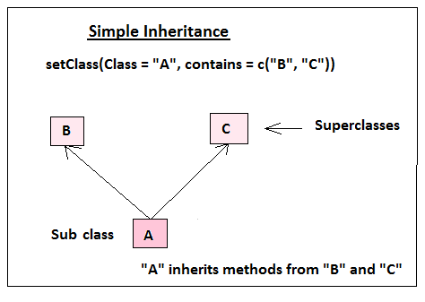

A `subclass` can also inherit methods of `superclasses` of it's `superclass`. For example `B` can have `superclasses` `D` and `E` and `C` could have `F` as its superclass.  

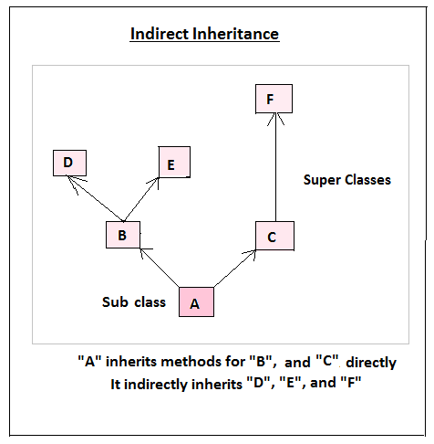

Sometimes inheritance can be complicated by objects inheriting methods from more than one superclass. For example, class `A`, can be defined to contain `B`, and `C`, Class `B` could be defined to contain `C` and `D` and class `C` could be defined to extend to class `D`. 

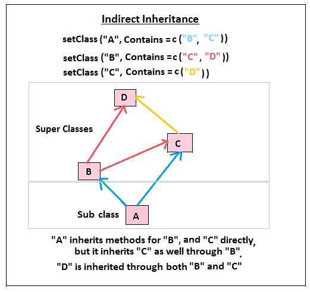

Which class is actually inherited when there are more than one way a class can be inherited is the work of a methods dispatching mechanism discussed in the section [predicting methods dispatched](#predictingDispatch).

##### S4 Methods{#s4Methods}

To create `S4` methods we use `setMethod` function. This function is used to set methods for an existing generics or change non-generic to generic functions  (however, the latter case is not good programming practice). Methods are stored as metadata to its generic function which is usually at the `global environment` but in other cases this can be a `package`. 

The key arguments in `setMethod` are: `f` the name of the generic function, `signature` a named list of classes, and `definition` which defines the behavior of the method as a function. `Signature` should have the same number of objects as the generic function. If the generic has two, then the method should have two signatures. There are two predefined classes that can used, these are `ANY` and `missing`. 

In addition to your defined classes, there are two predefined classes that are available for use, these are the `ANY` and `missing` classes. The `ANY` class is appropriate when setting default methods as it would match any class that has no method. `missing` is used to indicate a non non existing object, that is, you can call the method without an object.

```{r}
# Defining S4 method with two objects
setMethod(f = "genericName",
          signature = signature(object1 = "B", object2 = "C"),
          definition = function(object1, object2){
            cat("Method for class BC\n")
          })
# Method with predefined class `missing`
setMethod(f = "genericName",
          signature = signature(object1 ="B", object2 = "missing"),
          definition = function(object1){
            cat("Method for B\n")
          })
# A default method for any other class without a method
setMethod(f = "genericName",
          signature = signature(object1 = "ANY", object2 = "ANY"),
          definition = function(object1, object2){
            cat("Sorry, no method")
          })
# Another default method for calls with no object
setMethod(f = "genericName",
          signature = signature(object1 = "missing", object2 = "missing"),
          definition = function(object1, object2){
            cat("No object given")
          })
```


##### Predicting methods for multiple dispatch{#predictingDispatch}

**Single and Multiple Dispatch**

`S4` implements both [`single dispatch` and `multiple dispatch` mechanism](#dispatchingMechanism), therefore it can dispatch methods for one or more objects. Methods dispatched for single object follow the same logic as those of `S3`, what becomes a bit tricky is dispatch for more than one object. For multiple dispatch methods, the key to predicting the methods to be dispatched is to look at the combination of classes defined by the signature argument of the methods. If a generic is dispatching on two objects, then its methods would have paired combination of classes and when the generic function is invoked, `standardMethods` will go in search for the pair of classes issued, if there is a matching signature in its methods, then it will be dispatched,if there is none, then the default is dispatched or error is issued if there is no default.  

For example, in the [class definition](#s4ClassDfn) section, we defined three classes, `A`, `B` and `C` which we [instatiated](#s4Instatiation) with two objects `b` and `c`. In the methods section we created three methods `BC`, `B` and `default`. If we called the generic with two object of class `B` and `C`, then we should expect the method with class `BC` to be dispatched.

```{r}
genericName(object1 = b, object2 = c)
```

If we called the generic with an object of class `B` only, then we should expect a method for signature `B` and `missing` to be dispatched.

```{r}
genericName(b)
```

If any objects with classes other than these two are given, the the default will be dispatched

```{r}
# Calling with a class with no defined methods
genericName(c)
# A call with no objects
genericName()
```

**Direct and Indirect Relationships**

Since `S4` classes are defined, then classes can inherit methods of `superclasses` of their `superclasses`. Therefore when a method is not found for an objects `direct superclasses`, then methods for the `direct superclasses` of `direct superclasses` are dispatched. 

To understand this, consider class `A` with super classes `B` and `C`. Then class `B` has `superclasses` `D` and `E`, while class `C` has `F` as its `superclass`.

Methods for `superclasses` `B` and `C` are directly inherited by `Subclass A`. If these two classes did not have a method, then the dispatcher can dispatch methods for `direct superclasses` of both `B` and `C` which are `D`, `E`, and `F`.

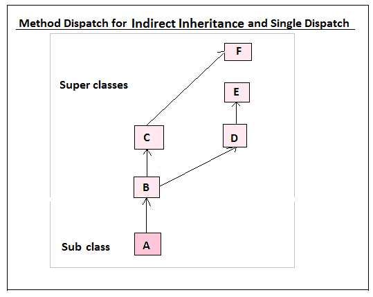

```{r eval=FALSE}
# Creating a generic function
setGeneric("g", 
           def = function(object){
             standardGeneric("g")
           })
# Defining classes A, B, C, D, E and F
setClass(Class = "F", contains = "numeric")
setClass(Class = "E", contains = "numeric")
setClass(Class = "D", contains =  "numeric")
setClass(Class = "C", contains = "F")
setClass(Class = "B", contains = c("D", "E"))
setClass(Class = "A", contains = c("B", "C"))
# Method for class F
setMethod("g", 
          signature = "F", 
          definition = function(object){
            "S4 method for class F"
})
# Default Method
setMethod("g",
          signature = "ANY",
          definition = function(object){
            cat("No method found")
          })
# Instatiating class A
A <- new(Class = "A")
# Calling the generic with an only a default an indirect method
g(A)
```

**Concept of Generations**

When an object's `subclass` has `superclasses` and these `superclasses` have their own `superclasses`, then these hierachial groups of `superclasses` are regarded as `generations`. The `first generation` of `superclasses` is an objects `direct superclasses` their `superclasses`  are the second generation.

The concept of generations is used to dispatch appropriate methods by determing the distance of a class. Distance of `1` means it a `first generation`, a distance of `2` for the `second generation` and so forth. This is particularly important in determining methods for `multiple dispatch` and `indirect relationships`. The method with the least distance is dispatched. Note, the predefined class `ANY` mostly used to set default has the greatest distance from all the other classes.

Suppose we were dispatching with two objects, we can try and predict the possible methods to be dispatched by computing the distances between the generations.

```{r}
# A generic function dispatching on two objects
setGeneric("g", 
           def = function(object1, object2){
             standardGeneric("g")
           })
# Method for class F
setMethod("g", 
          signature = signature(object1 = "A", object2 = "F"), 
          definition = function(object1, object2){
            "S4 method for class AF"
})
# Default Method
setMethod("g",
          signature = signature(object1 = "ANY", object2 = "ANY"),
          definition = function(object1, object2){
            cat("No method found")
          })
```

Here we have a generic function and methods for class `A` and `F`, and another for any other classes (default). What is your prediction as to the method to be dispatched when we call to the generic is made?

If you predicted `default`, then you would be right. First we have a method with the first object `A` that is the method `AF`, what it does not have is the class of the second object `B`. So the only other possibility is the default method.    
Now lets consider the other possible methods that could have been dispatched if they existed. These would be combination of class `A` and `B`  with  all their superclasses which come to `40` total possiblities.

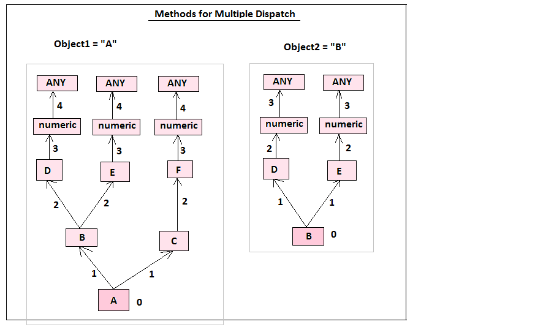


```{r}
a <-  c("A", "B", "C", "D", "E", "F", "numeric", "ANY")
b <-  c("B", "D", "E", "numeric", "ANY")
c <-  c(0, 1, 1, 2, 2, 2, 3, 4)
d <-  c(0, 1, 1, 2, 3)
ab <- expand.grid(object1 = a, object2 = b)
ab[, c(3, 4)] <- expand.grid(DistanceToA = c, DistanceToB = d)
ab[,5] <- rowSums(ab[,c(3,4)])
colnames(ab)[5] <- ("TotalDistance")
ab
```


In case there are some methods available, the dispatcher `standardGeneric()` will dispatch the method with the least amount of distance (ab data, column 5). Where there are ties, then the dispatcher will send you a message and dispatch the method with the first alphabetical order. For example, if methods for `AD` and `AE` are available and they both have the same total distance, then `AD` would be dispatched.


```{r eval=FALSE}
# Calling the generic with only methods AF and default `ANY ANY` 
g(object1 = new("A"), object2 = new("B"))
# Adding a method `A ANY`
setMethod("g",
          signature = signature(object1 = "A", object2 = "ANY"),
          definition = function(object1, object2){
            cat("Method for `A ANY`")
          })
# Calling generic with the added method
g(object1 = new("A"), object2 = new("B"))
# Adding a method `AE`
setMethod("g",
          signature = signature(object1 = "A", object2 = "E"),
          definition = function(object1, object2){
            cat("Method for `AE`")
          })
# Calling generic with the added method AE
g(object1 = new("A"), object2 = new("B"))
# Adding a method `AD`
setMethod("g",
          signature = signature(object1 = "A", object2 = "D"),
          definition = function(object1, object2){
            cat("Method for `AD`")
          })
# Calling generic with the added method AD
g(object1 = new("A"), object2 = new("B"))
```


##### callNextMethod function

Inheritance in`S4` is implemented by the function `callNextMethod()`. This function uses the variables created by `standardGeneric` to locate the next appropriate method. This function is just like `NextMethod` in `S3` and can only be called from a method.

When the function is called, it searches the next method after the currently implemented method and invokes it with the same arguments as those of the current method. If there is no `next appropriate method` then the default is called, if it does not exist then an error is issued.

Lets look at this from a multiple dispatch mechanism.

```{r eval=FALSE}
setGeneric("g2", 
           def = function(object1, object2){
             standardGeneric("g2")
           })

setMethod("g2",
          signature = signature(object1 = "A", object2 = "B"),
          definition = function(object1, object2){
            callNextMethod()
            cat("Method for `AB`")
          })
setMethod("g",
          signature = signature(object1 = "A", object2 = "D"),
          definition = function(object1, object2){
            callNextMethod()
            cat("Method for `AD`")
          })
setMethod("g",
          signature = signature(object1 = "C", object2 = "E"),
          definition = function(object1, object2){
            callNextMethod()
            cat("Method for `CE`")
          })
setMethod("g",
          signature = signature(object1 = "numeric", object2 = "numeric"),
          definition = function(object1, object2){
            callNextMethod()
            cat("Method for `CE`")
          })
g2(object1 = new("A"), object2 = new("B"))
```


#### RC OO System

Reference classes (RC) as mentioned is still to R. This system is quite similar to `S4` but yet so different, it is similar in terms of class definitions but quite different as regards methods implementation. This is because methods in `RC` belong to classes and not `generic functions` as with`S3` and `S4`.

`RC` system was added to offer a linkage between R's OO system and that of other OO implemething languages like `Java` and `C++`. RC is best suited for mutable programs or dynamic programs like model building.


##### RC class definition{#rcClassDef}

`RC` classes are defined with the function `setRefClass` which is similar to `S4 setClass`. Key arguments to `setRefClass()` are `Class`, `fields`, `contains` and `methods`. Having defined classes in `S4`, then `Class`, `contains` and `methods` are familiar terms, the only different term is `Fields` which is the same as representation or slots (named objects).

Suprisingly `RC` is written in `R` language using `S4` OO system whicl `S3` and `S4` are in `C` language. The data part of an `RC` has a class `environment` and fields correspond to named. Other than the terms, what is strikingly different in `RC` class definitions is the inclusion of methods, in addition these methods can change fields.   

Invoking `setRefClass()` returns a `generator function` (not our generator function in `S3` and `S4`) which needs to be assigned to a variable name for referencing. The generator function can be called to instantiate new objects of that class. This function contains methods for:

* Creating new objects (`new`), 
* Printing brief help topics (`help(topic)`),
* Getting methods or names of the reference methods for a class (`methods`)
* Getting list of fields and their classes (`fields`)
* Detailing names of locked fields
* Debbuging (`trace`)
* Accessing fields through getters and setters (`accessors`) 

Methods can be defined within the call to `setRefClass` or after class definition with `$methods`. Including it after class definition is recommended as they make code easier to read (good programming practice).

To appreciate `RC` ability to change it's fields (mutable), lets consider a situation where you are collecting some basic information on `births`, `deaths`, and `migration` of a certain region. `Migration` can either be `inmigration` (someone moves into the region) or `outmigration` (someone moves out of the region). These events are meant to increase or decrease the total population of that region. 

Event         | Increase/Decrease Population
--------------|-----------------------------
Birth         | Increase
Deaths        | Decrease
Inmigrants    | Increase
Outmigration  | Decrease

You collect this information on regular basis like monthly and you want to store the information as `RC` objects. First you can define classes to hold information on the base or previous population. The `fields` argument will have two slots for total population as a numeric value and a list which will have `births`, `deaths`, `inmigrants`, and `outmigrants`. 

```{r}
population <- setRefClass("population", fields = list(population = "numeric",
                                                      events = "list"))
population
```

We can also define a class for new events (post-baseline) which will have a list of the events only. This time we will not include the population as it was captured at baseline and will be amended by the events as detailed in the table. 

```{r}
events <- setRefClass("events", fields = list(newEvents = "list"))
```

Finally we define a class that will have both baseline (or previous) information and information on new events. 

 
```{r}
rounds <- setRefClass("rounds", 
                      fields = list(previousPop = "population",
                                    newPop = "events"))
```


list(births = "numeric",
                                    deaths = "numeric",
                                    inmigration = "numeric",
                                    outmigration = "numeric")
##### RC Class Instatiation/Creating Objects

Class instatiation is fairly simple, it is just a call to the class generator. For our example these are the variables with the our defined class; `population`, `events`, and `rounds`. `Population` will instatiate the baseline poulation, `events` will instatiate events that happened during the collection cycle and `rounds` will instatiate a class with both baseline and new events. 

```{r}
# Object with baseline population information
basePopulation <- population(population = 500,
                             events = list(births = 20,
                                          deaths = 5,
                                          inmigration = 32,
                                          outmigration = 13))
# Object with new events
roundOneEvents <- events(newEvents = list(births = 6,
                                          deaths = 1,
                                          inmigration = 12,
                                          outmigration = 3))
# Object with both baseline and new events
roundOne <- rounds(previousPop = basePopulation, newPop = roundOneEvents)
```

**Referencing/extraction methods for RC objects**

If you print an `RC` object you will see that it's like a named list and quite similar to `S4` objects.   

```{r}
basePopulation
```

`RC` objects have fields as their names like `population` and `events` for the `baselinePopulation` object. Fields can have named values like `births` in `events`. To reference an `RC` object you use `objName$fieldName` or `objName$fieldName$`.

```{r}
basePopulation$population
basePopulation$events$births
roundOne$previousPop$events$births
```


##### RC Methods

As noted in the preceeding dicsussion, methods belong to classes and therefore we could have added our method as an argument to `setRefClasses`. But since we need need to modify the original population information, then it was important to see how `RC` objects look like and how to extract their fields.

This method is intended to produce an `RC` object with ammended population, by adding and subtracting of the events noted in the table. This method will be added to the rounds class as it has the combined data. 

The computations are as basic as:

```
New Population  = Base/Previous population + new births + new inmigrants - (new deaths + new outmigrants)
New births = Base/Previous births + new births
New deaths = Base/Previous deaths + new deaths
New inmigrants = Base/Previous inmigrants + new inmigrants
New outmigrants = Base/Previous outmigrants + new outmigrants
```
To add a method to our generator function `rounds`, we will reference it as `rounds$methods`. To modify fields we will use the `non-local` assignment operator `<<-`. To refer to the object that is used in the call a reserved field `.self` is used. 

```{r}
# Adding a method to a generator function
rounds$methods(
  amendPop = function(){
    # Total population (births + inmigration) - (deaths + outmigration) 
    previousPop$population <<- previousPop$population + newPop$newEvents$births + newPop$newEvents$inmigration - (newPop$newEvents$deaths + newPop$newEvents$outmigration)
    # Total births
    previousPop$events$births <<- previousPop$events$births + newPop$newEvents$births
    # Total deaths
    previousPop$events$deaths <<- previousPop$events$deaths + newPop$newEvents$deaths
    # Total Inmigration
    previousPop$events$inmigration <<- previousPop$events$inmigration + newPop$newEvents$inmigration
    # Toata Outmigration
    previousPop$events$outmigration <<- previousPop$events$outmigration + newPop$newEvents$outmigration
    # Output: amended part of the object
    .self$previousPop
  })
```

##### Invoking methods on an object

Calling a method in `RC` requires the object to refer to the method

```{r}
(roundone <- roundOne$amendPop())
```

With this, one can keep using the amended population object to create new objects everytime there are new events. This is mutability nature of `RC` OO system.

##### RC Inheritance Mechanism 

Inheritance in `RC` follows the same mechanism as the other systems, that is, the subclass will inherit the fields and class-based methods of its `superclasses` which are detailed in the `contains` argument of `setRefClass`.

When a class is defined, it automatically inherits from a predefined class `envRefClass` which has methods to call super classes, copy, extract fields, coercing an object to another class such as it's superclass, access generator object and the formal class definition, import object value, initialize fields with `initialize()`, show or display object, apply debugging tools and name reference methods used by the current method. In addition to these inherited method, objects inherit two fields, `.self` (a reference to the entire object) and `.refClassDef` (class definition). Below we discuss some of the inherited methods.   

**callSuper**

Inheritance i  `RC` is similar to the functional OO systems `S3` and `S4` as the contains argument in `setRefClass()` lists superclasses the subclass inherits from. A subclass can inherit fields and methods of its super classes.

In `RC` `callSuper()` is used to implement  the inheritance mechanism. This function is equivalent to `NextMethod` and `callNextMethod` in `S3` and `S4`, however, it can only be invoked within another method with a similar name.

Lets implement this system with by invoking to `callSuper()`. We shall use our earlier example where we had class `A` with superclasses `B` and `C`, class `B` with super classes `E` and `D` and finally class `C` with superclass `F`.

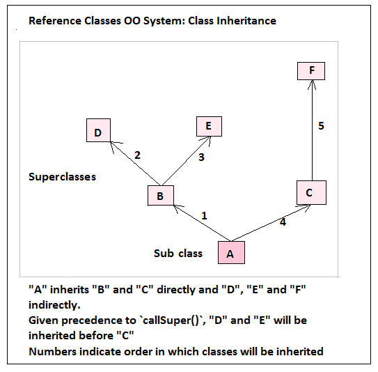

A few pointer, when defining classes, always start with the super classes.

```{r}
# Class definitions
f <- setRefClass("F",
                 methods = list(
                   fMethod = function(){
                     cat("Method for class F\n")
                   }))
e <- setRefClass("E",
                 methods = list(
                   eMethod = function(){
                     cat("Method for E\n")
                   }))
d <- setRefClass("D",
                 methods = list(
                   dMethod = function(){
                     cat("Method for D\n")
                   }))
c <- setRefClass("C", contains = "F",
                 methods = list(
                   fMethod = function(){
                     callSuper()
                  },
                  cMethod = function(){
                    fMethod()
                    cat("Method for class C\n")
                  }))
# Instatiating class "C"
C <- c()
# Invoking method for object "C"
C$cMethod()

b <- setRefClass("B", 
                 contains = list("D", "E"),
                 methods = list(
                   dMethod = function(){
                     callSuper()
                     },
                   eMethod = function(){
                     callSuper()
                   },
                   bMethod = function(){
                     dMethod()
                     eMethod()
                     cat("Method for B\n")
                   })) 
# Instatiating class "B"
B <- b()
# Invoking methods for object "B"
B$bMethod()

a <- setRefClass("A", contains = list("B", "C"),
                 methods = list(
                   bMethod = function(){
                     callSuper()
                   },
                   cMethod = function(){
                     callSuper()
                   },
                   aMethod = function(){
                     cMethod()
                     bMethod()
                     cat("Method for A\n")
                   }))
# Instatiating class "A"
A <- a()
# Invoking methods for object "A"
A$aMethod()
```


**Copy**

`RC` behaves in a totally different way from other `R` objects. This is in regards to creating new objects from other `RC` objects (enviroments). Take for instance the population at baseline and at round one from our example in [RC class definition](#rcClassDef). 

```{r}
basePopulation$population; roundone$population
```

They are the same which is really not what we wanted. We should have had 500 at baseline and 514 at round one. This means the modifications made were done to the object which is an environment, it did not matter that we gave it another name `roundone`.

To be able to get a different object you need to use the inherited method `copy` with argument shallow equal to true.

```{r}
# Instatiate object again 
basePopulation <- population(population = 500,
                             events = list(births = 20,
                                          deaths = 5,
                                          inmigration = 32,
                                          outmigration = 13))
roundOne <- rounds(previousPop = basePopulation, newPop = roundOneEvents)

# Make a copy of the baseline object 
roundone <- basePopulation$copy(shallow = TRUE)
# Generate round two object from copy
roundtwo <- roundOne$amendPop()
# Comparison of values
roundone$population; roundtwo$population
```

**Initialize**

If you have some tasks that need to be performed at the begining and before other methods are invoked, then you can create an intialize function.

```{r, eval=FALSE}
# 
tutorials <- setRefClass("tutorials",
                         fields = list(level = "character"),
                         methods = list(
                           initialize = function(){
                             level <<- readline(prompt = "Please choose level ")
                           },
                           train = function(){
                             cat("Classes for level", level, "begin shortly\n")
                           }
                         ))
myTutor <- tutorials()
## Please choose level 3
myTutor
## Reference class object of class "tutorials"
## Field "level":
## [1] "3"
myTutor$train()
## Classes for level 3 begin shortly
```


##### RC Methods Dispatch


Methods are invoked on these objects though reference like `object$method`. If a method requires to use elements of the `RC` object used to invoke a method, then `.self` variable is used.


## Implementation of Rs OO Systems: Case Study

So we have covered quite a bit of theory or concepts behind R's OO system. Now lets roll up our sleeves and put it all together and there is no better way to do that than applying it though an example. By the end of this session we should be able to design object oriented analytical programs  using either `S3`, `S4` or `RC`. Key issues to address in all the three systems are `classes`, `methods`, `inheritance`, `generic functions`, `object encapsulation`, and `polymorphism`.

Our case study is from hypothetical situation where we take on the role of an analyst trying to study the outbreak of a disease. Our interest in this case study is not to understand the subject at hand (epidemiology) but rather to implement an OO system for the program. Hence our core objective will be `implementation of an automated reporting system`. The motivation behind creation of the program is to reduce the time spent doing routine work and have more time reviewing the results as well as proposing next cause of actions. 

As we conclude this section, we shall discuss the "highs" and "lows" of each of the systems and propose strategies for selecting an OO system.

### An automated reporting system: Design Phase

First off, [this]("SummaryReport.2016-03-18.Rmd") is what we want to produce, a summary report of the data generated for one period. In essence we want to take the data and carry out the necessary computation before generating the summary report.

To implement this in OOP we will first design the program in terms of objects needed (inputs) to objects to be generated. FOr our case looking at the report (the expected output of the program) we need a data set as the input. what might not be too clear right now is the processes involved between input to output.

For purposes of learning `inheritance` and `polymorphism` in R's OO system, I will add a new dimension to our program. I want us to simulate data for testing the program. Therefore our program should be able to receive existing/real data (data sets) as well as simulate it (simulation inputs).

Inaddtion data sets and simluation inputs, we will need information about the reporting site, what is called `meta data`. This data is used as top matter of the summary report. So at this stage we have two inputs (data and metaData) for the analysis and reporting function.    

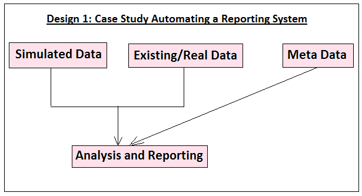

Now we need to simulate the data by adding a simulator function.

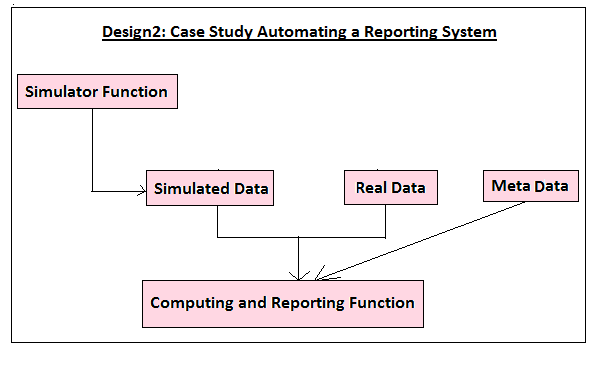

We have a fairly simple program that should make monitoring a bit more interesting. Before implementing the program in the three systems, lets detail the variables needed and their types (bases of good analysis). We will go step by step, starting off with  `meta data` and then the data sets. 

**Meta Data Requirements**

  Data                                          | Type
------------------------------------------------|-----------------------
Site ID                                         | "character"
Population under surveillance (geographic area) | "character"
Name of Report generator                        | "character"
Date of report generation                       | "numeric"
Collection cycle                                | "numeric"

This object will only be used in report generation.  

**Data Sets**

Our two data objects (simulated and real data sets) should have the following variables:

Variable      |   Type
--------------|------------
Site          |  "Factor"
ID            |  "Character"
Dates         |  "Date"
Round         |  "Numeric"
Exposed       |  "Numeric"
Incidences    |  "Numeric"
Prevalence    |  "Numeric"
Status        |  "Numeric"
MedicalCosts  |  "Numeric"


**Simulated data**

The following inputs are needed to simulate data.

```
Data                |  Type
--------------------|----------------------
Site                |  "Numeric"
Patients            |  "Numeric"
Dates               |  "Date"
Period              |  "Numeric"
Exposed             |  "Numeric"
Prevalence          |  "Numeric"
Incidence           |  "Numeric"
Mortality           |  "Numeric"
Cost                |  "Numeric"

```

**Analysis and Reporting**

The analysis and reporting function will receive data either as existing or simulated data. It will be the core function of the program although we shall have different forms of it.

**Validation**

A key issue when dealing with data is `validation` or the process of ensuring requirements are met. This process is implemented differently in Rs OO systems. So even though we have not factored it in our design, we shall implement it in the three systems.
    

#### Implementing the Case Study in S3  

We have a simple task, developing a program to analyse and generate summary reports. But we want some flexibility on this by having methods that can:

* Simulate data only
* Validate 
* Produce results only and
* Generate both results and report

So we need to think of the sequence of events, what begins and what follows, in this case we expect:

* Simulating data (only) would require one call to a simulator function and then to a validator which should result in a data frame
* To produce results (only) 
  + From existing data we will require a call to an analyst which will call for validation first before doing the analysis.
  + In the case of simulated data, a call will be made to the analyst which in turn will call a data simulator and then the validator before producing the results.
* Generating results and summary report will first call a reporting method before going through the preceeding step. 

Given the flow of action above, we expect the following class inheritance:

* To simulate data: Validator will inherit simulation methods
* To produce results only:
  + For existing data - Analysis method will inherit validation methods
  + For simulated data - Analysis method will inherit validation and simulation methods
* To generate both results and report: 
  + For existing data - reporting method will inherit from analysis and validator
  + For simulated data - reporting method will inherit from analysis, validator and simulator


We therefore need to define the following methods which will have similar class names:

* Simulation
* Validation
* Analysis
* Reporting

But before we define these methods, we have to create the objects and a generic function.   

### S3 Objects and Classes for the Case Study

We have three types of inputs (objects) in this case study, these are; 

* Simulation inputs, 
* Data set with existing/real data and a
* List with meta data. 

From these inputs (arguments to the generic), we expect the following outputs:

For simulated data

1. Simulated data only or
1. Analysis output or
1. Summary Report with Analysis Outputs

For existing or real data

1. Analysis output or
1. Summary Report with Analysis Outputs

In addition, we will have a meta data object that will be used in summary report generation.  

Therefore, in total we will create six objects with class vectors with either, `metaDataS3`, `simulatorS3`, `validatorS3`, `epidemiologistS3` and `summaryReportS3`. 

Data   | Object | Output | Class
-------|--------|--------|-------
Meta Data | `metaDataS3` | Report front matter | "metaDataS3"
Simulation Inputs | `simulatorInputsS3.1` | Data Simulation | c("validatorS3",  "simulatorS3") 
Simulation Inputs | `simulatorInputsS3.2` | Results only  | c("epidemiologistS3", "validatorS3", "simulatorS3")  
Simulation Inputs | `simulatorInputsS3.3` | Report with outputs | c("summaryReportS3", "epidemiologistS3", "validatorS3", "simulatorS3")
Data set | realDataS3.1 | Results Only | c("epidemiologistS3", "validatorS3")
Data set | realDataS3.2 | Report with outputs | c("summaryReportS3", "epidemiologistS3", "validatorS3")

```{r}
# Meta data object 
metaDataS3 <- structure(list(siteName = "Abnaceh",
                     siteId = "01/001/2016",
                     population = "Abnocia",
                     name = "Hellen Gakuruh",
                     reportingCycle = 1), class = "metaDataS3") 

# 1. Simulation Objects
# Variables for simulation
simulatorInputsS3.1 <- list(site = 1,
                            patients = 886,
                            dates = c("01-02-2016", "28-02-2016"),
                            period = 2,
                            exposed = 58,
                            prevalence = 47,
                            incidence = 36,
                            mortality = 32,
                            cost = 16, 
                            metaData = metaDataS3)

# a. Classes for data  simulation  only
class(simulatorInputsS3.1) <- c("validatorS3", "simulatorS3")
simulatorInputsS3.1

# b. To produce report only
simulatorInputsS3.2 <- simulatorInputsS3.1
class(simulatorInputsS3.2) <- c("epidemiologistS3", "validatorS3", "simulatorS3")


# c. To produce both analysis and report
simulatorInputsS3.3 <- simulatorInputsS3.1
class(simulatorInputsS3.3) <- c("summaryReportS3", "epidemiologistS3", "validatorS3", "simulatorS3")


# 2. Object for real/existing data
# Reading in data 
epiData <- read.csv(file = "realData.csv", sep = " ")
head(epiData, 2)

# a. Object to produce results only
realDataS3.1 <- list(epiData, metaDataS3)
class(realDataS3.1) = c("epidemiologistS3", "validatorS3")

# b. Object to generate summary report with output
realDataS3.2 <- realDataS3.1
class(realDataS3.2) <- c("summaryReportS3", "epidemiologistS3", "validatorS3")
```

Lets Confirm they are all S3 objects.

```{r}
library(pryr)
# Meta data
otype(metaDataS3)
# Simulator objects
otype(simulatorInputsS3.1); otype(simulatorInputsS3.2); otype(simulatorInputsS3.3)
# Real/existing data objects
otype(realDataS3.1); otype(realDataS3.2) 
```

We can check their inheritance.

```{r}
# Simulation objects
# First object: Data Simulation Only
inherits(simulatorInputsS3.1, c("validatorS3", "simulatorS3"))

# Second object: Simulation and Analysis
inherits(simulatorInputsS3.2, c("epidemiologistS3", "validatorS3",      "simulatorS3"))

# Third object: Simulation, Analysis and Summary report
inherits(simulatorInputsS3.1, c("summaryReportS3",  "epidemiologistS3", "validatorS3", "simulatorS3"))

# Real/existing object
# First Object: Analysis only
inherits(realDataS3.1, c("epidemiologistS3", "validatorS3"))

# Second Object: Analysis and Summary Report 
inherits(realDataS3.2, c("summaryReportS3", "epidemiologistS3", "validatorS3"))
```


### Creating generic functions and defining methods in `S3`

We will create our generic function as discussed in the section [S3 Generic Functions](#s3Generics) and name it `generatorS3`. 

```{r s3Generic}
generatorS3 <- function(object){
  UseMethod("generatorS3", object)
}
# Confirm its type
library(pryr)
ftype(generatorS3)
```

### S3 Methods

Now, lets create methods for our case study, we have four of them; simulator, validator, outputs, and reporter. From a programming standing point, the three types of output (simulated data only, results only and both results and report) indicate `polymorphism` (different forms of an output object). We will also implement the principle of `encapsulation` by separating the functions that actually simulate data, analyse and generate summary report. By doing so we can be able to call the functions from multiple methods. It will also ensure that these core functions are not tampered with as we develop the program. `Inheritance` will be implemented by `NextMethod` according to the order of our class vector. 

```{r s3Methods1}
# Sourcing encapsulated functions
source('Scripts/epiProgramOOP_S3.R')
```

Our first method is a data `simulator` which will only simulate data. 

```{r}
generatorS3.simulatorS3 <- function(object){
  simulatorS3(object)        
}
```

Second method is a validator, a call to this method will have one object as `S3` is a `single method dispatcher`. However, this object is expected to have two elements that is `simulation inputs and a meta data object` or `real data and a meta data object`. Validation will ensure object meets set requirements like variable names.  

```{r}
generatorS3.validatorS3 <- function(object){
  classes <- class(object)
  # Validate data frames (existing data) validate 
  if(class(object[[1]]) == "data.frame"){
    validatorS3(object)
  # Validation for simulated data
  } else { 
    obj <- NextMethod() # Simulate
    object <- list(obj, object$metaData) # return list with simulated and meta data
    class(object) <- classes # Add original class attribute
    validatorS3(object)
    # Output for simulated data:
  if(length(classes) > 2){ 
    # 1. Output: Results and meta data for either results or report generation 
    return(object)
  } else{
    # 2. Output: Simulated data only 
    return(object[[1]])
  }
  }
}
```

Third is an analysis method called `epidemiologistS3`, it's the core method.

```{r}
# Analysis method to produce results only
generatorS3.epidemiologistS3 <- function(object){
  # For real data
  if(class(object[[1]]) == "data.frame"){
    NextMethod()# Send data for validation
    results <- epidemiologistS3(object[[1]])# Analyse validated data
    # For simulated data
  } else {  
    obj <- NextMethod()# Simulate data then validate
    results <- return(epidemiologistS3(obj[[1]]))# Analyse data
  }
  classes <- class(object)
  # Output for this function:
  if(classes[1] == "summaryReportS3"){ 
    # 1. Output: Results and meta data for report generation 
    obj <- list(output = results, metaData = object[[2]])
    return(obj)
  } else{
    # 2. Output: Results only 
    return(results)
  }
}# Not run: Amended the object set to analyst to be just the first element of the list  
```

Our fourth method is a summary and report function.  

```{r}
generatorS3.summaryReportS3 <- function(object){
  metaData <- object$metaData
  # For real data
  if(class(object[[1]]) == "data.frame"){
    obj <- NextMethod()# Send data for validation and analysis
    summaryReportS3(obj)# If validated, analyse  
  # For simulated data
  } else {  
    results <- NextMethod() # Simulate, validate and analyse
    results <- list(results, metaData)
    summaryReportS3(results)# Analyse data
  }
}
```

Finally and in line with good programming we add a default method

```{r}
generatorS3.default <- function(object){
  cat("No method found")
}
```

We can confirm that these methods are in our generic function `generatorS3`.

```{r}
methods(generic.function = "generatorS3")
```


#### Generating outputs

We have everything set, now we can run our program with the various objects. 

1. Simulating data only
```{r}
# Simulating data
head(generatorS3(simulatorInputsS3.1), 2)
```

2. Results only

a). Real data 

```{r}
generatorS3(realDataS3.1)
```

b). Simulated Data


```{r}
generatorS3(simulatorInputsS3.2)
```

3. Produce both output and report

a). Real Data

```{r}
generatorS3(realDataS3.2)
# Preview the report
#file.show(paste0("SummaryReport.", Sys.Date(), ".Rmd"))
```

b). Simulated Data

```{r}
generatorS3(simulatorInputsS3.3)
# Preview output
#file.show(paste0("SummaryReport.", Sys.Date(), ".Rmd"))
```


With that, we have successfully implemented `S3` OO system and as we have seen, creating `S3` objects is not hard, you create them in the usual way with an `assignment` operator or the `structure` function and add a `class attribute`. However, these classes are not defined and one can add or amend them without describing what the classes are or should do. This very nature is not in line with good programming and therefore a more descriptive method was called for, this is the `S4` OO system.

#### S4 Case Study Implementation: Automation of a monitoring system 

To implement this system, we need to amend our design as we no loger need a validator method and we want to take advantage of the multiple dispatching mechanism of `S4`. We can now have the dispatcher dispatching  methods for both data and meta data; that is, dispatch on two objects. The second input object will be used to control the output produced, that is, presencence of a meta data object indicates a summary report is required, if it is not, then simulated data or analysis results is required. 

With this in mind, lets amend the design by looking at it from a  class inheritance perspective, that is, `what object classes will meet our objective`. Recall our interests are:

* Producing simulated data, 
* Producing results only and
* Producing both results and report. 

Therefore we will have two types of classes, those for the first object and those for the second object. 


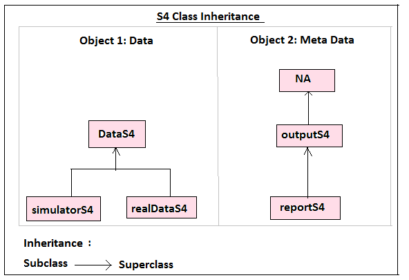  

The combination of these classes should result in one of the specified outputs. 

##### Class Combination Table with expected outputs{#combinationTable}

Combination                                   |   Output
----------------------------------------------|---------------------
Object 1      | Object 2
SimulatorS4   | Nothing(missing) or NA        |   Simulated data
SimulatorS4   | outputS4                      |   Analysis results
SimulatorS4   | reportS4                      |   Summary report with analysis results 
RealDataS4    |  Nothing(missing), NA or outputS4| Analysis results
RealDataS4    |  reportS4                        | Summary report with analysis results


#### Case Study: S4 Class definition

Going by our `S4` design, we have six classes to define, these are

```
For first object
DataS4
    simulatedS4
    realDataS4

For the second object
NA
  outputS4
    reportS4
```

For the first object, we will define three classes, the first being a parent class `DataS4`, the second class is for data simulation and the third class is for data sets. We will include a validator argument to the real/existing data class definition to ensure variables conform to expectations. `Protype` (default) argument is irrelevant for both `realDataS4` and `simulatorInputsS4`.

```{r}
# Parent class for the data sets
setClass(Class = "DataS4",
         representation = representation(data = "data.frame"))

# Class definition for simulating data 
setClass(Class = "simulatorS4",
         representation = representation(
           site = "numeric",
           patients = "numeric", 
           dates = "character",
           period = "numeric",
           exposed = "numeric", 
           prevalence = "numeric", 
           incidence = "numeric",
           mortality = "numeric", 
           cost = "numeric")
         )
#

# Class for data sets (validator is included)
setClass(Class = "realDataS4",
         # Inheriting methods
         contains = "DataS4",
         # Including a validator
         validity = function(object){
           cols <- c("Site", "ID", "Dates", "Round", "Exposed", "Incidences",   "Prevalence", "Status", "MedicalCosts")
           objectColumns <- names(object@data)
           test <- tolower(cols)%in%tolower(objectColumns) == FALSE
           if(any(test)){
             ind <- which(test)
             cat("Missing columns: "); cat(cols[ind], sep = ", ")
             stop("Validity check is case insensitive and not partially matched")
           }
           TRUE
         }
         )
```

The next group of classes are for the second object `meta data` and they will determine which output is generated. First class is `NA`, it will simulate data or produce results depending on the first class. The second is `outputS4` which will produce results and third is `reportS4` for report generation.  

```{r}
# 1. Class for data simulate 
setClass(Class = "NA", prototype = "NULL")
# 2. Class for analysis only
setClass(Class = "outputS4",
         contains = "NA")
# 3. Class report generation
setClass(Class = "reportS4",
         representation = representation(
           siteName = "character",
           siteId = "character",
           population = "character",
           name = "character",
           reportingCycle = "numeric"),
          contains = "outputS4") 
```

Having defined the classes, we can test, get, find, reset, seal and remove these formal classes.

```{r}
# Check if class is formally defined
isClass("simulatorS4")
# Inspect a formal class
getClass("simulatorS4")
# See all the formal classes in the global environment
getClasses(globalenv())
# Tracing a formal class
findClass("simulatorS4")
# see all `superclasses` (equivalent to `inherit` in `S3`)
is("simulatorS4")
```


##### Case Study: S4 generic function

The `S4` generic for our case study will be called `generatorS4` and it will dispatch on two argument, `object` and `MetaData`. The second object will be used to determine the output produced. 

```{r creatingS4Generic}
# Declaring a generic
setGeneric(name = "generatorS4",
           def = function(object, MetaData){
             standardGeneric("generatorS4")
           })
```


#### Case Study: S4 Methods

Okay, we have our classes define and a generic created, now we need to add `S4` methods for it.  

For our case study, we will create methods to:
* Simulate data  
* Analyse data 
* Generate summary report and finally a
* Show method for displaying data

In defining these methods, we will be guided by the [class combination](#combinationTable) table we produced earlier. So to start us off is a method to simulate data, it requires only one object, simulation input but it can also simulate data if a second empty object of class `NA` is provided. The actual simulation is done by an encapsulated function `simulatorS4`.

```{r S4SimulatorMethod}
source(file = "Scripts/epiProgramOOP_S4.R")
# To simulate data only
# Method one 
setMethod(f = "generatorS4",
          signature = c(object = "simulatorS4", MetaData = "missing"),
          definition = function(object){
            # Calling encapsulated core function and returning an S4 object
            simDataS4 <- new(Class = "DataS4", data = simulatorS4(object))
            simDataS4
          })
# Method two 
setMethod(f = "generatorS4",
          signature = c(object = "simulatorS4", MetaData = "NA"),
          definition = function(object, MetaData){
            simulatorS4(object)
          })
```
 
Next are methods to produce output only. 

To produce results for real data, one can input the data set only or the data set and an empty object of class `outputS4`. Results are produce by a call to the analyst (`EpidemiologistS4`). 

```{r}
# Obtain results only for real dataset
setMethod(f = generatorS4,
          signature = c(object = "realDataS4", MetaData = "missing"),
          definition = function(object){
            EpidemiologistS4(object)
          })

setMethod(f = generatorS4,
          signature = c(object = "realDataS4", MetaData = "outputS4"),
          definition = function(object, MetaData){
            EpidemiologistS4(object)
          })
```

For simulated data, output can be produced with two objects, simulator inputs and an empty object of class `outputS4`. Inheritance is implemented as the method calls for data simulation first before calling the analyst. 

```{r}
# Method to obtain results only for simulated data
setMethod(f = generatorS4,
          signature = c(object = "simulatorS4", MetaData = "outputS4"),
          definition = function(object, MetaData){
          epidata <- callNextMethod(object)
          epidata <- new(Class = "realDataS4", data = epidata)
          EpidemiologistS4(epidata)
          })
```

Finally are methods to analyse and generate a summary report. Both simulated and real data will need to have a meta data object of the class `reportS4` which has a direct `superclass` of `outputS4`. Once analysis is done, then a call is made to a function that does the report, `summaryReportS4`. 

```{r}
# For simulated data
setMethod(f = generatorS4,
          signature = c(object = "simulatorS4", MetaData = "reportS4"),
          definition = function(object, MetaData){
          results <- callNextMethod(object)
          object <- list(results, MetaData)
          summaryReportS4(object)
          })

# For real data 
setMethod(f = generatorS4,
          signature = c(object = "realDataS4", MetaData = "reportS4"),
          definition = function(object, MetaData){
          results <- callNextMethod(object)  
          object <- list(results, MetaData)
          summaryReportS4(object)
          })
```

As good programming practice, lets add a default methods. We will use the pre-defined class `ANY` to indicate any object with a class other than those defined and have methods in the generic `generatorS4`. 

```{r s4DefaultMethod}
# When objects of any other class are supplied
setMethod(f = generatorS4,
          signature = c(object = "ANY", MetaData = "ANY"),
          definition = function(object, MetaData){
            cat("Opps, sorry no method found")
          })
# Checking functionality of default
setClass(Class = "a", contains = "missing")
generatorS4(new("a"), new("a"))
```

Our final method in `s4` involves adding to a base generic. Our intent is to display only a snippet (4 rows) of the data sets.

```{r}
# A show method for data set
setMethod(f = "show", 
          signature = "DataS4",
          definition = function(object){
            cat("An object of class", sQuote(class(object)), "\n")
            cat("\n")
            cat("Slot: data\n")
            print(head(object@data, 4))
            cat("\n") 
            cat("Showing 4 row out of", nrow(object@data), "\n")
          })
```

#### Class Instatiation - S4 objects

With the classes and methods defined, we can now instantiate the classes or create objects. We shall instantiate three objects, one for simulation, real data and finally meta data.

Starting with simulator input object, we will give it a class `simulatorS4`. It will contain values for data simulation.

```{r}
# 1. Simulation object
simulatorInputsS4 <- new(Class = "simulatorS4",
                         site = 1,
                         patients = 1977,
                         dates = c("01-03-2016", "31-03-2016"),
                         period = 1,
                         exposed = 62,
                         prevalence = 15,
                         incidence = 43,
                         mortality = 25,
                         cost = 19
)
# How does S4 object look like?
simulatorInputsS4

# 2. Real data object
realDataS4 <- new(Class = "realDataS4", data = epiData)
# Display data (Show method will print only 4 rows)
realDataS4
# Confirm it is an S4 object
isS4(realDataS4)

# 3. Meta data Object
site17Info <- new(Class = "reportS4", 
                 siteName = "Boah",
                 siteId = "17",
                 population = "Thespa",
                 name = "Hellen Gakuruh",
                 reportingCycle = 2
                )
site17Info
# Confirm it is an S4 object
isS4(site17Info)

```

Before an object is created in `S4` the function `validObject` checks the validity of the object in relation to its class definition. If it is not valid, expect to receive an error. If you add a validation function, this too will be used check for validity.

For example, in instantiating `realDataS4` object, if we added meta data variables like in `S3`, then we should expect to receive an error. If the data set does not have the defined variables, then this too shall raise an error.

```{r, eval=FALSE}
# Copy of data set 
epiData_2 <- epiData
# 1. Error from `validObject()`
realDataS4_2 <- new(Class = "realDataS4", 
                  data = epiData_2,
                  siteName = "Gamenh",
                  siteId = "1",
                  population = "Region A",
                  name = "Hellen Gakuruh",
                  reportingCycle = 1)

# Error in initialize(value, ...) : 
  # invalid names for slots of class "realDataS4": siteName, siteId, population, name, reportingCycle

# 2. Error from our defined validator 
names(epiData_2) <- c("Site", "ID", "Cycle", "Round", "Expose", "Incidence",   "Prevalence", "Status", "MedicalCost")
realDataS4_2 <- new(Class = "realDataS4", data = epiData_2)

# Missing columns: Dates, Exposed, Incidences, MedicalCosts
 
 # Error in validityMethod(object) : 
  # Validity check is case insensitive and not partially matched
```


### Case Study: Generating S4 outputs

We set out to produce three types of outputs using `S4 OO system`. These are, simulated data, results and summary report. We can now the program to produce these outputs.

1. To simulate data, we need simulator inputs

```{r s4DataSimulation}
# Call generic function with either:
# One object; simulator inputs 
generatorS4(simulatorInputsS4)
# Or with a second empty object of class "NA"
head(generatorS4(simulatorInputsS4, new("NA")), 4)
```

To produce results, both simulated and real data will have the second object supplied to the generic as an empty object of class `output`. However, for real data, the first object will be a data frame having a `realDataS4` class. For the simulated data, the first object will be simulator inputs with class `simulatorInputsS4`.

```{r}
# To produce results from real/existing datasets
generatorS4(realDataS4) # or generatorS4(realDataS4, new("outputS4"))
# To produce results from simulated data 
generatorS4(simulatorInputsS4, new("outputS4")) 
```

Finally to generate both results and report

```{r}
# For simulated data
generatorS4(object = simulatorInputsS4, MetaData = site17Info)
# For real data
generatorS4(object = realDataS4, site17Info)
```

And there we have done it, we have implemented an `S4` OO system. Now off to the new system in `R` called `reference classes (RC)`.

### Case Study: Reference Classes (RC)

In this system all we need to do is to define classes, instantiate them (creating objects) and then invoke methods through the objects created. Design wise, we are looking at two classes, simulated data and real data. But to learn `inheritance` in `RC` we will separate the simulation process and call`superclass` with the function `callSuper`. Ideally this is what we want to achieve.


With that as our focus, lets implement it by defining the classes.  

Okay, lets go to our case study, first we will define our simulator classes; a class to simulate data only, another to analyse the data and a third one to analyse and generate a summary report. Since our program is relatively simple, we shall include the methods within the call to `setRefClass`.  

```{r}
# 1. Simulation Classes (Inheritance approach)

# a) Reference class to simulate 
simulationClassRC <- setRefClass(Class = "simulationClassRC",
                                 fields = list(data = "list"),
                                 methods = list(
                                   simulater = function(){
                                     simulatorRC(.self)
                                   }
                                 ))

# b) Class to simulate and produce output
outputClassRC <- setRefClass(Class = "outputClassRC",
                             contains = "simulationClassRC",
                             methods = list(
                               simulater = function(){
                                 epidemiologistRC(callSuper())
                               })
)


# c) Class to generate report
reportClassRC <- setRefClass(Class = "reportClassRC",
                             fields = list(data = "list"),
                             contains = "outputClassRC",
                             methods = list(
                               simulater = function(){
                                 epidata <- list(callSuper(), .self$data[[2]])
                                 summaryReportRC(epidata)
                               }
                             ))
# 2. Class for real data (method call approach - simplified to one class)
realDataRC <- setRefClass(Class = "realDataRC",
                          fields = list(data = "list"),
                          methods = list(
                            output = function(){
                              epidemiologistRC(.self)
                            },
                            report = function(){
                              obj <- list(output(), .self$data[[2]])
                              summaryReportRC(object = obj)
                            }
                          )) 
```

Now lets instantiate the classes. 

```{r}
# Inputs
metaDataRC <- list(siteName = "Site1",
                   siteId = "001",
                   population = "Yonder",
                   name = "Hellen",
                   reportingCycle = 1)

simInputsRC <- list(site = 1,
                    patients = 1977,
                    dates = c("01-03-2016", "31-03-2016"),
                    period = 1,
                    exposed = 62,
                    prevalence = 15,
                    incidence = 43,
                    mortality = 25,
                    cost = 19)

# 1. Simulator Objects

# a) Object to simulation data only
site1 <- simulationClassRC(data = simInputsRC)
# Preview object
site1
# Confirm it is an RC object
library(pryr)
otype(site1)

# b. Simulator Object to produce output
outputSimRC <- outputClassRC(data = simInputsRC)        

# c. Simulator Object to produce results and summary report
site1Report <- reportClassRC(data = list(simInputsRC, metaDataRC))


# 2. Real data
realDataObjRC <- realDataRC(data = list(epiData, metaDataRC))
```

Finally, we invoke the methods with the objects we have created.

```{r}
source("Scripts/epiProgramOOP_RC.R")
# 1. Simulation Outputs
# Producing outputs
# a. Simulate data
head(site1$simulater(), 4)
# b. Produce Results
outputSimRC$simulater()
# c. Generate Summary Report
site1Report$simulater()
#file.show(paste0("SummaryReport.", Sys.Date(), ".Rmd"))

# 2. Real Data Outputs
# a) Analysis only
realDataObjRC$output()
# b) Analysis and Summary Report
realDataObjRC$report()
#file.show(paste0("SummaryReport.", Sys.Date(), ".Rmd"))
```


## What R OO system should you use?

Selection of an OO system will mostly depend on two things; one, how conversant you are with the system and what you want to do with it. `S3` is fairly easy to work with but its lack of definitions is not considered good programming. Hence, most programmer prefer the other two systems. If you have a program that need to change its slots or fields often, then consider using `RC` .


TODO

1. ~Code and write-up for RC~
2. ~Finalise S3 and S4 write up (code explanations)~
3. Add short reference section below
4. Edit article

Off dates:
1. ~10/03/2016~
2. 16/03/2016 Postponed till all is done - But tentatively off the ~whole weekend~ 


#### Programming Paradigm{#paradigm}

* What is it and why is it necessary in a programming language

#### Procedural and Object Oriented Programming(OPP){#procedural.opp}


In this section we delve into a bit of computer science, though we shall only be touching the surface and only enough to get you started well in R.

Let's beginning with the first term `object`; in the real world it can be a thing, anything that you can be able to describe in terms of it's `structure/properties`, `name`, and `actions`. So an object can be "*you*" as a person, the computer you are using, house or data. For example, your computer is an object because it has a manufacturers name or some unique name you have given it; it has properties such as size, color, and type; and it can be switched on and off, compute and record sounds.    

In the same line, R objects are composed of `attributes` and `methods`. Attributes can be thought of as the `"what" of the object` and methods as the `"how" or simply what the object can do`. So, in the case of *you* being an object, the attributes would be your age, gender, color, e.t.c (what makes you up) and methods is what you can do like you sleep, walk, run, work e.t.c.{#object}     

With all R objects, there is a `class` which describe the object. They tell you what the object is all about or how it should be developed. It is the blueprint of the object and therefore to produce the object, this blueprint must be processed; something called `instatation`. Using our earlier example, of you as an object, then we could say you are an object of class "person". The class person will contain full details about you. 

Now in R, almost everything is an object and all operations are performed using objects. For example, all functions including the mean are objects and therefore have a class that define them, attributes and methods. 

It is good to have this in mind as you programme in R and can leave the rest of this section (OOP) if need be, but hopefully we will be completing it. 

Now that you know what an object is, it's attributes, methods and classes, there are two other important concepts that are fundamental to object oriented programming, these are `encapsulation` and `inheritance`. 

#### Encapsulation{#encapsulation}

When we discussed how to make function calls, we saw that you can pull up the help documentation for the function using either `help(function)` or `?function`. We also noted that we could get the arguments of a function using the `args()` function. But to see how the function works or its internals, we type in the functions name without the parenthesis.

```{r function.internal}
# Look for a function that shows its internal
```

What is Rs internal(documentation)? storage, 

Encapsulation means hiding the complexity of the internal working of the object which is particularly useful for functions. For example, in addition to getting help documentation, you can look up a functions code by typing the name of the function without the parenthesis. Now, if you do this for say the mean, you will see that it has hidden its code or stored it separately. 

```{r }
mean    
```

Encapsulating helps to ensure consistency, more so when the internals change. That is, sometimes the function would have some updates to it's internal working but it's core or what is shown does not get affected, in this case the call to the mean remains the same.


### Reasons for learning OOP in R

* You get to know how to access hidden source codes. Source codes can be a great way to improve your programming skills in addition to knowing how a function works

##### Short Definitions


**Function Call**: {#call}

**Mutable**: {#mutable}

Prone to change

**Symbols:**{#symbols}

Symbols are names of R objects. They can either be provided when the object is being defined or are created with `as.name` and `quote` function.

```{r}
#For example, 
symbls <- as.name("nams")

#c is a symbol i.e.
is.name(symbls)

# Core composition
mode(symbls)

# Object type 
typeof(symbls)
```

**Internal and Primitive Functions**{#internal.primitive}

*internal non-primitive functions?

### Compilers and Interpreters{#comp.inter} 

One of the first things you are taught when learning how to use computers is that a computer only understands `0's and 1's`, representing off and on state. This means that every action you need the computer to perform needs to be in the form of 0 and 1 or what is called `computer language`. 

Now imaging**(sp)** you want to make a summary statistic of a given variable, naturally you would use commands that you can understand like mean(), median(), or summary(). For you, this is easily understandable, but for the computer, it would not be understandable. Therefore, you would need to convert the command to `computer language` or into 0's and 1's. Doing it manually can be quite a task and therefore there are computer programs which help convert the code to a form the computer can understand. These are compilers and interpreters. 

Compilers pick your list of instructions and converts the whole document to computer language. This can be quite slow at first as the program takes time in the conversion process, but runs pretty first once the codes have been converted. One key flaw in this system is that if your code was faulty, and the compilation has began, then it would be too late to amend it.

Interpreters on the other hand picks one instruction, converts it until they are finished. The good thing about it is that the conversion begins immediately and one can amend the instructions as they go on. However, this method is quite slow unlike the compiler.

The instructions or code given to either of the two programs would be in one of the numerous programming language of which R is one of them. R uses an interpreter in it's implementation along side `Lisp programming language`, `Dartmouth BASIC` `Perl`, `Python`, `MATLAB`, `Ruby`, `UCSD`, `Pascal` etc. Read more on this at [Wikipedia]("https://en.wikipedia.org/wiki/Interpreter_(computing)"). Examples of compilers are `c++`, `BASIC`, `COBOL`, `Fortran` and many others.


#### Exercises

**S3 Inheritance** 

 For example, all computers have the same functionality, and therefore they fall under the class "computers". However, there are two types of computers, "desktops" and "laptops". You could also look at desktops as "usual desktops" or "mainframe" computers. All these are different forms of a computer and they each inherit the method specified for the class before also known as a `superclasses` (the current class is called `subclass`). 

```{r eval=FALSE}
# generic function: "computers"
computers <- function(object){
  UseMethod("computers", object)
}
# Methods
computers.computer <- function(object){
  print("I am a computer")
  NextMethod()
}
computers.Laptop <-function(object){
  print("specifically a laptop")
  NextMethod()
}
computers.HP <- function(object){
  print("and HP is my type")
}
# Object
myComputer <- list()
class(myComputer) <- c("computer", "Laptop", "HP")
# Call the generic
computers(myComputer)
```

In our example above, we have an object called `myComputer` which is a computer as well as being a laptop and a HP type, these are its various forms. It therefore inherits all the method for a computer and laptop. In this case we would expect the following output once the generic is called.

```{r eval=FALSE}
[1] "I am a computer"
[1] "specifically a laptop"
[1] "and HP is my type"
```


## References{#references}

1. R Core Team (2015). R: A language and environment for statistical computing. R Foundation for Statistical Computing, Vienna, Austria. URL https://www.R-project.org/.
1. John Chambers, 2006; "How `S4` Methods work"


```{r}
sessionInfo()
```
