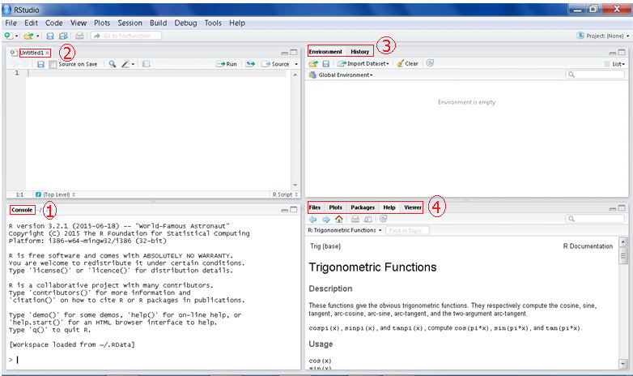

# Level One: Session One
    
## Session's goal

* Main goal is to make the necessary preparation for using R 
* It will involve getting and setting-up base R and RStudio
* It will also introduce the two programs


## What you will learn

* How to download, and install   
    + <b>Base R</b>
    + <b>RStudio</b>
* Work Interactively with R and RStudio (Using the console)
* Get to know the global environment/working space and history files
* Learn how to code using scripts
* Install and understand what R Packages are

# What is R?

## About R

* A system for statistical computation and graphics (R Documentation)
* A Programming Language
* A dialect of the `S` language and started in 1983
* Partly named after the leading founders `Ross Ihaka` and `Robert Gentleman` first names and partly to bear similarity with `S`
* Began as a program for teaching statistics at a university 
* Has since grown with diverse user from all over the world  
* A collaborative project with many contributors to the base package as well as extensions (packages)

# Why R?

## Reason to learn R

* It's absolutely free
* Has magnificent graphing capabilites: R's greatest strength.
* It is highly extensible. As a programming language, it allows user defined functions(programs) or packages (add-on)
* R offers a growing number of packages to facilitate reproducible analysis. From these packages, outputs can be documented in various formats like PDF, HTML, microsoft Word, and presentation slides among others
* Available softwares packaged to create interactive statistical application (apps) like [shiny]("http://shiny.rstudio.com/gallery/")
* There is a growing number of users thereby creating a common sharing platform

-------------------------------------------------

* A growing number of free and commercial Intergrated Development Environment (IDE's).
* `IDE's` are softwares that ease the coding process, they include [RStudio]("https:/rstudio.com") which has a free and a commercial version, and [Revolution R]("http://www.revolutionanalytics.com") which mostly has a commercial version and is best suited for big data. 
* To distinguish R from it's IDE's, it is usually refered to as `base R`    

---------------------------------------------------------------------------

* With a good foundation, R is not that hard. 
* `My Challenge to you:` put this statement into action and test if it is correct by assessing your knowledge and skills after completing level one (it has four sessions). For example, 
    + go to Q&A sites like [StackOverflow]("http://stackoverflow.com/questions/tagged/r") and find questions on the areas already covered, use the tags and gauge your understanding of the questions and solutions offered. 
    + Given a well written R script, do you  understand the code?
    + Look at your initial scripts, can you be your own critic? How is your learning curve, have you gotten better with time and practice?

# Base R 

## Downloading R

* R is available from [The Comprehensive R Archives Network (CRAN)]("https://cran.r-project.org/")
* CRAN is a collection of web servers that stores identical and up to date version of code and documentation of R
* There are multiple mirrors (copies) of CRAN located across the globe. It is recommended to download from one of the mirrors closest to your area
* Select a platform most suitable to your computer specification (OS, 32/64 bit)
* Lets now download and start it up

# Demo 1: [Downloading and Installation of Base R](demo/1.Downloading and Installing R.pdf) 

# Getting to know Base R

## Base R at a glance


## The toolbar

* <b>File:</b> Open/create script, load/save workspace and history, print and exit. Workspace and history files to be discussed later in this session
* <b>Edit:</b> Usual edit options plus run options and GUI preference (appearance) options
* <b>Packages:</b> selecting mirrors, loading, installing and uninstalling package. Packages are add-ons 
* <b>Windows:</b> How to arrange the windows
* <b>Help:</b> Manuals and help documentation

## The Console 

* Also called `Command Line Interface` and acts like a calculator
* Type a code or enter an input on the console and it will be evaluated immediately and their Output produced i.e. interactive
* Being a window just like any other window, you can minimize, maximize, or re-size the window. Try and see 
* The console is most suitable for single lines

## Interactive session: The console

```{r}
# simple arithmetric
1 + 1
20/2
# Exponential
exp(1)
```

--------------------------------------------------------------

```{r}
# Some geometry  
2 * pi * (90/360)
# Some trigonometry
cos(90 - 32)
atan(28/63)
```

* Note that R is case sensitive, so <b><u>C</u>os</b> and <b><u>c</u>os</b> are not the same. Useful to know that when you see a "+" instead of ">", know that your syntax is incomplete and R is prompting you to complete it.


## R's Script

* If you were to give someone your code to rerun how would you do it?
* Working on the console gives instant results but not suitable for reproducibility or codes with multiple line, that is where scripts come in
* In essence, scripts are like other text inputing programslike Ms Word and notepad, hence called text editors.
* Text editors are programmed to understand certain programming languages thereby giving guidance in the coding process.

---------------------------------------------------------------------------

* To create a new script on base R go to `files > New Scripts`


# Demo: Scripting in R

## First things first

* What is the first thing you need to do when you start R?
* How can you work on different analysis projects?
* How does R know where to look for documents i need?
* Quick answer to these questions is to  **specify your working directory** and **know thy file path**

## The working directory

* It is a folder on your PC (disk) you create to store documents to be used during analysis. You can also use this folder to store files you generate
* Since tasks and projects can be numerous, it is advisable to tell R which folder is the working directory (wd) for each `R session`. 
* A session in R begins the moment R is started and ends when it is closed.
* Before telling R the working directory, it is good to know the path of the **current** working directory using the `get()` function
* To change the working directory to another folder use the `setwd() function`
* But what is a function and are the brackets necessary?

## Brief introduction to R functions

* To know the current directory or change it, you must use a function
* So what is a function and how do you use them?
* A function in the simplest terms, is a command that performs a specified task
* All functions have a name preceeded by an opening and closing bracket
* Within the brackets are what are called `arguments`. They give further details of how R should implement the command or what data it should use.

---------------------------------------------------------------------------

* To use a function we refer to it as `calling a function` or `making a function call`
* R has numerous function that come with base R but there many more that come with add-on called `packages`.
* You can also write your own functions with the help of base R functions
* Okay, with that small introduction, let's go back to knowing and setting working directories

----------------------------------------------------------------

* Both `getwd()` and `setwd()` functions require you to know the path to the folder.
* The easiest way of setting the working directory (without specifiying the path), is to use the toolbars:
    + On Base R: file > change dir
    + On RStudio: Session > Set Working Directory > and either:
        - To source file locator: path of an opened R Script
        - To File Pane locator: R Studio's path on your PC
        - Choose Directory: Select a folder from an opened dialog box 
* Practice session: 
    + Create a folder on your computer called `Data_Mgt_Analysis_and_Graphics_R`
    + Set your working directory to that folder.
    
--------------------------------------------------------------------

* On the command line or console, you can create the folder on the home path as:

```{r, eval=FALSE}
dir.create("~/Data_Mgt_Analysis_and_Graphics_R")
```

* To set the working directory to that folder

```{r, eval=FALSE}
setwd("~/Data_Mgt_Analysis_and_Graphics_R")
```

* What is a path, a home path and what is that tilde?

## Paths

* A path is a name that specifies a unique location in a computer or website
* So a file path specifies a unique location of a file
* For example *C:/Users/Hellen Gakuruh/Documents/Data Mania/Intro.R*
* Meaning the file is located in a directory called Data Mania, which is in the documents folder, which is in a users folder named Hellen Gakuruh, all of it in the c drive.
* The different folders are separated with what are known as delimeters like the `/` but it could also be `\` or a `.` depending with the operating system

-----------------------------------------------------------------------------

* A path can either be absolute or relative. An absolute path begin from what is called a `root node` like `C:` for windows.A relative path is a shortened path name like `Data Mania/exercises.R`. 
* In R, relative paths are used as long as the path for the working directory has been specified
* This path need not start at the root node but to where R was installed which by default is the home path denoted by a tilde (~) 
* A home path is a location in the computer inside the root element and specified during installation of the operating system. Most often the `Documents` folder i windows. 

# What is the working space or the global environment?

## Working Space/Global Environment

* It is a temporary storage area in the computer memory where R stores data and other objects used in an R session.
* The objects on the working space are only avaliable during the R session but can be saved as ".Rdata" file.
* Saved workspaces are usually reloaded in the next session or can be loaded using:
    + the `load()` function on the console
    + toolbar:
        - On R: file > Load Workspace
        - On RStudio > Session > Load Workspace

# RStudio

## What is RStudio?

* It is one of R's `Integrated Development Environment(IDE)'s`. Some of it's key advantages over base R are:
    + Well thought out and organized layout(panes), making it easy to see all the core windows at the same time.
    + It has a syntax-highlighting editor that supports direct code execution,
    + Workspace management.
    + Makes data importation easier
    + Incorporation of R markdown files makes documentation and reproducible analyis easier. 
* It is available for open source and commercial editions and runs on the desktop (Windows, Mac, and Linux) or in a browser connected to RStudio Server or RStudio Server Pro (Debian/Ubuntu, RedHat/CentOS, and SUSE Linux) [RStudio]("https://www.rstudio.com/products/rstudio/").

## Downloading RStudio

* Download from [RStudio]("https://www.rstudio.com/products/rstudio/download/")
* Select platform specific version 
* Click the executable file to begin the installation process

# Demo: Downloading and Installing RStudio

## RStudio at a glance




## One: The Console Pane

* This is similar to base R's console
* An interactive platform that you can input commands and generates outputs

## Two: The Script editor and Data Viewer Pane

* The script editor is a better version of the one in base R. One of the core reasons most analysts prefer using IDE's
* The pane can have multiple scripts opened as well as have a a data viewer similar to other analytical programs.

## Three: Global Environment and History Pane

* Unlike base R, the global environment or workspace is visible and one can see the data and functions currently being used 
* The history pane is unique to RStudio and allows one to document all commands that have been run.
* Both the global environment and the history documents can be saved and restored using a `.Rdata` and `.Rhistory` file. 

## Four: The Files, Plots, Packages, Help and the Viewer Pane

The last pane on the right has four windows:

  + The file window which shows the files and directories in the current working directory 
  + A window to display plots generated
  + A window to show the currently installed packages or add-on's
  + The help window that displays R documentations and lastly
  + The Viewer window used to view local web content

# R Packages

## What are packages

* R packages are extensions that are added to base R 
* They are basically specialized functions that are packaged together
* For example, a package could contain functions to develop dynamic graphs (e.g. shiny)
* There are a number of packages that come with base R upon installation
* But many of the packages need to be downloaded from CRAN 
* The packages, just like base R and RStudio are free

## Downloading/Installing a package

* There are a number of ways of download a package in R, these are: 
    + On Base R: Packages > Install Package(s)
    + On RStudio: Tools > Install Packages
    + On command line type: `install.packages("Name of the package")` 
* Note, you have to be online
* Once installed (added to your list of R's packages), the packages are now in the PC but are not available for use. It has to be loaded 

## Loading packages

* To load a package(s)
    + From base R: Packages > Install Packages
    + From RStudio: Packages pane > check the needed package
    + From the console: type `library("Package Name")`
* A loaded package means that it is now on R's search path
* [Search path](#search path) is the list of objects like packages that start up by default when R is starting. 
* You can view the search path at any one time by using the functions `search()`
* To get information about a package, use `packageDescription("package name")` function

# Demo: Downloding and Installing an R package from CRAN